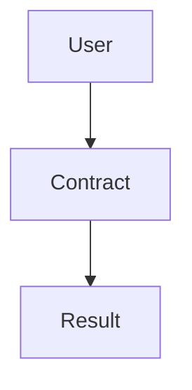

# Oak Network Documentation

[](https://opensource.org/licenses/MIT)
[](https://docusaurus.io/)
[](https://nodejs.org/)
[](https://reactjs.org/)

> **Oak Network Documentation** - Comprehensive documentation for the Oak Network crowdfunding protocol built with Docusaurus.

## 📋 Table of Contents

- [Overview](#overview)
- [Prerequisites](#prerequisites)
- [Installation](#installation)
- [Development](#development)
- [Testing](#testing)
- [Deployment](#deployment)
- [Contributing](#contributing)
- [Code Standards](#code-standards)
- [Security](#security)
- [License](#license)

## 📖 Overview

This repository contains the documentation for Oak Network, a decentralized crowdfunding protocol built on the Celo blockchain. The documentation is built with Docusaurus and provides comprehensive guides for developers, users, and contributors.

### Documentation Sections

- **Concepts** - Understanding Oak Network's architecture and core concepts
- **Smart Contracts** - Detailed API reference for all smart contracts
- **Integration Guides** - Step-by-step guides for developers
- **Security** - Security model, audits, and best practices
- **Deployment** - Deployment guides for different networks
- **API Reference** - Complete API documentation

## 🔧 Prerequisites

- **Node.js** 18+ and pnpm
- **Git** for version control
- **Basic knowledge** of Markdown and React (for contributions)

## 🚀 Installation

```bash
# Clone the repository
git clone https://github.com/oaknetwork/docs.git
cd docs/oaknetwork

# Install dependencies
pnpm install
```

## 💻 Development

### Start Development Server

```bash
# Start the development server
pnpm start

# The site will be available at http://localhost:3000
```

### Build Documentation

```bash
# Build the documentation for production
pnpm build

# The built files will be in the 'build' directory
```

### Serve Production Build

```bash
# Serve the production build locally
pnpm serve

# The site will be available at http://localhost:3000
```

## 📝 Content Management

### Adding New Pages

1. Create a new Markdown file in the `docs/` directory
2. Add the page to `sidebars.ts` for navigation
3. Use proper frontmatter for metadata

```markdown
---
title: "Page Title"
description: "Page description"
---

# Page Content

Your content here...
```

### Adding Blog Posts

1. Create a new Markdown file in `blog/` directory
2. Use the format: `YYYY-MM-DD-title.md`
3. Include proper frontmatter

```markdown
---
slug: post-title
title: "Post Title"
authors: [author-name]
tags: [tag1, tag2]
---

# Post Content

Your blog post content...
```

### Custom Components

- **Mermaid Diagrams** - Use the `MermaidDiagram` component for interactive diagrams
- **Custom React Components** - Add to `src/components/`
- **Styling** - Modify `src/css/custom.css`

## 🤝 Contributing

We welcome contributions to improve the documentation! Please read our [Contributing Guide](CONTRIBUTING.md) for detailed information.

### Quick Start

```bash
# Fork and clone the repository
git clone https://github.com/your-username/docs.git
cd docs/oaknetwork

# Install dependencies
npm install

# Create a feature branch
git checkout -b feature/your-feature-name

# Start development server
npm start

# Make your changes and test
npm run build

# Commit and push
git add .
git commit -m "docs: improve your section"
git push origin feature/your-feature-name

# Open a Pull Request
```

### Types of Contributions

- 📝 **Content Updates** - Improve existing documentation
- ✨ **New Pages** - Add new documentation sections
- 🎨 **UI/UX** - Improve design and user experience
- 🐛 **Bug Fixes** - Fix broken links, typos, etc.
- 🌍 **Translations** - Translate documentation
- 📊 **Diagrams** - Add or improve Mermaid diagrams

## 📏 Content Standards

### Markdown Guidelines

```markdown
# Use proper heading hierarchy
## Section headings
### Subsection headings

**Bold text** for emphasis
*Italic text* for subtle emphasis
`code` for inline code

```javascript
// Code blocks with syntax highlighting
const example = "Hello World";
```

- Use bullet points for lists
- Keep lines under 80 characters
- Use descriptive link text
```

### Writing Style

- **Clear and concise** - Write for your audience
- **Consistent tone** - Professional but approachable
- **Active voice** - Use "you" instead of "one"
- **Short sentences** - Break up complex ideas
- **Examples** - Include practical examples

### File Organization

```
docs/
├── concepts/          # Core concepts
├── contracts/         # Smart contract docs
├── guides/           # Integration guides
├── security/         # Security documentation
└── deployment/       # Deployment guides

blog/
├── 2024-12-20-*.md   # Blog posts
└── authors.yml       # Author information
```

### Mermaid Diagrams

```markdown
import MermaidDiagram from '@site/src/components/MermaidDiagram';

<MermaidDiagram title="Architecture Overview">



</MermaidDiagram>
```

## 🚀 Deployment

### Development

```bash
# Start development server
npm start
```

### Production Build

```bash
# Build for production
npm run build

# Serve production build
npm run serve
```

### GitHub Pages

```bash
# Deploy to GitHub Pages
npm run deploy
```

### Custom Deployment

The built files in the `build/` directory can be deployed to any static hosting service:

- **Vercel** - Connect your GitHub repository
- **Netlify** - Drag and drop the build folder
- **AWS S3** - Upload build files to S3 bucket
- **Cloudflare Pages** - Connect your repository

## 📄 License

This project is licensed under the MIT License - see the [LICENSE](LICENSE) file for details.

## 🆘 Support

- **Documentation**: [docs.oaknetwork.org](https://docs.oaknetwork.org)
- **Discord**: [Join our community](https://discord.gg/oaknetwork)
- **GitHub Issues**: [Report issues](https://github.com/oaknetwork/docs/issues)
- **Email**: docs@oaknetwork.org

## 🙏 Acknowledgments

- **Docusaurus** - Documentation framework
- **React** - UI library
- **Mermaid** - Diagram generation
- **Community** - Feedback, contributions, and support

---

**Built with ❤️ by the Oak Network team**

*Comprehensive documentation for decentralized crowdfunding*
