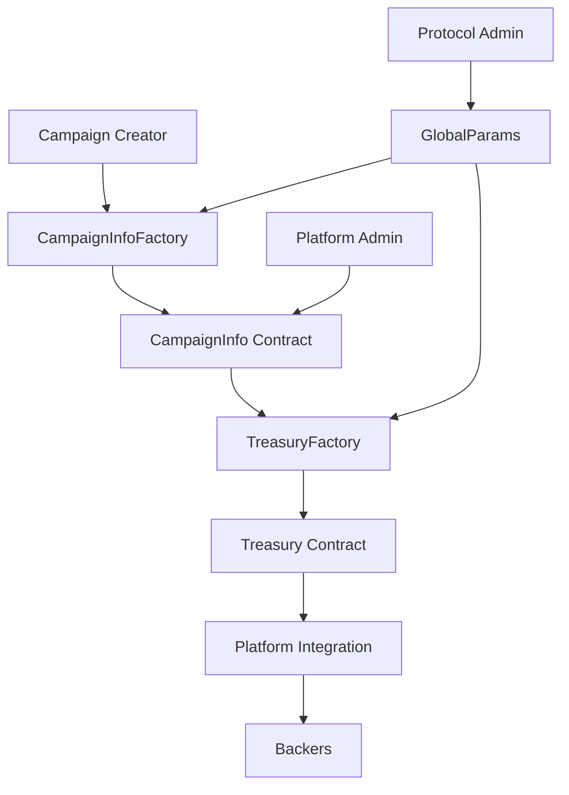

# Oak Network Documentation

[](https://opensource.org/licenses/MIT)
[](https://celo.org/)
[](https://soliditylang.org/)

> **Crowdfunding Infrastructure on Celo** - A decentralized protocol enabling any application to integrate crowdfunding capabilities with enterprise-grade security and developer-friendly APIs.

## 🌟 Overview

Oak Network is a comprehensive crowdfunding protocol built on the Celo blockchain that serves as infrastructure for all applications - whether crowdfunding-specific or not. Our mission is to democratize access to crowdfunding by providing a robust, secure, and easy-to-integrate platform that developers can seamlessly incorporate into their applications.

### Key Features

- **🔒 Zero Key Storage Policy** - Enhanced security with Privy and Turnkey integration
- **⚡ Direct Smart Contract Integration** - No SDK dependencies, use `ethers.js` directly
- **🌍 Celo Blockchain** - Fast, low-cost transactions with mobile-first design
- **💰 Flexible Treasury Models** - All-or-nothing and keep-what's-raised campaigns
- **🛡️ Enterprise Security** - Hardware security modules and embedded wallets
- **📱 Mobile-First** - Optimized for mobile crowdfunding experiences
- **🔧 Developer-Friendly** - Comprehensive documentation and examples

## 🚀 Quick Start

### Prerequisites

- Node.js 16+ and npm/yarn
- Basic knowledge of Solidity and `ethers.js`
- Celo wallet (MetaMask, Valora, etc.)

### Installation

```bash
# Clone the repository
git clone https://github.com/oaknetwork/ccprotocol-contracts.git
cd ccprotocol-contracts

# Install dependencies
npm install

# Compile contracts
npx hardhat compile

# Run tests
npx hardhat test
```

### Basic Integration

```javascript
import { ethers } from 'ethers';

// Connect to Celo network
const provider = new ethers.providers.JsonRpcProvider('https://forno.celo.org');
const wallet = new ethers.Wallet(process.env.PRIVATE_KEY, provider);

// Contract addresses (mainnet)
const CAMPAIGN_FACTORY = '0x...';
const TREASURY_FACTORY = '0x...';

// Create a campaign
const campaignFactory = new ethers.Contract(CAMPAIGN_FACTORY, abi, wallet);
const tx = await campaignFactory.createCampaign(
  'My Campaign',
  'Description',
  ethers.utils.parseEther('10'), // Goal: 10 CELO
  30 * 24 * 60 * 60, // Duration: 30 days
  'AllOrNothing' // Treasury type
);
```

## 📚 Documentation

### Core Concepts

- **[Overview](docs/concepts/overview.md)** - Understanding Oak Network's architecture
- **[Campaigns](docs/concepts/campaigns.md)** - How campaigns work and lifecycle
- **[Platforms](docs/concepts/platforms.md)** - Integrating with existing platforms
- **[Treasuries](docs/concepts/treasuries.md)** - Different funding models
- **[Security](docs/security/overview.md)** - Security model and best practices

### Smart Contracts

- **[Contract Overview](docs/contracts/overview.md)** - Architecture and relationships
- **[CampaignInfoFactory](docs/contracts/campaign-info-factory.md)** - Creating campaigns
- **[TreasuryFactory](docs/contracts/treasury-factory.md)** - Managing treasuries
- **[GlobalParams](docs/contracts/global-params.md)** - Protocol parameters

### Integration Guides

- **[Quick Start](docs/guides/quick-start.md)** - Get up and running quickly
- **[Create Campaign](docs/guides/create-campaign.md)** - Step-by-step campaign creation
- **[Platform Integration](docs/guides/platform-integration.md)** - Building on Oak Network

### Security

- **[Security Overview](docs/security/overview.md)** - Our security model
- **[Audits](docs/security/audits.md)** - Security audit reports
- **[Best Practices](docs/security/best-practices.md)** - Security guidelines
- **[Bug Bounty](docs/security/bug-bounty.md)** - Report security issues

## 🏗️ Architecture



### Core Components

1. **CampaignInfoFactory** - Creates and manages campaign instances
2. **TreasuryFactory** - Deploys treasury contracts for fund management
3. **GlobalParams** - Manages protocol-wide parameters and fees
4. **Utility Contracts** - Access control, pausability, and validation
5. **Interface Contracts** - Standardized interfaces for integration

## 🔐 Security Model

Oak Network implements a **Zero Key Storage Policy** for enhanced security:

### Privy Integration
- **Social Authentication** - Login with Google, Apple, Discord, etc.
- **Embedded Wallets** - No seed phrase management required
- **Multi-Factor Authentication** - Additional security layers
- **Recovery Mechanisms** - Account recovery without seed phrases

### Turnkey Integration
- **Hardware Security Modules** - Enterprise-grade key protection
- **Audit Logs** - Complete transaction history
- **Key Rotation** - Automatic key management
- **Compliance** - SOC 2 Type II certified

## 🌍 Roadmap 2026

### Q1 2026: Appstore
Extend our standalone client with apps, giving developers the power to add features that can be used by creators, backers, and platforms. Developers can create:
- **Backend Services** - Custom API endpoints and business logic
- **Frontend Components** - Reusable UI components and widgets
- **Smart Contracts** - Custom contract logic and integrations

### Q2 2026: Catalyst
Our centralized experience that empowers platforms and accelerates developers. All features in smart contracts and payment providers available via API and SDK:
- **Payment Providers** - On/Off ramp, Stripe, bridge integrations
- **Multi-Language SDKs** - TypeScript, Python, and Golang
- **API Gateway** - Unified API for all Oak Network features
- **Developer Tools** - Testing, debugging, and deployment tools

### Q3 2026: Signet
A blind platform for partner registration without sharing keys:
- **Blind Key Linking** - Link keys without sharing private keys
- **Key Generation** - Generate and share keys blindly
- **No Storage** - Keys are never stored on our servers
- **Partner Onboarding** - Seamless integration for enterprise partners

## 🤝 Contributing

We welcome contributions from the community! Here's how you can help:

### Development Setup

```bash
# Fork the repository
git clone https://github.com/your-username/ccprotocol-contracts.git
cd ccprotocol-contracts

# Install dependencies
npm install

# Run tests
npm test

# Run linting
npm run lint

# Run coverage
npm run coverage
```

### Contribution Guidelines

1. **Fork** the repository
2. **Create** a feature branch (`git checkout -b feature/amazing-feature`)
3. **Commit** your changes (`git commit -m 'Add amazing feature'`)
4. **Push** to the branch (`git push origin feature/amazing-feature`)
5. **Open** a Pull Request

### Code Standards

- Follow Solidity style guide
- Write comprehensive tests
- Update documentation
- Ensure all tests pass
- Follow security best practices

## 📄 License

This project is licensed under the MIT License - see the [LICENSE](LICENSE) file for details.

## 🆘 Support

- **Documentation**: [docs.oak.network](https://docs.oak.network)
- **Discord**: [Join our community](https://discord.gg/oaknetwork)
- **Twitter**: [@oak_network](https://twitter.com/oak_network)
- **GitHub Issues**: [Report bugs](https://github.com/oaknetwork/ccprotocol-contracts/issues)

## 🙏 Acknowledgments

- **Celo Foundation** - For building an amazing mobile-first blockchain
- **Privy** - For embedded wallet infrastructure
- **Turnkey** - For enterprise-grade security
- **OpenZeppelin** - For battle-tested smart contract libraries
- **Community** - For feedback, contributions, and support

---

**Built with ❤️ by the Oak Network team**

*Empowering the future of decentralized crowdfunding*