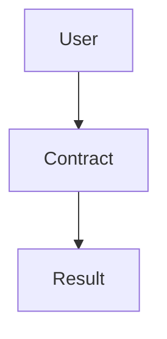

# Oak Network Documentation

[](https://opensource.org/licenses/MIT)
[](https://mintlify.com/)
[](https://nodejs.org/)

> **Oak Network Documentation** - Comprehensive documentation for the Oak Network crowdfunding protocol built with Mintlify.

## 📋 Table of Contents

- [Overview](#overview)
- [Prerequisites](#prerequisites)
- [Installation](#installation)
- [Development](#development)
- [Content Management](#content-management)
- [Contributing](#contributing)
- [Content Standards](#content-standards)
- [Deployment](#deployment)
- [License](#license)
- [Support](#support)

## 📖 Overview

This repository contains the documentation for Oak Network, a decentralized crowdfunding protocol built on the Celo blockchain. The documentation is built with Mintlify and provides comprehensive guides for developers, users, and contributors.

### Documentation Sections

- **Concepts** - Understanding Oak Network's architecture and core concepts
- **Smart Contracts** - Detailed API reference for all smart contracts
- **Integration Guides** - Step-by-step guides for developers
- **Security** - Security model, audits, and best practices
- **Operations** - Operational guides and runbooks
- **API Reference** - Complete Payment API documentation, synced from the backend OpenAPI spec

## 🔧 Prerequisites

- **Node.js** 18+ (to run the Mintlify CLI)
- **Git** for version control
- **Basic knowledge** of Markdown / MDX (for contributions)

## 🚀 Installation

```bash
# Clone the repository
git clone https://github.com/oak-network/docs.git
cd docs

# Install the Mintlify CLI
npm i -g mint      # or run ad-hoc with: npx mint@latest <cmd>
```

## 💻 Development

### Start Development Server

```bash
# Start the local preview server
mint dev

# The site will be available at http://localhost:3000
```

### Validate the Build

```bash
# Check internal links
mint broken-links

# Validate docs.json and the OpenAPI spec
mint validate
```

All configuration lives in [`docs.json`](./docs.json) — theme, navigation, redirects, SEO, and the API reference.

## 📝 Content Management

### Adding New Pages

1. Create a new `.mdx` file in the relevant content directory
2. Add its path (without the `.mdx` extension) to the appropriate `group` in `docs.json` → `navigation.tabs` — a page is only visible once it is listed in the navigation
3. Use proper frontmatter for metadata

```mdx
---
title: "Page Title"
description: "Page description"
---

# Page Content

Your content here...
```

### Adding Blog Posts

1. Create a new `.mdx` file in the `blog/` directory
2. Add it to the **Blog** tab in `docs.json`
3. Include proper frontmatter

```mdx
---
title: "Post Title"
description: "Post description"
---

# Post Content

Your blog post content...
```

### Components

- **Callouts** - `<Tip>`, `<Info>`, `<Note>`, `<Warning>`
- **Mermaid Diagrams** - fenced ` ```mermaid ` code blocks
- **Styling** - modify [`style.css`](./style.css)

### API Reference

The **API Reference** tab is generated natively by Mintlify from the bundled OpenAPI spec at [`api-specs/v1/crowdsplits.yaml`](./api-specs/v1/crowdsplits.yaml). The spec is **not** edited by hand — it is synced from the [`oak-network/crowdsplit`](https://github.com/oak-network/crowdsplit) backend.

## 🤝 Contributing

We welcome contributions to improve the documentation! Please read our [Contributing Guide](CONTRIBUTING.md) for detailed information.

### Quick Start

```bash
# Fork and clone the repository
git clone https://github.com/your-username/docs.git
cd docs

# Create a feature branch
git checkout -b feature/your-feature-name

# Start the preview server
mint dev

# Make your changes, then validate
mint broken-links && mint validate

# Commit and push
git add .
git commit -m "docs: improve your section"
git push origin feature/your-feature-name

# Open a Pull Request
```

### Types of Contributions

- 📝 **Content Updates** - Improve existing documentation
- ✨ **New Pages** - Add new documentation sections
- 🎨 **UI/UX** - Improve design and user experience
- 🐛 **Bug Fixes** - Fix broken links, typos, etc.
- 🌍 **Translations** - Translate documentation
- 📊 **Diagrams** - Add or improve Mermaid diagrams

## 📏 Content Standards

### Markdown Guidelines

```markdown
# Use proper heading hierarchy
## Section headings
### Subsection headings

**Bold text** for emphasis
*Italic text* for subtle emphasis
`code` for inline code

- Use bullet points for lists
- Keep lines under 80 characters
- Use descriptive link text
```

### Writing Style

- **Clear and concise** - Write for your audience
- **Consistent tone** - Professional but approachable
- **Active voice** - Use "you" instead of "one"
- **Short sentences** - Break up complex ideas
- **Examples** - Include practical examples

### File Organization

```
concepts/         # Core concepts
contracts/        # Smart contract docs
contracts-sdk/    # Contracts client SDK reference
sdk/              # Payments SDK reference
guides/           # Integration guides
security/         # Security documentation
operations/       # Operational guides
blog/             # Blog posts
api-specs/        # Bundled OpenAPI spec (powers the API Reference tab)
```

### Mermaid Diagrams

````mdx

```mermaid
graph TB
    A[User] --> B[Contract]
    B --> C[Result]
```
````

## 🚀 Deployment

This site is built with Mintlify, so there is no local build step to run.

Before opening a PR, verify locally:

```bash
mint dev          # preview the site
mint validate     # validate docs.json and the OpenAPI spec
```

## 📄 License

This project is licensed under the MIT License - see the [LICENSE](LICENSE) file for details.

## 🆘 Support

- **Documentation**: [docs.oaknetwork.org](https://docs.oaknetwork.org)
- **Discord**: [Join our community](https://discord.com/invite/srhtEpWBHx)
- **GitHub Issues**: [Report issues](https://github.com/oak-network/docs/issues)
- **Email**: docs@oaknetwork.org

## 🙏 Acknowledgments

- **Mintlify** - Documentation platform
- **Mermaid** - Diagram generation
- **Community** - Feedback, contributions, and support

---

**Built with ❤️ by the Oak Network team**

*Comprehensive documentation for decentralized crowdfunding*
