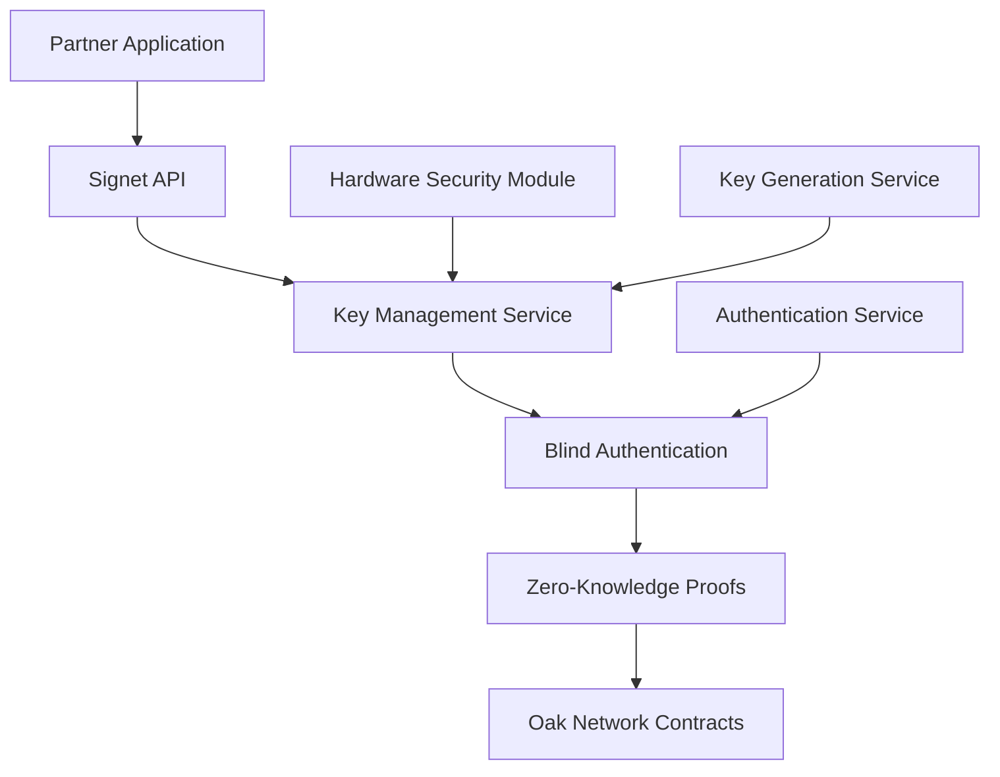

# 🗺️ Introducing Our 2026 Roadmap: Appstore, Catalyst, and Signet

We're thrilled to share our ambitious roadmap for 2026, featuring three revolutionary products that will transform how we think about decentralized crowdfunding infrastructure.

<!-- truncate -->

## 🏪 Appstore - Extensible Platform Ecosystem

**Timeline: Q1 2026**

The Oak Network Appstore will extend our standalone client with a powerful app ecosystem, giving developers the ability to create and deploy custom features that can be used by creators, backers, and platforms.

### What Makes Appstore Special?

- **Complete Development Framework**: Backend, frontend, and smart contract development tools
- **App Marketplace**: Discover, install, and manage third-party applications
- **Revenue Sharing**: Developers earn from app usage and subscriptions
- **Seamless Integration**: Apps work natively with Oak Network infrastructure

### Developer Benefits

```javascript
// Example: Custom analytics app
class CampaignAnalyticsApp {
  async install() {
    await oakNetwork.apps.register({
      name: 'Campaign Analytics',
      version: '1.0.0',
      permissions: ['read:campaigns', 'read:contributions']
    });
  }
  
  async analyzeCampaign(campaignId) {
    const data = await this.gatherCampaignData(campaignId);
    return this.generateInsights(data);
  }
}
```

## ⚡ Catalyst - Centralized Development Experience

**Timeline: Q2 2026**

Catalyst is our centralized development platform that will accelerate platform and developer adoption by providing comprehensive APIs, SDKs, and tools for all trending technologies.

### Multi-Language Support

We're building SDKs for the most popular programming languages:

#### TypeScript/JavaScript
```typescript
import { OakNetwork } from '@oaknetwork/catalyst-ts';

const oak = new OakNetwork({
  apiKey: process.env.OAK_API_KEY,
  environment: 'production'
});

const campaign = await oak.campaigns.create({
  goal: 10000,
  currency: 'USD',
  paymentMethods: ['stripe', 'crypto', 'fiat']
});
```

#### Python
```python
from oaknetwork import OakNetwork

oak = OakNetwork(api_key="your_api_key")

platform = oak.platforms.create({
    name: "My Platform",
    fee_percent: 3.5,
    features: ["analytics", "custom_rewards"]
})
```

#### Golang
```go
package main

import (
    "github.com/oaknetwork/catalyst-go"
)

func main() {
    client := oaknetwork.NewClient("your_api_key")
    
    campaign, err := client.Campaigns.Create(&oaknetwork.CampaignRequest{
        Goal: 10000,
        Currency: "USD",
        Platforms: []string{"web", "mobile"},
    })
}
```

### Payment Integration

- **On/Off Ramps**: Seamless fiat to crypto conversion
- **Stripe Integration**: Traditional payment processing
- **Bridge Solutions**: Cross-chain asset transfers
- **Multi-Currency Support**: Support for various tokens and fiat currencies

## 🔐 Signet - Blind Key Management Platform

**Timeline: Q3 2026**

Signet is our revolutionary platform that enables partners to integrate with Oak Network infrastructure without sharing private keys, providing secure key management and blind authentication.

### Revolutionary Features

- **Blind Key Registration**: Partners register without exposing private keys
- **Key Linking**: Link existing keys without sharing them
- **Key Generation**: Generate new keys for clients securely
- **Blind Authentication**: Verify ownership without revealing keys
- **Zero-Knowledge Proofs**: Cryptographic proofs of key ownership

### Security Architecture



### Integration Example

```javascript
import { SignetClient } from '@oaknetwork/signet';

const signet = new SignetClient({
  apiKey: process.env.SIGNET_API_KEY,
  environment: 'production'
});

// Register without sharing private key
const registration = await signet.register({
  publicKey: wallet.publicKey,
  platformId: 'my-platform',
  permissions: ['create:campaigns', 'manage:users']
});

// Blind authentication
const authProof = await signet.authenticate({
  challenge: randomChallenge,
  publicKey: wallet.publicKey
});
```

## 🔐 Enhanced Security Model

### Privy & Turnkey Integration

Oak Network leverages industry-leading security providers to ensure maximum security without holding any private keys.

#### Privy Integration
- **Embedded Wallets**: Seamless wallet creation and management
- **Social Login**: Email, Google, Apple, and social media authentication
- **Multi-Factor Authentication**: Enhanced security for all users
- **Recovery Mechanisms**: Secure account recovery without seed phrases

#### Turnkey Integration
- **Hardware Security**: Enterprise-grade key management
- **Multi-Signature Support**: Advanced transaction signing
- **Audit Trails**: Complete transaction and key usage logging
- **Compliance**: SOC 2 Type II and other security certifications

## 🌟 Long-term Vision (2026+)

### Decentralized Governance
- **Token-based Voting**: Community-driven protocol decisions
- **Proposal System**: Transparent governance process
- **Treasury Management**: Community-controlled protocol funds

### Cross-Chain Expansion
- **Multi-Chain Support**: Ethereum, Polygon, Arbitrum, and more
- **Cross-Chain Campaigns**: Campaigns spanning multiple networks
- **Bridge Integration**: Seamless asset transfers between chains

### Advanced Features
- **AI-Powered Analytics**: Machine learning for campaign optimization
- **Dynamic Pricing**: Algorithmic fee adjustment based on demand
- **Insurance Products**: Campaign failure protection
- **Liquidity Pools**: Secondary markets for campaign tokens

## 📅 Timeline Summary

| Quarter | Focus | Key Deliverables |
|---------|-------|------------------|
| Q1 2026 | Appstore | App development framework, marketplace |
| Q2 2026 | Catalyst | Multi-language SDKs, payment integration |
| Q3 2026 | Signet | Blind key management, zero-knowledge proofs |
| Q4 2026 | Integration | Full ecosystem integration, enterprise features |

## 🤝 Get Involved

### For Developers
- **Early Access**: Join our developer program for early access
- **Feedback**: Help shape the future of Oak Network
- **Contributions**: Contribute to open source development
- **Partnerships**: Build on top of Oak Network infrastructure

### For Platforms
- **Integration Support**: Dedicated support for platform integration
- **Custom Solutions**: Tailored solutions for your platform
- **Revenue Sharing**: Earn from platform usage
- **Priority Support**: Dedicated support channels

### For Users
- **Beta Testing**: Test new features before public release
- **Feedback**: Share your experience and suggestions
- **Community**: Join our growing community
- **Early Access**: Get early access to new features

## 🚀 Ready to Build the Future?

We're building the next generation of decentralized crowdfunding infrastructure, and we want you to be part of it. Whether you're a developer, platform builder, or user, there's a place for you in the Oak Network ecosystem.

**Join us in revolutionizing crowdfunding!**

- **Discord**: [discord.gg/oaknetwork](https://discord.com/invite/srhtEpWBHx)
- **GitHub**: [github.com/oaknetwork](https://github.com/oak-network)
- **Twitter**: [@oaknetwork](https://twitter.com/oak_network)

---

*For more details about our roadmap, visit our [comprehensive roadmap page](/docs/roadmap).*
