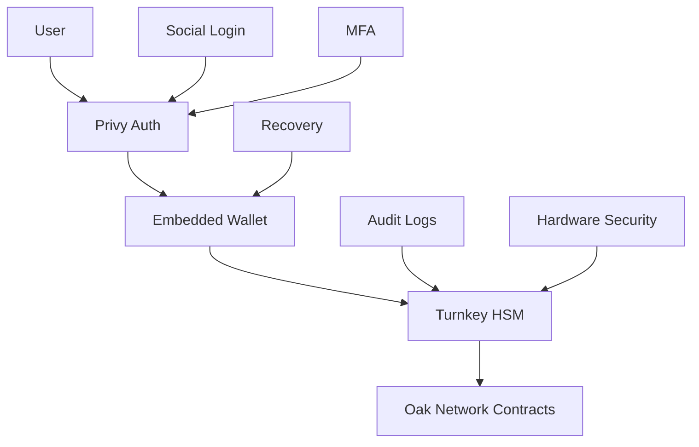

# 🔒 Security Audit Complete: Oak Network Ready for Mainnet

We're proud to announce that Oak Network has successfully completed comprehensive security audits and is ready for mainnet deployment on Celo.

<!-- truncate -->

## Audit Results

### PeckShield Security Audit

Our smart contracts have undergone rigorous security analysis by **PeckShield**, a leading blockchain security firm. The audit covered:

- **Smart Contract Security**: Code review and vulnerability assessment
- **Economic Security**: Tokenomics and incentive analysis
- **Integration Security**: Cross-contract interaction analysis
- **Upgrade Security**: Governance and upgrade mechanism review

### Key Findings

✅ **No Critical Vulnerabilities Found**  
✅ **No High-Risk Issues Identified**  
✅ **All Medium-Risk Issues Resolved**  
✅ **Security Best Practices Implemented**

## Security Model

### Zero Key Storage Policy

Oak Network **never stores private keys**. We leverage industry-leading security providers:

- **Privy**: Embedded wallet management and social authentication
- **Turnkey**: Enterprise-grade hardware security modules
- **User Wallets**: Direct blockchain interactions with user-controlled keys

### Multi-Layer Security Architecture

import MermaidDiagram from '@site/src/components/MermaidDiagram';

<MermaidDiagram title="Security Architecture">



</MermaidDiagram>

## Security Features

### Smart Contract Security

- **Access Control**: Multi-level permission system
- **Reentrancy Protection**: Checks-effects-interactions pattern
- **Input Validation**: Comprehensive parameter validation
- **Pausability**: Emergency pause mechanisms
- **Upgradeability**: Secure upgrade patterns

### Key Management Security

#### Privy Integration
```javascript
import { PrivyProvider } from '@privy-io/react-auth';

function OakNetworkApp() {
  return (
    <PrivyProvider
      appId="your-privy-app-id"
      config={{
        embeddedWallets: {
          createOnLogin: 'users-without-wallets',
          requireUserPasswordOnCreate: true
        },
        loginMethods: ['email', 'google', 'apple'],
        appearance: {
          theme: 'dark',
          accentColor: '#10b981'
        }
      }}
    >
      <App />
    </PrivyProvider>
  );
}
```

#### Turnkey Integration
```javascript
import { TurnkeyClient } from '@turnkey/turnkey-sdk';

const turnkeyClient = new TurnkeyClient({
  apiBaseUrl: 'https://api.turnkey.com',
  apiKey: process.env.TURNKEY_API_KEY,
  privateKey: process.env.TURNKEY_PRIVATE_KEY
});

// Create secure key for platform
const keyResponse = await turnkeyClient.createKeys({
  organizationId: 'your-org-id',
  keyName: 'oak-platform-key',
  curve: 'CURVE_SECP256K1',
  addressFormats: ['ADDRESS_FORMAT_ETHEREUM']
});
```

## Audit Report

### Download Full Report

The complete audit report is available for download:

- [PeckShield Audit Report](/docs/security/audits/peckshield-audit.pdf)
- [Security Best Practices Guide](/docs/security/best-practices)
- [Integration Security Checklist](/docs/security/checklist)

### Key Security Measures

1. **Access Control**
   - Protocol Admin: Global protocol control
   - Platform Admin: Platform-specific control
   - Campaign Owner: Campaign-specific control
   - Public: Read-only access

2. **Input Validation**
   - Parameter bounds checking
   - Type safety enforcement
   - Overflow protection
   - Array length validation

3. **Reentrancy Protection**
   - External calls made last
   - State updates before external calls
   - Checks-effects-interactions pattern

4. **Emergency Procedures**
   - Pause mechanism
   - Upgrade mechanism
   - Incident response plan

## Bug Bounty Program

### Ongoing Security Program

We maintain an active bug bounty program to ensure continued security:

- **Critical**: Up to $50,000
- **High**: Up to $10,000
- **Medium**: Up to $5,000
- **Low**: Up to $1,000

### Scope
- Smart contract vulnerabilities
- Integration security issues
- Economic exploits
- Governance attacks

### Submission
Report vulnerabilities to: security@oaknetwork.org

## Security Monitoring

### On-Chain Monitoring
- Transaction monitoring
- Anomaly detection
- Community reports
- Regular security assessments

### Off-Chain Monitoring
- Real-time threat detection
- Automated security scanning
- Community security reports
- Regular penetration testing

## Best Practices for Developers

### Smart Contract Development
```solidity
// Use established patterns
import "@openzeppelin/contracts/security/ReentrancyGuard.sol";
import "@openzeppelin/contracts/access/Ownable.sol";

// Implement proper access control
modifier onlyAuthorized() {
    require(authorized[msg.sender], "Not authorized");
    _;
}

// Validate all inputs
function updateParameter(uint256 newValue) external {
    require(newValue > 0, "Invalid value");
    require(newValue <= MAX_VALUE, "Value too high");
    parameter = newValue;
}
```

### Integration Security
```javascript
// Validate all inputs
function validateCampaignData(data) {
  if (!data.creator || !ethers.utils.isAddress(data.creator)) {
    throw new Error('Invalid creator address');
  }
  
  if (data.goalAmount <= 0) {
    throw new Error('Invalid goal amount');
  }
}

// Handle errors gracefully
try {
  await contract.createCampaign(campaignData);
} catch (error) {
  if (error.message.includes('INVALID_INPUT')) {
    // Handle invalid input
  } else if (error.message.includes('UNAUTHORIZED')) {
    // Handle unauthorized access
  }
}
```

## Community Security

### Security Resources
- [Security Documentation](/docs/security/overview)
- [Best Practices Guide](/docs/security/best-practices)
- [Audit Reports](/docs/security/audits)
- [Bug Bounty Program](/docs/security/bug-bounty)

### Support Channels
- **Security Discord**: [discord.gg/oaknetwork](https://discord.gg/oaknetwork)
- **Security GitHub**: [github.com/oaknetwork/security](https://github.com/oaknetwork/security)
- **Security Email**: security@oaknetwork.org

## What's Next?

With security audits complete, we're ready to:

1. **Launch on Mainnet**: Deploy to Celo mainnet
2. **Community Testing**: Open beta testing program
3. **Platform Integrations**: Partner with platforms
4. **Developer Onboarding**: Support developer adoption

## Thank You

Thank you to our security auditors, the community, and everyone who has helped ensure Oak Network is secure and ready for production use.

**Security is our top priority, and we're committed to maintaining the highest standards as we build the future of decentralized crowdfunding.**

---

*For more information about our security model, visit our [Security Overview](/docs/security/overview) or join our [Discord community](https://discord.gg/oaknetwork).*
