# Protocol Documentation — Information Architecture

## Folder Structure

```
docs/
│
├── introduction.md                          # What is the protocol. Two products, one vision. Key links.
│
├── getting-started/
│   ├── overview.md                          # "Choose your path" — visual fork, no tutorials here
│   ├── path-contract-integrator.md          # Journey: Concepts → Smart Contracts → Contract SDK
│   └── path-payment-developer.md           # Journey: Payment SDK → API Reference → go live
│
├── concepts/
│   ├── architecture.md                      # Full system map: onchain layer + API layer + how they connect
│   ├── tokenomics.md                        # Token model, supply, utility
│   ├── governance.md                        # DAO, voting, proposals
│   └── security-model.md                   # Trust assumptions, threat model, invariants
│
├── smart-contracts/
│   ├── overview.md                          # Contract system map, how to read these docs
│   ├── interfaces/
│   │   └── *.md                             # One file per interface (IVault.md, IRouter.md...)
│   ├── contracts/
│   │   └── *.md                             # One file per contract: NatSpec + usage context + audit link
│   ├── events-and-errors.md                 # All events + custom errors, indexed for searchability
│   ├── deployment-addresses.md              # Mainnet + testnet per chain, block explorer links
│   └── upgrade-history.md                  # Proxy upgrade log, rationale, diffs
│
├── sdk/
│   ├── overview.md                          # Both SDKs explained, when to use which, or both together
│   │
│   ├── contract-sdk/                        # Frontend SDK — wraps smart contract interactions
│   │   ├── overview.md                      # What it abstracts, supported chains, philosophy
│   │   ├── installation.md                  # npm/yarn, peer deps, framework notes (Next.js, Vite...)
│   │   ├── reference/                       # Auto-gen from typedoc — one file per module
│   │   ├── guides/
│   │   │   ├── connect-wallet.md
│   │   │   ├── read-state.md
│   │   │   ├── write-transaction.md
│   │   │   ├── listen-events.md
│   │   │   └── error-handling.md
│   │   ├── snippets/
│   │   │   ├── connect-wallet.md
│   │   │   ├── read-contract.md
│   │   │   ├── write-contract.md
│   │   │   ├── multicall.md
│   │   │   └── simulate-transaction.md
│   │   └── migration/
│   │       └── v1-to-v2.md
│   │
│   └── payment-sdk/                         # API SDK — ecommerce, Stripe, Bridge, future agentic
│       ├── overview.md                      # What it covers: payments, Stripe, Bridge, agentic roadmap
│       ├── installation.md                  # npm/yarn, env vars, environments (sandbox/prod)
│       ├── reference/                       # Auto-gen from typedoc/openapi — one file per module
│       ├── guides/
│       │   ├── setup-provider.md            # Init SDK, keys, environments
│       │   ├── create-payment.md            # Basic checkout flow end-to-end
│       │   ├── stripe-integration.md        # Stripe-specific flow
│       │   ├── bridge-integration.md        # Bridge / crypto offramp flow
│       │   ├── webhooks.md                  # Events, signatures, retry logic
│       │   └── error-handling.md
│       ├── snippets/
│       │   ├── create-checkout.md
│       │   ├── handle-webhook.md
│       │   ├── refund.md
│       │   └── agentic-trigger.md           # Stub — grows as agentic ships
│       ├── agentic-payments/                # Forward-looking section
│       │   └── overview.md                  # Vision, design philosophy, early API previews
│       └── migration/
│           └── v1-to-v2.md
│
├── api-reference/                           # Raw HTTP API — for devs who skip the SDK
│   ├── overview.md                          # Base URL, auth, rate limits, versioning policy
│   ├── authentication.md
│   ├── endpoints/                           # One file per resource group
│   │   ├── payments.md
│   │   ├── refunds.md
│   │   ├── webhooks.md
│   │   └── *.md
│   └── errors.md                            # Error codes, retry logic, status meanings
│
├── security/
│   ├── overview.md                          # Security posture, responsible disclosure
│   ├── audits/
│   │   ├── index.md                         # Audit log table: firm, date, scope, findings summary
│   │   └── [firm]-[year].md                 # Full report or link + remediation notes
│   ├── bug-bounty.md                        # Scope, severity levels, payout, submission link
│   └── known-issues.md                      # Acknowledged issues, mitigations, timeline
│
├── roadmap/
│   ├── overview.md                          # Vision, phases, current status
│   ├── changelog.md                         # What shipped and when — linked to releases
│   └── upcoming.md                          # What's next: agentic payments, new chains, etc.
│
├── company/
│   ├── about.md                             # Mission, team, investors
│   ├── brand.md                             # Logo, colors, usage guidelines
│   └── legal/
│       ├── terms.md
│       └── privacy.md
│
└── contributing/
    ├── overview.md                          # How to contribute to protocol or docs
    ├── local-setup.md                       # Dev environment for contributors
    └── style-guide.md                       # Writing conventions, code style, review process
```

---

## Mermaid Diagram

```mermaid
graph TD
    ROOT["📚 Protocol Docs"]

    ROOT --> INTRO["introduction.md"]
    ROOT --> GS["🚀 Getting Started"]
    ROOT --> CONCEPTS["🧠 Concepts"]
    ROOT --> SC["📜 Smart Contracts"]
    ROOT --> SDK["🛠 SDKs"]
    ROOT --> API["🔌 API Reference"]
    ROOT --> SEC["🔒 Security"]
    ROOT --> RM["🗺 Roadmap"]
    ROOT --> CO["🏢 Company"]
    ROOT --> CONTRIB["🤝 Contributing"]

    GS --> PATH["overview.md\n⚑ Choose your path"]
    PATH -->|"Building a dApp / DeFi"| P1["path-contract-integrator.md"]
    PATH -->|"Adding payments\nto my app"| P2["path-payment-developer.md"]
    P1 --> CONCEPTS
    P1 --> SC
    P1 --> CSDK
    P2 --> PSDK
    P2 --> API

    CONCEPTS --> C1["architecture · tokenomics\ngovernance · security-model"]

    SC --> SC1["interfaces/\ncontracts/"]
    SC --> SC2["events-and-errors\ndeployment-addresses\nupgrade-history"]

    SDK --> SDKOV["overview.md\nwhen to use which SDK\nor both together"]
    SDK --> CSDK["contract-sdk/"]
    SDK --> PSDK["payment-sdk/"]

    CSDK --> CSDK_IN["overview · installation"]
    CSDK --> CSDK_R["reference/\nauto-gen typedoc"]
    CSDK --> CSDK_G["guides/\nwallet · read · write\nevents · errors"]
    CSDK --> CSDK_S["snippets/\nwallet · read · write\nmulticall · simulate"]
    CSDK --> CSDK_M["migration/"]

    PSDK --> PSDK_IN["overview · installation"]
    PSDK --> PSDK_R["reference/\nauto-gen typedoc"]
    PSDK --> PSDK_G["guides/\nsetup · payment · stripe\nbridge · webhooks · errors"]
    PSDK --> PSDK_S["snippets/\ncheckout · webhook\nrefund · agentic-trigger"]
    PSDK --> PSDK_AG["agentic-payments/\n🔮 vision + early API"]
    PSDK --> PSDK_M["migration/"]

    API --> API1["overview · authentication\nendpoints/ · errors"]

    SEC --> SEC1["audits/ · bug-bounty\nknown-issues"]

    RM --> RM1["overview · changelog · upcoming"]
```



---

## Design Decisions

### Getting Started is a router, not a tutorial
`overview.md` is a single "choose your path" page — two buttons, two journeys. No content lives there except orientation. Juniors need this most; seniors skip it entirely.

### Two SDKs are siblings
`contract-sdk` and `payment-sdk` live at the same level. `sdk/overview.md` explains the relationship — when you'd use one, the other, or both (e.g. a dApp that also charges fees via your payment layer). That's the only place cross-SDK content lives.

### Snippets live inside each SDK
A dev grabbing a contract snippet and a payment snippet are in completely different headspaces. Co-location means no context switching — everything you need to copy-paste is within the section you're already reading.

### API Reference is separate from Payment SDK
The SDK wraps the API. Backend engineers and senior devs often want raw HTTP — keeping them separate avoids polluting SDK docs with curl examples and vice versa. `path-payment-developer.md` links to both.

### Agentic Payments is a stub section now
Plant the flag inside `payment-sdk/`. Even one `overview.md` signals intentional roadmap to partners. It grows in place without restructuring when the feature ships.

### Smart Contracts cross-link to Security
Each contract's `.md` frontmatter carries an `audit` tag linking to the relevant audit file. Keeps both sections authoritative without duplicating content.

### Deployment Addresses is a living doc
Most-checked file in any protocol. Consider a CI action that auto-updates from deployment artifacts so it's never stale.

### Auto-gen where possible
`smart-contracts/contracts/`, `contract-sdk/reference/`, and `payment-sdk/reference/` should be generated from NatSpec (`solidity-docgen`), TypeDoc, or OpenAPI. Hand-write narrative in `overview.md` files only — let tooling handle the reference grind.
