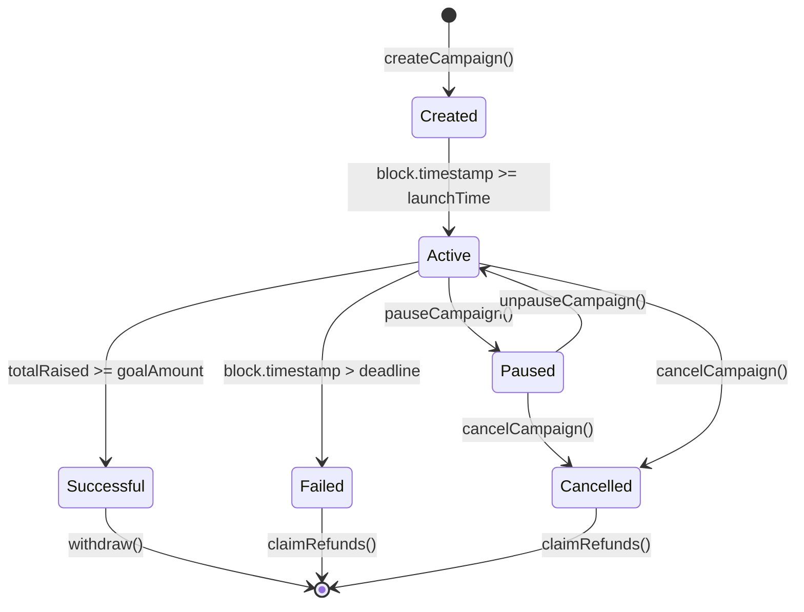

# Campaign Management

Campaigns are the heart of Oak Network. This section covers how campaigns work, their lifecycle, and how to manage them effectively.

## Campaign Structure

### CampaignData

Every campaign is defined by a `CampaignData` struct:

```solidity
struct CampaignData {
    uint256 launchTime;    // When the campaign becomes active
    uint256 deadline;      // When the campaign ends
    uint256 goalAmount;    // Target amount to raise
}
```

### Campaign States

Campaigns can exist in several states:

- **Created**: Campaign created but not yet active
- **Active**: Campaign is live and accepting contributions
- **Paused**: Campaign temporarily suspended
- **Cancelled**: Campaign permanently cancelled
- **Successful**: Campaign reached its goal
- **Failed**: Campaign deadline passed without reaching goal

## Campaign Creation

### Prerequisites

Before creating a campaign, ensure you have:

1. **Valid Creator Address**: Must be a valid Ethereum address
2. **Unique Identifier**: Each campaign needs a unique `bytes32` identifier
3. **Selected Platforms**: At least one platform must be selected
4. **Valid Parameters**: Launch time, deadline, and goal amount must be valid

### Creation Process

```solidity
// 1. Prepare campaign data
CampaignData memory campaignData = CampaignData({
    launchTime: block.timestamp + 1 days,    // Launch in 1 day
    deadline: block.timestamp + 30 days,     // 30-day campaign
    goalAmount: 10000 * 10**18               // $10,000 goal
});

// 2. Select platforms
bytes32[] memory platforms = new bytes32[](2);
platforms[0] = keccak256("platform1");
platforms[1] = keccak256("platform2");

// 3. Create campaign
factory.createCampaign(
    creator,
    identifierHash,
    platforms,
    platformDataKeys,
    platformDataValues,
    campaignData
);
```

### Validation Rules

The protocol enforces several validation rules:

- **Launch Time**: Must be in the future
- **Deadline**: Must be after launch time
- **Goal Amount**: Must be greater than zero
- **Platforms**: Must be listed and valid
- **Identifier**: Must be unique across all campaigns

## Campaign Management

### Parameter Updates

Campaign owners can update certain parameters before the campaign launches:

#### Launch Time Update

```solidity
function updateLaunchTime(uint256 newLaunchTime) external onlyOwner {
    // Can only update before current launch time
    require(block.timestamp < getLaunchTime(), "Campaign already launched");
    require(newLaunchTime > block.timestamp, "Invalid launch time");
    require(newLaunchTime < getDeadline(), "Launch time must be before deadline");
    
    s_campaignData.launchTime = newLaunchTime;
    emit CampaignInfoLaunchTimeUpdated(newLaunchTime);
}
```

#### Deadline Update

```solidity
function updateDeadline(uint256 newDeadline) external onlyOwner {
    // Can only update before launch
    require(block.timestamp < getLaunchTime(), "Campaign already launched");
    require(newDeadline > getLaunchTime(), "Deadline must be after launch");
    
    s_campaignData.deadline = newDeadline;
    emit CampaignInfoDeadlineUpdated(newDeadline);
}
```

#### Goal Amount Update

```solidity
function updateGoalAmount(uint256 newGoalAmount) external onlyOwner {
    // Can only update before launch
    require(block.timestamp < getLaunchTime(), "Campaign already launched");
    require(newGoalAmount > 0, "Goal amount must be positive");
    
    s_campaignData.goalAmount = newGoalAmount;
    emit CampaignInfoGoalAmountUpdated(newGoalAmount);
}
```

### Platform Management

#### Adding Platforms

```solidity
function updateSelectedPlatform(
    bytes32 platformHash,
    bool selection
) external onlyOwner {
    // Can only update before launch
    require(block.timestamp < getLaunchTime(), "Campaign already launched");
    
    // Platform must be listed
    require(
        GLOBAL_PARAMS.checkIfPlatformIsListed(platformHash),
        "Platform not listed"
    );
    
    // Cannot deselect approved platforms
    if (!selection && checkIfPlatformApproved(platformHash)) {
        revert("Cannot deselect approved platform");
    }
    
    s_isSelectedPlatform[platformHash] = selection;
    emit CampaignInfoSelectedPlatformUpdated(platformHash, selection);
}
```

## Campaign Lifecycle Events

### Key Events

```solidity
// Campaign created
event CampaignInfoFactoryCampaignCreated(
    bytes32 indexed identifierHash,
    address indexed campaignAddress
);

// Parameter updates
event CampaignInfoLaunchTimeUpdated(uint256 newLaunchTime);
event CampaignInfoDeadlineUpdated(uint256 newDeadline);
event CampaignInfoGoalAmountUpdated(uint256 newGoalAmount);

// Platform management
event CampaignInfoSelectedPlatformUpdated(
    bytes32 indexed platformHash,
    bool selection
);

event CampaignInfoPlatformInfoUpdated(
    bytes32 indexed platformHash,
    address indexed platformTreasury
);
```

### State Transitions



## Access Control

### Owner Functions

Only the campaign owner can:

- Update campaign parameters (before launch)
- Transfer ownership
- Cancel the campaign

### Admin Functions

Protocol and platform admins can:

- Pause/unpause campaigns
- Cancel campaigns (in emergencies)
- Access campaign data

### Public Functions

Anyone can:

- View campaign information
- Contribute to active campaigns
- Claim refunds (when applicable)

## Best Practices

### Campaign Design

1. **Realistic Goals**: Set achievable funding targets
2. **Appropriate Timeline**: Balance urgency with feasibility
3. **Clear Communication**: Provide detailed campaign information
4. **Platform Selection**: Choose platforms that align with your audience

### Security Considerations

1. **Parameter Validation**: Always validate user inputs
2. **Access Control**: Implement proper permission checks
3. **Emergency Procedures**: Have plans for pausing/cancelling
4. **Regular Monitoring**: Monitor campaign progress and health

### Gas Optimization

1. **Batch Operations**: Group related operations when possible
2. **Efficient Storage**: Use appropriate data types
3. **Event Optimization**: Emit only necessary events
4. **Function Optimization**: Minimize external calls

## Common Patterns

### Campaign Factory Pattern

```solidity
contract MyCampaignFactory {
    ICampaignInfoFactory public oakFactory;
    
    function createMyCampaign(
        address creator,
        string memory name,
        uint256 goal,
        uint256 duration
    ) external {
        // Custom validation
        require(bytes(name).length > 0, "Name required");
        require(goal > 0, "Invalid goal");
        
        // Create campaign
        bytes32 identifier = keccak256(abi.encodePacked(name, creator, block.timestamp));
        CampaignData memory data = CampaignData({
            launchTime: block.timestamp,
            deadline: block.timestamp + duration,
            goalAmount: goal
        });
        
        oakFactory.createCampaign(creator, identifier, platforms, keys, values, data);
    }
}
```

### Campaign Monitoring

```solidity
contract CampaignMonitor {
    function checkCampaignHealth(address campaign) external view returns (bool) {
        ICampaignInfo info = ICampaignInfo(campaign);
        
        // Check if campaign is active
        if (info.paused() || info.cancelled()) {
            return false;
        }
        
        // Check if campaign is within time bounds
        uint256 now = block.timestamp;
        if (now < info.getLaunchTime() || now > info.getDeadline()) {
            return false;
        }
        
        // Check if campaign has reasonable progress
        uint256 raised = info.getTotalRaisedAmount();
        uint256 goal = info.getGoalAmount();
        uint256 progress = (raised * 100) / goal;
        
        // Consider campaign healthy if it has some progress or is early
        return progress > 5 || (now - info.getLaunchTime()) < 7 days;
    }
}
```

## Next Steps

- [Platform Integration](/docs/concepts/platforms) - Learn about platform roles
- [Treasury Models](/docs/concepts/treasuries) - Understand funding mechanisms
- [Integration Guides](/docs/guides/create-campaign) - Practical implementation


