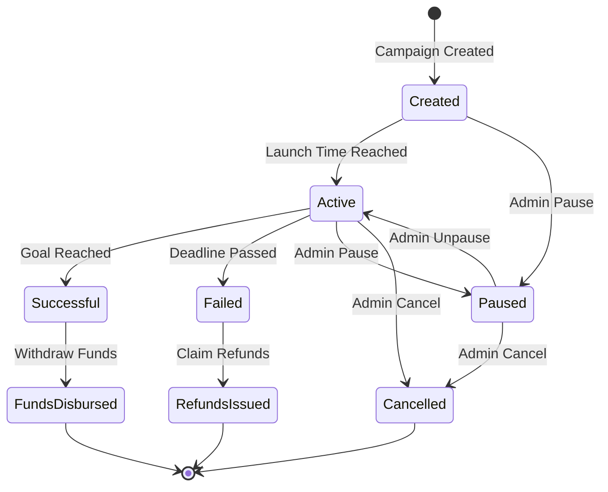

# Core Concepts

Understanding the fundamental concepts of Oak Network is essential for building effective crowdfunding solutions. This section covers the key concepts that power the protocol.

## Campaign Lifecycle

Every campaign on Oak Network follows a structured lifecycle:

import MermaidDiagram from '@site/src/components/MermaidDiagram';

<MermaidDiagram title="Campaign Lifecycle">



</MermaidDiagram>

## Key Entities

### Campaigns

A **Campaign** is the central entity in Oak Network. It represents a crowdfunding project with:

- **Creator**: The address that created the campaign
- **Goal Amount**: The target amount to be raised
- **Launch Time**: When the campaign becomes active
- **Deadline**: When the campaign ends
- **Token**: The ERC-20 token used for contributions
- **Platforms**: Selected platforms for integration

### Platforms

**Platforms** are applications or services that integrate with Oak Network to provide crowdfunding functionality:

- **Platform Hash**: Unique identifier for each platform
- **Platform Admin**: Address with administrative privileges
- **Platform Fee**: Configurable fee percentage
- **Treasury Address**: Where platform fees are sent

### Treasuries

**Treasury contracts** handle the actual fund collection and distribution:

- **All or Nothing**: Funds only released if goal is met
- **Keep What's Raised**: Funds released regardless of goal achievement
- **Custom Models**: Extensible for specialized use cases

## Fee Structure

Oak Network implements a transparent, multi-layered fee structure:

### Protocol Fee (1%)
- **Fixed Rate**: Always 1% of total contributions
- **Destination**: Oak Network ecosystem fund
- **Purpose**: Protocol maintenance and development

### Platform Fee
- **Configurable**: Set by each platform
- **Range**: 0% to maximum allowed by protocol
- **Destination**: Platform treasury address
- **Purpose**: Platform operations and incentives

### Fee Calculation Example

```solidity
// Example: $1000 contribution with 5% platform fee
uint256 contribution = 1000 * 10**18; // $1000 in wei
uint256 protocolFee = contribution * 1 / 100; // $10 (1%)
uint256 platformFee = contribution * 5 / 100; // $50 (5%)
uint256 campaignAmount = contribution - protocolFee - platformFee; // $940
```

## Access Control

Oak Network implements a sophisticated access control system:

### Protocol Admin
- **Global Parameters**: Can modify protocol-wide settings
- **Emergency Functions**: Can pause/cancel campaigns in emergencies
- **Platform Management**: Can add/remove platforms

### Platform Admin
- **Platform-Specific**: Controls only their platform's campaigns
- **Campaign Management**: Can pause/cancel platform campaigns
- **Fee Configuration**: Can set platform-specific fees

### Campaign Owner
- **Campaign Control**: Full control over their campaign
- **Parameter Updates**: Can modify campaign parameters before launch
- **Treasury Management**: Controls fund distribution

## Security Model

### Pausability
- **Campaign Level**: Individual campaigns can be paused
- **Platform Level**: All platform campaigns can be paused
- **Protocol Level**: Entire protocol can be paused

### Cancellation
- **Campaign Owner**: Can cancel their own campaign
- **Platform Admin**: Can cancel platform campaigns
- **Protocol Admin**: Can cancel any campaign

### Refund Mechanism
- **Automatic**: Refunds available when campaigns fail
- **Token-Based**: Uses ERC-721 tokens for refund tracking
- **Gas Efficient**: Optimized for minimal gas costs

## Integration Patterns

### Direct Integration
Applications directly interact with Oak Network contracts:

```solidity
// Create a campaign
ICampaignInfoFactory factory = ICampaignInfoFactory(factoryAddress);
factory.createCampaign(creator, identifier, platforms, data, campaignData);
```

### Platform Integration
Platforms provide a layer of abstraction:

```solidity
// Platform creates campaign on behalf of user
function createCampaignForUser(
    address user,
    CampaignData calldata data
) external onlyPlatformAdmin {
    // Platform-specific logic
    // Call to Oak Network
}
```

### Frontend Integration
Use ethers.js or web3.js for direct contract interaction:

```javascript
// JavaScript integration example
const campaignFactory = new ethers.Contract(factoryAddress, factoryABI, signer);
const tx = await campaignFactory.createCampaign(
  creator,
  identifier,
  platforms,
  platformData,
  campaignData
);
const receipt = await tx.wait();
```

## Next Steps

- [Campaign Management](/docs/concepts/campaigns) - Deep dive into campaign mechanics
- [Platform Integration](/docs/concepts/platforms) - Understanding platform roles
- [Treasury Models](/docs/concepts/treasuries) - Different funding strategies
- [Security Considerations](/docs/concepts/security) - Best practices and considerations
