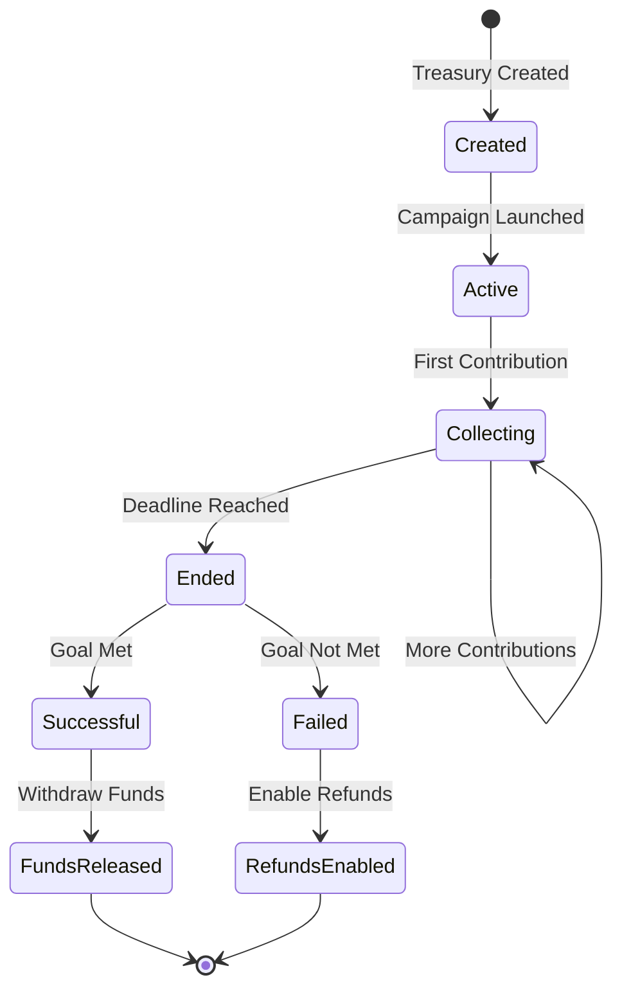

# Treasury Models

Oak Network supports multiple treasury models to accommodate different crowdfunding strategies. This section covers the available treasury types and their use cases.

## Overview

Treasury contracts handle the actual fund collection and distribution in Oak Network. They are responsible for:

- **Fund Collection**: Accepting contributions from backers
- **Fee Distribution**: Distributing protocol and platform fees
- **Success Validation**: Determining if campaigns meet their goals
- **Fund Disbursement**: Releasing funds to campaign creators or backers

## Available Treasury Models

### All or Nothing

The **All or Nothing** model is the most common crowdfunding approach:

- **Success Condition**: Campaign must reach its goal amount
- **Fund Release**: Funds are only released if the goal is met
- **Refund Policy**: All contributions are refunded if the goal is not met
- **Use Cases**: Product launches, creative projects, charitable causes

```solidity
contract AllOrNothing is BaseTreasury, IReward, ERC721Burnable {
    // Campaign must reach goal to be successful
    function _checkSuccessCondition() internal view override returns (bool) {
        return INFO.getTotalRaisedAmount() >= INFO.getGoalAmount();
    }
    
    // Refunds available if campaign fails
    function claimRefund(uint256 tokenId) external {
        require(!_checkSuccessCondition(), "Campaign successful");
        // Refund logic...
    }
}
```

### Keep What's Raised

The **Keep What's Raised** model allows creators to keep all contributions:

- **Success Condition**: Always considered successful
- **Fund Release**: Funds are released regardless of goal achievement
- **Refund Policy**: No refunds available
- **Use Cases**: Ongoing projects, flexible funding, community support

```solidity
contract KeepWhatsRaised is BaseTreasury {
    // Always successful
    function _checkSuccessCondition() internal view override returns (bool) {
        return true;
    }
    
    // No refund mechanism
    // Funds are always released to creator
}
```

## Treasury Architecture

### BaseTreasury

All treasury contracts inherit from `BaseTreasury`:

```solidity
abstract contract BaseTreasury is 
    ICampaignTreasury, 
    PausableCancellable, 
    TimestampChecker, 
    AdminAccessChecker 
{
    // Core treasury functionality
    function disburseFees() public virtual;
    function withdraw() public virtual;
    function _checkSuccessCondition() internal view virtual returns (bool);
}
```

### Key Functions

#### Fund Collection

```solidity
function _collectFunds(address backer, uint256 amount) internal {
    // Transfer tokens from backer
    TOKEN.safeTransferFrom(backer, address(this), amount);
    
    // Calculate fees
    uint256 protocolFee = amount * PROTOCOL_FEE_PERCENT / 100;
    uint256 platformFee = amount * platformFeePercent / 100;
    uint256 campaignAmount = amount - protocolFee - platformFee;
    
    // Update state
    s_pledgedAmount += campaignAmount;
    
    // Emit event
    emit Contribution(backer, amount, campaignAmount);
}
```

#### Fee Distribution

```solidity
function disburseFees() public {
    require(block.timestamp > INFO.getDeadline(), "Campaign not ended");
    require(!s_feesDisbursed, "Fees already disbursed");
    
    uint256 totalRaised = s_pledgedAmount;
    uint256 protocolFee = totalRaised * PROTOCOL_FEE_PERCENT / 100;
    uint256 platformFee = totalRaised * platformFeePercent / 100;
    uint256 creatorAmount = totalRaised - protocolFee - platformFee;
    
    // Transfer fees
    TOKEN.safeTransfer(PROTOCOL_TREASURY, protocolFee);
    TOKEN.safeTransfer(platformTreasury, platformFee);
    
    // Mark fees as disbursed
    s_feesDisbursed = true;
    
    emit FeesDisbursed(protocolFee, platformFee);
}
```

#### Fund Withdrawal

```solidity
function withdraw() public {
    require(block.timestamp > INFO.getDeadline(), "Campaign not ended");
    require(_checkSuccessCondition(), "Campaign not successful");
    require(!s_fundsWithdrawn, "Funds already withdrawn");
    
    uint256 amount = s_pledgedAmount;
    s_fundsWithdrawn = true;
    
    TOKEN.safeTransfer(INFO.owner(), amount);
    emit FundsWithdrawn(amount);
}
```

## Treasury Selection

### Choosing the Right Model

#### All or Nothing

**Best for:**
- Product launches with specific funding targets
- Projects that require minimum funding to succeed
- High-risk, high-reward projects
- Campaigns with clear deliverables

**Example Use Cases:**
- Hardware product development
- Software development with specific milestones
- Creative projects with production costs
- Charitable causes with specific goals

#### Keep What's Raised

**Best for:**
- Ongoing projects and initiatives
- Community support and donations
- Flexible funding goals
- Projects that can scale with available funds

**Example Use Cases:**
- Open source software development
- Community events and meetups
- Research and development
- Flexible creative projects

## Advanced Treasury Features

### Reward System Integration

```solidity
// Reward management in AllOrNothing treasury
contract AllOrNothing is BaseTreasury, IReward {
    mapping(bytes32 => Reward) private s_rewards;
    
    function addRewards(
        bytes32[] calldata rewardNames,
        Reward[] calldata rewards
    ) external onlyCampaignOwner {
        // Add reward tiers
        for (uint256 i = 0; i < rewardNames.length; i++) {
            s_rewards[rewardNames[i]] = rewards[i];
        }
    }
    
    function pledgeForAReward(
        address backer,
        bytes32[] calldata rewardNames
    ) external {
        // Calculate total pledge amount
        uint256 totalAmount = 0;
        for (uint256 i = 0; i < rewardNames.length; i++) {
            totalAmount += s_rewards[rewardNames[i]].rewardValue;
        }
        
        // Process pledge
        _collectFunds(backer, totalAmount);
    }
}
```

### Item Management

```solidity
// Item registry for rewards
contract ItemRegistry {
    mapping(bytes32 => Item) private s_items;
    
    struct Item {
        string name;
        string description;
        uint256 value;
        uint256 quantity;
        bool isActive;
    }
    
    function addItem(
        bytes32 itemId,
        Item calldata item
    ) external onlyCampaignOwner {
        s_items[itemId] = item;
        emit ItemAdded(itemId, item);
    }
    
    function updateItemQuantity(
        bytes32 itemId,
        uint256 newQuantity
    ) external onlyCampaignOwner {
        s_items[itemId].quantity = newQuantity;
        emit ItemQuantityUpdated(itemId, newQuantity);
    }
}
```

### Fiat Integration

```solidity
// Fiat currency support
contract FiatEnabled is BaseTreasury {
    address public priceOracle;
    
    function convertToFiat(uint256 tokenAmount) public view returns (uint256) {
        // Convert token amount to fiat equivalent
        return tokenAmount * getTokenPrice() / 1e18;
    }
    
    function convertFromFiat(uint256 fiatAmount) public view returns (uint256) {
        // Convert fiat amount to token equivalent
        return fiatAmount * 1e18 / getTokenPrice();
    }
    
    function getTokenPrice() public view returns (uint256) {
        // Get current token price from oracle
        return IPriceOracle(priceOracle).getPrice();
    }
}
```

## Treasury Lifecycle

### Creation Phase



### State Transitions

1. **Created**: Treasury contract deployed and initialized
2. **Active**: Campaign is live and accepting contributions
3. **Collecting**: Contributions are being received
4. **Ended**: Campaign deadline has passed
5. **Successful**: Goal was reached, funds can be withdrawn
6. **Failed**: Goal was not reached, refunds are available

## Treasury Management

### Campaign Owner Functions

```javascript
// Treasury management for campaign owners
class TreasuryManager {
  constructor(treasuryAddress) {
    this.treasury = new ethers.Contract(treasuryAddress, TreasuryABI, signer);
  }
  
  // Check if campaign is successful
  async isSuccessful() {
    return await this.treasury.isSuccessful();
  }
  
  // Withdraw funds (if successful)
  async withdrawFunds() {
    const isSuccessful = await this.isSuccessful();
    if (!isSuccessful) {
      throw new Error('Campaign not successful');
    }
    
    return await this.treasury.withdraw();
  }
  
  // Get treasury statistics
  async getStatistics() {
    const totalRaised = await this.treasury.getTotalRaised();
    const goalAmount = await this.treasury.getGoalAmount();
    const successRate = (totalRaised / goalAmount) * 100;
    
    return {
      totalRaised: ethers.utils.formatEther(totalRaised),
      goalAmount: ethers.utils.formatEther(goalAmount),
      successRate: successRate,
      isSuccessful: await this.isSuccessful()
    };
  }
}
```

### Backer Functions

```javascript
// Treasury functions for backers
class BackerManager {
  constructor(treasuryAddress) {
    this.treasury = new ethers.Contract(treasuryAddress, TreasuryABI, signer);
  }
  
  // Make a contribution
  async contribute(amount, rewardTier = null) {
    if (rewardTier) {
      return await this.treasury.pledgeForAReward(
        await signer.getAddress(),
        amount,
        rewardTier
      );
    } else {
      return await this.treasury.pledgeWithoutAReward(
        await signer.getAddress(),
        amount
      );
    }
  }
  
  // Claim refund (if campaign failed)
  async claimRefund(tokenId) {
    const isSuccessful = await this.treasury.isSuccessful();
    if (isSuccessful) {
      throw new Error('Campaign successful, no refunds available');
    }
    
    return await this.treasury.claimRefund(tokenId);
  }
  
  // Get contribution history
  async getContributions(backerAddress) {
    const filter = this.treasury.filters.Contribution(backerAddress);
    const events = await this.treasury.queryFilter(filter);
    
    return events.map(event => ({
      amount: ethers.utils.formatEther(event.args.amount),
      timestamp: new Date(event.args.timestamp * 1000),
      reward: event.args.reward
    }));
  }
}
```

## Best Practices

### Treasury Design

1. **Clear Success Criteria**: Define clear, measurable success conditions
2. **Appropriate Timeline**: Set realistic campaign durations
3. **Fee Structure**: Consider the impact of fees on campaign success
4. **Refund Policy**: Clearly communicate refund policies to backers

### Security Considerations

1. **Access Control**: Implement proper permission checks
2. **Reentrancy Protection**: Use checks-effects-interactions pattern
3. **Input Validation**: Validate all user inputs
4. **Emergency Procedures**: Have plans for pausing/cancelling campaigns

### Gas Optimization

1. **Batch Operations**: Group related operations when possible
2. **Efficient Storage**: Use appropriate data types and storage patterns
3. **Event Optimization**: Emit only necessary events
4. **Function Optimization**: Minimize external calls and computations

## Next Steps

- [Treasury Factory](/docs/contracts/treasury-factory) - Treasury creation and management
- [All or Nothing Treasury](/docs/contracts/all-or-nothing) - Detailed implementation
- [Keep What's Raised Treasury](/docs/contracts/keep-whats-raised) - Alternative model
- [Integration Examples](/docs/guides/treasury-integration) - Practical implementation


