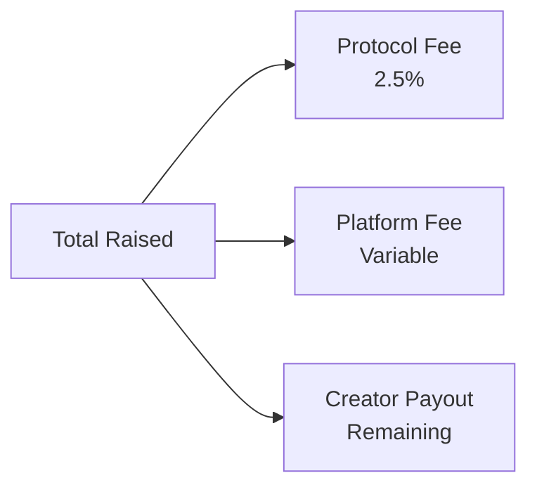
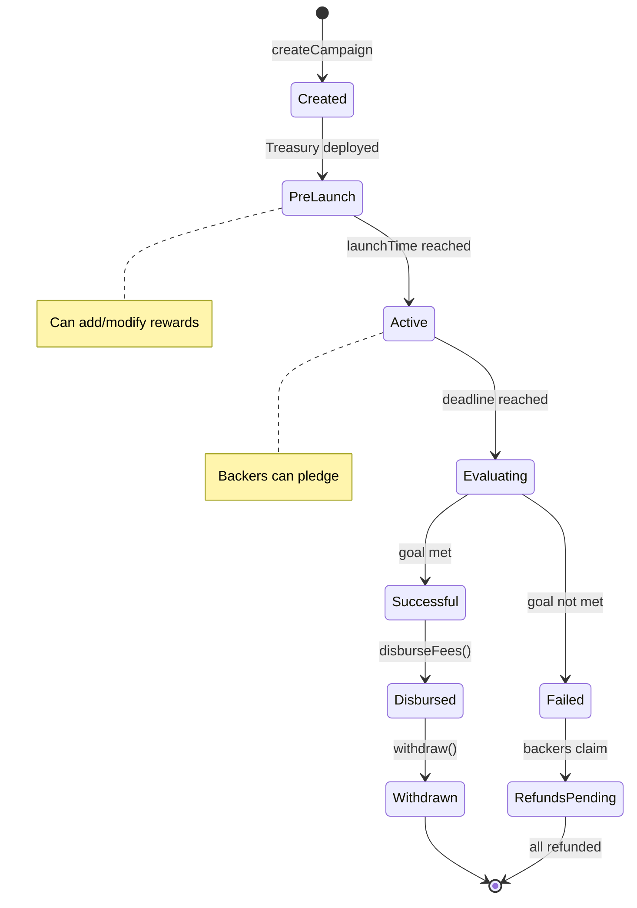

# Integration Flow

Master the full smart contract architecture for crypto-native crowdfunding on Oak Network. This guide covers contract deployment, treasury management, and advanced integration patterns.

import MermaidDiagram from '@site/src/components/MermaidDiagram';

---

## Campaign Creation

### Step 1: Create Campaign

```javascript
const ethers = require('ethers');

// Prepare campaign data
const campaignData = {
  launchTime: Math.floor(Date.now() / 1000) + 86400, // 1 day from now
  deadline: Math.floor(Date.now() / 1000) + 30 * 86400, // 30 days
  goalAmount: ethers.utils.parseUnits('10000', 6), // 10,000 USDC
};

// Generate unique identifier
const identifierHash = ethers.utils.keccak256(
  ethers.utils.toUtf8Bytes('my-campaign-2026')
);

// Create campaign
const tx = await campaignFactory.createCampaign(
  creatorAddress,
  identifierHash,
  [platformHash], // Selected platforms
  [], // Platform data keys
  [], // Platform data values
  campaignData
);

const receipt = await tx.wait();
const campaignAddress = receipt.events.find(
  e => e.event === 'CampaignInfoFactoryCampaignCreated'
).args.campaignAddress;

// Connect to campaign
const campaign = new ethers.Contract(campaignAddress, CampaignInfoABI, signer);
```

Or using the Contracts SDK:

```typescript
import { createOakContractsClient, CHAIN_IDS, keccak256, toHex, getCurrentTimestamp, addDays } from '@oaknetwork/contracts-sdk';

const oak = createOakContractsClient({
  chainId: CHAIN_IDS.CELO_TESTNET_SEPOLIA,
  rpcUrl: 'https://forno.celo-sepolia.celo-testnet.org',
  privateKey: process.env.PRIVATE_KEY!,
});

const factory = oak.campaignInfoFactory('0x...factoryAddress');

const identifierHash = keccak256(toHex('my-campaign-2026'));
const PLATFORM_HASH = keccak256(toHex('my-platform'));
const now = getCurrentTimestamp();

const txHash = await factory.createCampaign({
  creator: '0x...creatorAddress',
  identifierHash,
  selectedPlatformHash: [PLATFORM_HASH],
  campaignData: {
    launchTime: now + 86_400n, // 1 day from now
    deadline: addDays(now, 30), // 30 days
    goalAmount: 10_000_000_000n, // 10,000 USDC (6 decimals)
    currency: toHex('USD', { size: 32 }),
  },
  nftName: 'My Campaign NFT',
  nftSymbol: 'MCN',
  nftImageURI: 'https://example.com/nft.png',
  contractURI: 'https://example.com/contract.json',
});

const receipt = await oak.waitForReceipt(txHash);
const campaignAddress = await factory.identifierToCampaignInfo(identifierHash);
console.log('Campaign deployed at:', campaignAddress);
```

### Step 2: Deploy Treasury

```javascript
// Deploy treasury for this campaign
const treasuryTx = await treasuryFactory.deploy(
  platformHash,
  campaignAddress,
  1, // AllOrNothing implementation ID
  'My Campaign Treasury',
  'MCT'
);

const treasuryReceipt = await treasuryTx.wait();
const treasuryAddress = treasuryReceipt.events.find(
  e => e.event === 'TreasuryDeployed'
).args.treasuryAddress;

// Connect to treasury
const treasury = new ethers.Contract(treasuryAddress, AllOrNothingABI, signer);
```

### Step 3: Configure Rewards

```javascript
// Add reward tiers before launch
const rewards = [
  {
    rewardValue: ethers.utils.parseUnits('50', 6), // $50 minimum
    isRewardTier: true,
    itemId: [ethers.utils.keccak256(ethers.utils.toUtf8Bytes('early-bird'))],
    itemValue: [ethers.utils.parseUnits('50', 6)],
    itemQuantity: [1],
  },
  {
    rewardValue: ethers.utils.parseUnits('100', 6), // $100 minimum
    isRewardTier: true,
    itemId: [
      ethers.utils.keccak256(ethers.utils.toUtf8Bytes('product')),
      ethers.utils.keccak256(ethers.utils.toUtf8Bytes('exclusive-nft')),
    ],
    itemValue: [
      ethers.utils.parseUnits('80', 6),
      ethers.utils.parseUnits('20', 6),
    ],
    itemQuantity: [1, 1],
  },
];

const rewardNames = [
  ethers.utils.keccak256(ethers.utils.toUtf8Bytes('tier-early-bird')),
  ethers.utils.keccak256(ethers.utils.toUtf8Bytes('tier-product')),
];

await treasury.addRewards(rewardNames, rewards);
```

---

## Backer Interactions

### Pledging for a Reward

```javascript
// Backer approves token transfer
const usdc = new ethers.Contract(USDC_ADDRESS, ERC20ABI, backerSigner);
const pledgeAmount = ethers.utils.parseUnits('100', 6);
const shippingFee = ethers.utils.parseUnits('10', 6);

await usdc.approve(treasuryAddress, pledgeAmount.add(shippingFee));

// Backer pledges for a reward
const rewardName = ethers.utils.keccak256(
  ethers.utils.toUtf8Bytes('tier-product')
);

const pledgeTx = await treasury.connect(backerSigner).pledgeForAReward(
  rewardName,
  pledgeAmount,
  shippingFee
);

const pledgeReceipt = await pledgeTx.wait();
const tokenId = pledgeReceipt.events.find(
  e => e.event === 'Receipt'
).args.tokenId;

console.log('Backer received NFT receipt:', tokenId.toString());
```

### Checking Pledge Details

```javascript
// Get pledge info from NFT
const pledgeInfo = await treasury.getPledgeInfo(tokenId);
console.log('Pledge amount:', ethers.utils.formatUnits(pledgeInfo.amount, 6));
console.log('Reward ID:', pledgeInfo.rewardId);
console.log('Shipping fee:', ethers.utils.formatUnits(pledgeInfo.shippingFee, 6));
```

---

## Campaign Settlement

### Successful Campaign

```javascript
// Check campaign status
const deadline = await campaign.getDeadline();
const goal = await campaign.getGoalAmount();
const totalRaised = await treasury.getTotalPledged();

const now = Math.floor(Date.now() / 1000);
const hasEnded = now >= deadline.toNumber();
const isSuccessful = totalRaised.gte(goal);

console.log('Goal:', ethers.utils.formatUnits(goal, 6), 'USDC');
console.log('Raised:', ethers.utils.formatUnits(totalRaised, 6), 'USDC');

if (hasEnded && isSuccessful) {
  // 1. Disburse fees first
  const disburseTx = await treasury.disburseFees();
  await disburseTx.wait();
  console.log('Protocol and platform fees disbursed');
  
  // 2. Withdraw remaining funds
  const withdrawTx = await treasury.withdraw();
  await withdrawTx.wait();
  console.log('Funds withdrawn to creator');
}
```

### Failed Campaign (Refunds)

```javascript
if (hasEnded && !isSuccessful) {
  // Each backer claims their refund with their NFT token ID
  const tokenId = 1; // Backer's NFT token ID
  
  const refundTx = await treasury.connect(backerSigner).claimRefund(tokenId);
  await refundTx.wait();
  
  // NFT is burned, funds returned
  console.log('Refund claimed successfully');
}
```

---

## Fund Distribution

When a campaign succeeds, funds are distributed as follows:

<MermaidDiagram title="Fund Distribution Breakdown">



</MermaidDiagram>

| Recipient | Description | Calculation |
|---|---|---|
| **Protocol Fee** | Oak Network's fee for infrastructure | 2.5% of total raised |
| **Platform Fee** | Fee for the crowdfunding platform | Variable (set by platform) |
| **Creator Payout** | Net funds received by campaign creator | Total - Protocol Fee - Platform Fee |

```javascript
// Fund distribution calculation
const totalRaised = await treasury.getTotalPledged();
const protocolFeePercent = await globalParams.getProtocolFeePercent(); // 250 = 2.5%
const platformFeePercent = await campaign.getPlatformFeePercent();

const protocolFee = totalRaised.mul(protocolFeePercent).div(10000);
const platformFee = totalRaised.mul(platformFeePercent).div(10000);
const creatorPayout = totalRaised.sub(protocolFee).sub(platformFee);

console.log('Protocol fee:', ethers.utils.formatUnits(protocolFee, 6));
console.log('Platform fee:', ethers.utils.formatUnits(platformFee, 6));
console.log('Creator payout:', ethers.utils.formatUnits(creatorPayout, 6));
```

---

## Campaign State Machine

<MermaidDiagram title="Campaign States">



</MermaidDiagram>

---

## Events Reference

| Contract | Event | When Emitted |
|---|---|---|
| **CampaignInfoFactory** | `CampaignInfoFactoryCampaignCreated` | Campaign created |
| **TreasuryFactory** | `TreasuryDeployed` | Treasury deployed |
| **AllOrNothing** | `Receipt` | Backer pledges |
| **AllOrNothing** | `RefundClaimed` | Backer claims refund |
| **AllOrNothing** | `FeesDisbursed` | Fees distributed |
| **AllOrNothing** | `Withdrawn` | Creator withdraws |

### Listening to Events

```javascript
// Listen for new pledges
treasury.on('Receipt', (tokenId, backer, amount, rewardId, event) => {
  console.log(`New pledge: ${backer} pledged ${ethers.utils.formatUnits(amount, 6)} USDC`);
  console.log(`Token ID: ${tokenId.toString()}`);
});

// Listen for refunds
treasury.on('RefundClaimed', (tokenId, backer, amount, event) => {
  console.log(`Refund: ${backer} received ${ethers.utils.formatUnits(amount, 6)} USDC`);
});
```

---

## Multi-Platform Support

A campaign can be listed on multiple platforms simultaneously.

```javascript
// Create campaign for multiple platforms
const platformHashes = [
  ethers.utils.keccak256(ethers.utils.toUtf8Bytes('platform-a')),
  ethers.utils.keccak256(ethers.utils.toUtf8Bytes('platform-b')),
];

const tx = await campaignFactory.createCampaign(
  creatorAddress,
  identifierHash,
  platformHashes, // Multiple platforms
  [],
  [],
  campaignData
);

// Deploy treasury for each platform
for (const platformHash of platformHashes) {
  await treasuryFactory.deploy(
    platformHash,
    campaignAddress,
    1,
    `Treasury ${platformHash}`,
    'TRS'
  );
}
```

---

## Security Considerations

| Risk | Mitigation |
|---|---|
| **Reentrancy** | Checks-effects-interactions pattern in all fund transfers |
| **Front-running** | Pledge amounts are fixed per reward tier |
| **Oracle manipulation** | No external price oracles; all amounts in stablecoin |
| **Access control** | Role-based permissions for admin functions |
| **Upgrade safety** | Immutable core logic; only parameters configurable |

---

## Gas Optimization

| Operation | Estimated Gas | Notes |
|---|---|---|
| `createCampaign` | ~200k | Clone pattern reduces cost |
| `deploy` (treasury) | ~250k | Clone pattern reduces cost |
| `pledgeForAReward` | ~150k | Includes NFT mint |
| `claimRefund` | ~80k | Burns NFT |
| `withdraw` | ~60k | Single transfer |

Use `oak.multicall()` to batch multiple reads into a single RPC call:

```typescript
const [goal, raised, deadline] = await oak.multicall([
  () => ci.getGoalAmount(),
  () => aon.getRaisedAmount(),
  () => ci.getDeadline(),
]);
```

---

## Integration Patterns

### Backend Event Listener

```javascript
// Poll events for backend integration
async function pollEvents(treasury, fromBlock) {
  const events = await treasury.queryFilter(
    treasury.filters.Receipt(),
    fromBlock
  );
  
  for (const event of events) {
    await processNewPledge(event);
  }
  
  return events.length > 0 
    ? events[events.length - 1].blockNumber 
    : fromBlock;
}
```

### Subgraph Integration

```graphql
# Query campaigns
query Campaigns($creator: String!) {
  campaigns(where: { creator: $creator }) {
    id
    creator
    goalAmount
    deadline
    totalRaised
    treasuries {
      id
      pledges {
        backer
        amount
        tokenId
      }
    }
  }
}
```

---

## Contract Function Reference

### CampaignInfoFactory

| Function | Parameters | Returns | Description |
|---|---|---|---|
| `createCampaign` | `creator`, `identifierHash`, `platformHashes[]`, `dataKeys[]`, `dataValues[]`, `campaignData` | Campaign address | Deploy new campaign |

**campaignData struct:**

| Field | Type | Description |
|---|---|---|
| `launchTime` | `uint256` | Unix timestamp when campaign opens for pledges |
| `deadline` | `uint256` | Unix timestamp when campaign ends |
| `goalAmount` | `uint256` | Target funding amount (in token decimals) |

### TreasuryFactory

| Function | Parameters | Returns | Description |
|---|---|---|---|
| `deploy` | `platformHash`, `campaignAddress`, `implementationId`, `name`, `symbol` | Treasury address | Deploy treasury for campaign |
| `registerTreasuryImplementation` | `platformHash`, `implementationId`, `implementationAddress` | — | Register treasury type |
| `approveTreasuryImplementation` | `platformHash`, `implementationId` | — | Approve treasury for use |

### AllOrNothing Treasury

| Function | Parameters | Returns | Description |
|---|---|---|---|
| `addRewards` | `rewardNames[]`, `rewards[]` | — | Configure reward tiers (before launch) |
| `pledgeForAReward` | `rewardName`, `amount`, `shippingFee` | Token ID | Backer pledges and receives NFT |
| `claimRefund` | `tokenId` | — | Backer claims refund (if campaign failed) |
| `disburseFees` | — | — | Distribute protocol and platform fees |
| `withdraw` | — | — | Creator withdraws remaining funds |
| `getTotalPledged` | — | `uint256` | Total amount pledged |
| `getPledgeInfo` | `tokenId` | Pledge struct | Get pledge details by NFT |

**reward struct:**

| Field | Type | Description |
|---|---|---|
| `rewardValue` | `uint256` | Minimum pledge amount for this tier |
| `isRewardTier` | `bool` | Whether this is a reward tier |
| `itemId` | `bytes32[]` | Item identifiers in this reward |
| `itemValue` | `uint256[]` | Value of each item |
| `itemQuantity` | `uint256[]` | Quantity of each item |

### CampaignInfo

| Function | Parameters | Returns | Description |
|---|---|---|---|
| `getDeadline` | — | `uint256` | Campaign end timestamp |
| `getGoalAmount` | — | `uint256` | Target funding amount |
| `getLaunchTime` | — | `uint256` | Campaign start timestamp |
| `getPlatformFeePercent` | — | `uint256` | Platform fee in basis points |

---

## Next Steps

- [Quickstart](/docs/contracts-sdk/quickstart) — Deploy your first campaign
- [Client Configuration](/docs/contracts-sdk/client) — Signer patterns and browser wallets
- [AllOrNothing](/docs/contracts-sdk/all-or-nothing) — Treasury mechanics in detail
- [Events](/docs/contracts-sdk/events) — All contract events and watching
- [Metrics](/docs/contracts-sdk/metrics) — Pre-built aggregation reports
- [Error Handling](/docs/contracts-sdk/error-handling) — Typed error decoding
