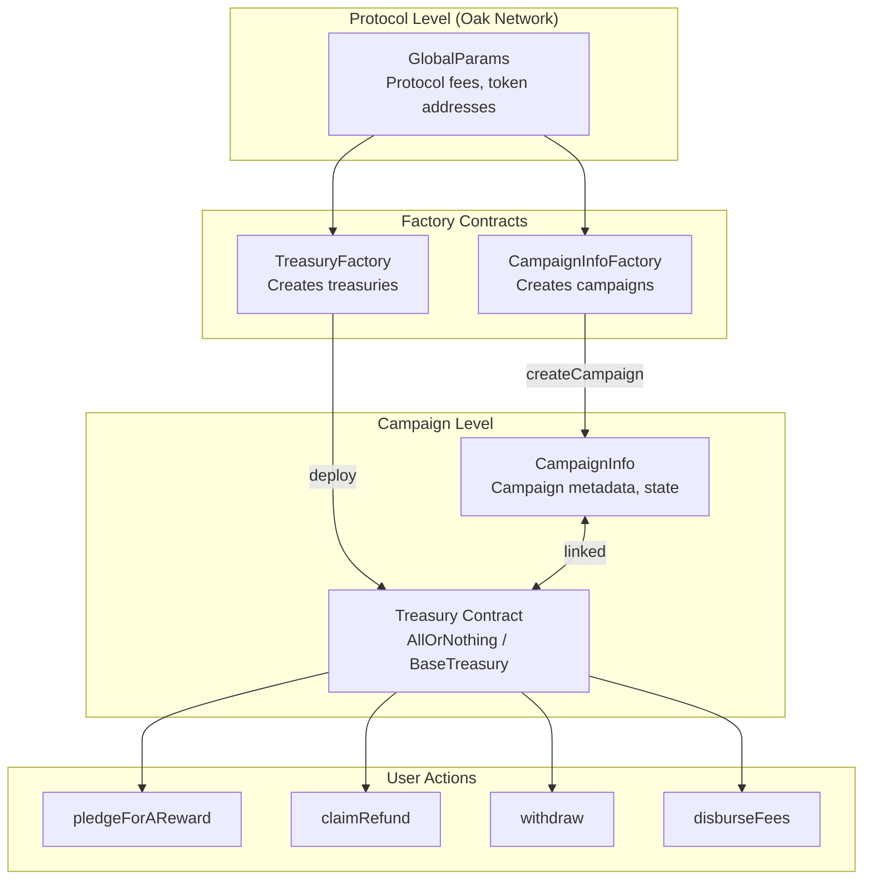

# Contracts SDK

The `@oaknetwork/contracts-sdk` package is a TypeScript SDK for interacting with Oak Network smart contracts. It provides a type-safe client with full read/write access to all Oak protocol contracts, built on top of [viem](https://viem.sh).

import MermaidDiagram from '@site/src/components/MermaidDiagram';

:::tip Testnet first
Start by pointing the SDK at Celo Sepolia testnet (`CHAIN_IDS.CELO_TESTNET_SEPOLIA`) to experiment without risking real funds.
:::

:::tip Deployed addresses
You need deployed contract addresses to use this SDK — including factory addresses (for example `CampaignInfoFactory`, `TreasuryFactory`) and any protocol contracts you call through the client. The SDK interacts with Oak Network smart contracts that must already be deployed on-chain. To get your contract addresses and sandbox environment access, contact our team at [support@oaknetwork.org](mailto:support@oaknetwork.org).
:::

## Smart Contract Architecture

<MermaidDiagram title="Contract Architecture">



</MermaidDiagram>

| Contract | Purpose | Deployed By |
|---|---|---|
| **GlobalParams** | Protocol-level configuration (fees, tokens) | Oak Network |
| **CampaignInfoFactory** | Creates CampaignInfo clones | Oak Network |
| **TreasuryFactory** | Deploys treasury contracts | Oak Network |
| **CampaignInfo** | Campaign metadata and state | Platform (via factory) |
| **BaseTreasury** | Abstract treasury base class | Not deployed directly |
| **AllOrNothing** | Refund-if-failed treasury model | Platform (via factory) |

---

## Highlights

- **Flexible signers** — simple keyed client, read-only RPC client, per-entity or per-call signer overrides, or full viem `PublicClient` / `WalletClient` setup including [Privy](https://www.privy.io/) embedded wallets (see [Client Configuration](/docs/contracts-sdk/client))
- **Entity factories** for every on-chain contract: `oak.globalParams(address)`, `oak.campaignInfo(address)`, etc.
- **Typed reads, writes, and simulations** — every method is fully typed with TypeScript
- **Typed error decoding** — `parseContractError()` turns raw revert data into SDK errors with recovery hints
- **Pure utility exports** — hashing, encoding, time helpers, and chain resolution with zero client dependency
- **Tree-shakeable entry points** — import only what you need: `@oaknetwork/contracts-sdk/utils`, `@oaknetwork/contracts-sdk/client`, etc.

## Quick example

```typescript
import { createOakContractsClient, CHAIN_IDS, keccak256, toHex } from '@oaknetwork/contracts-sdk';

const oak = createOakContractsClient({
  chainId: CHAIN_IDS.CELO_TESTNET_SEPOLIA,
  rpcUrl: 'https://forno.celo-sepolia.celo-testnet.org',
  privateKey: '0x...',
});

const gp = oak.globalParams('0x...');

const admin = await gp.getProtocolAdminAddress();
const fee = await gp.getProtocolFeePercent();

console.log('Admin:', admin, 'Fee:', fee);
```

> See the full walkthrough in the [Quickstart](/docs/contracts-sdk/quickstart) guide.

## Contract entities

The SDK ships 8 contract entity modules. Call the factory method on the client to get a typed entity for a deployed contract address.

| Entity                                                             | Factory                                | What it does                                      |
| ------------------------------------------------------------------ | -------------------------------------- | ------------------------------------------------- |
| [`GlobalParams`](/docs/contracts-sdk/global-params)                | `oak.globalParams(address)`            | Protocol-wide configuration registry              |
| [`CampaignInfoFactory`](/docs/contracts-sdk/campaign-info-factory) | `oak.campaignInfoFactory(address)`     | Deploy new CampaignInfo contracts                 |
| [`CampaignInfo`](/docs/contracts-sdk/campaign-info)                | `oak.campaignInfo(address)`            | Per-campaign configuration and state              |
| [`TreasuryFactory`](/docs/contracts-sdk/treasury-factory)          | `oak.treasuryFactory(address)`         | Deploy treasury contracts for campaigns           |
| [`PaymentTreasury`](/docs/contracts-sdk/payment-treasury)          | `oak.paymentTreasury(address)`         | Fiat-style payments via a payment gateway         |
| [`AllOrNothing`](/docs/contracts-sdk/all-or-nothing)               | `oak.allOrNothingTreasury(address)`    | Crowdfunding — funds released only if goal is met |
| [`KeepWhatsRaised`](/docs/contracts-sdk/keep-whats-raised)         | `oak.keepWhatsRaisedTreasury(address)` | Crowdfunding — creator keeps all funds raised     |
| [`ItemRegistry`](/docs/contracts-sdk/item-registry)                | `oak.itemRegistry(address)`            | Manage items available for purchase in campaigns  |

## Multicall

Batch multiple read calls into a single RPC round-trip. Works across different contract entities:

```typescript
const [platformCount, goalAmount, raisedAmount] = await oak.multicall([
  () => gp.getNumberOfListedPlatforms(),
  () => ci.getGoalAmount(),
  () => aon.getRaisedAmount(),
]);
```

> See the full [Multicall](/docs/contracts-sdk/multicall) guide for standalone usage and cross-contract batching.

## Events

Every contract entity exposes an `events` property for fetching historical logs, decoding raw logs, and watching live events:

```typescript
const gp = oak.globalParams('0x...');

// Fetch historical logs
const logs = await gp.events.getPlatformEnlistedLogs();

// Decode raw logs from a receipt
const decoded = gp.events.decodeLog({ topics: log.topics, data: log.data });

// Watch live events
const unwatch = gp.events.watchPlatformEnlisted((logs) => {
  console.log('New platform enlisted:', logs);
});
```

> See the full [Events](/docs/contracts-sdk/events) guide for all available events per contract.

## Metrics

Pre-built aggregation functions that combine multiple on-chain reads into meaningful reports:

```typescript
import { getPlatformStats, getCampaignSummary, getTreasuryReport } from '@oaknetwork/contracts-sdk/metrics';
```

| Function | Description |
|---|---|
| [`getPlatformStats`](/docs/contracts-sdk/metrics#platform-stats) | Protocol-level statistics from GlobalParams |
| [`getCampaignSummary`](/docs/contracts-sdk/metrics#campaign-summary) | Financial aggregation from a CampaignInfo contract |
| [`getTreasuryReport`](/docs/contracts-sdk/metrics#treasury-report) | Per-treasury financial report for any treasury type |

> See the full [Metrics](/docs/contracts-sdk/metrics) guide.

## Campaign Lifecycle

```mermaid
sequenceDiagram
    participant Creator
    participant CIF as CampaignInfoFactory
    participant CI as CampaignInfo
    participant TF as TreasuryFactory
    participant Treasury as AllOrNothing Treasury
    participant Backer
    participant Protocol as Protocol Admin
    
    rect rgb(40, 40, 60)
    Note over Creator,Treasury: Phase 1: Campaign Setup
    Creator->>CIF: createCampaign(data)
    CIF->>CI: Clone & initialize
    CI-->>CIF: Campaign address
    CIF-->>Creator: Campaign created
    
    Creator->>TF: deploy(campaignInfo, implementationId)
    TF->>Treasury: Clone & initialize
    Treasury-->>TF: Treasury address
    TF->>CI: setPlatformInfo(treasury)
    TF-->>Creator: Treasury deployed
    
    Creator->>Treasury: addRewards(rewards)
    Treasury-->>Creator: Rewards configured
    end
    
    rect rgb(40, 60, 40)
    Note over Creator,Backer: Phase 2: Campaign Active
    Note over CI: Launch time reached
    
    Backer->>Treasury: pledgeForAReward(rewardId, amount, shipping)
    Treasury->>Treasury: Transfer tokens from backer
    Treasury->>Treasury: Mint NFT receipt
    Treasury-->>Backer: Token ID returned
    
    Note over Treasury: More backers pledge...
    end
    
    rect rgb(60, 60, 40)
    Note over Creator,Protocol: Phase 3a: Campaign Succeeds
    Note over CI: Deadline reached, goal met
    
    Creator->>Treasury: disburseFees()
    Treasury->>Protocol: Transfer protocol fee
    Treasury->>CI: Transfer platform fee
    Treasury-->>Creator: Fees disbursed
    
    Creator->>Treasury: withdraw()
    Treasury-->>Creator: Remaining funds transferred
    end
    
    rect rgb(60, 40, 40)
    Note over Creator,Backer: Phase 3b: Campaign Fails
    Note over CI: Deadline reached, goal NOT met
    
    Backer->>Treasury: claimRefund(tokenId)
    Treasury->>Treasury: Burn NFT
    Treasury-->>Backer: Pledge amount returned
    end
```

<MermaidDiagram title="Campaign Lifecycle">



</MermaidDiagram>

---

## Entry points

| Import path                       | Contents                                    |
| --------------------------------- | ------------------------------------------- |
| `@oaknetwork/contracts-sdk`           | Everything — client, types, utils, errors   |
| `@oaknetwork/contracts-sdk/client`    | `createOakContractsClient` only             |
| `@oaknetwork/contracts-sdk/contracts` | Contract entity factories only              |
| `@oaknetwork/contracts-sdk/utils`     | Utility functions only (no client)          |
| `@oaknetwork/contracts-sdk/errors`    | Error classes and `parseContractError` only |
| `@oaknetwork/contracts-sdk/metrics`   | Platform, campaign, and treasury reporting helpers |

## Next up

- [Installation](/docs/contracts-sdk/installation) — install the package and configure your chain
- [Quickstart](/docs/contracts-sdk/quickstart) — your first contract interaction in under 5 minutes
- [Client Configuration](/docs/contracts-sdk/client) — patterns, signer overrides, and resolution order
- [Multicall](/docs/contracts-sdk/multicall) — batch reads into a single RPC call
- [Events](/docs/contracts-sdk/events) — historical logs, decoding, and live event watching
- [Metrics](/docs/contracts-sdk/metrics) — pre-built aggregation reports
- [Error Handling](/docs/contracts-sdk/error-handling) — typed error decoding and recovery hints
