# Crowdfunding Campaign — ArtFund

import MermaidDiagram from '@site/src/components/MermaidDiagram';

> **See also:** [API Reference Examples](/docs/contracts-sdk/examples/overview) — executable TypeScript walkthroughs.

## The Business

**ArtFund** is a creative crowdfunding platform where filmmakers, musicians, and artists raise funds for their projects. Campaigns have a funding goal and a deadline. If the goal is met, the creator receives the funds. If not, every backer gets a full refund. Backers can select reward tiers (digital downloads, signed merchandise, premiere tickets) when pledging.

## Why Oak?

ArtFund needs:

- **All-or-nothing funding** — the creator only gets funds if the goal is met; backers are automatically refunded otherwise
- **Campaign creation** — on-chain campaign with goal, deadline, metadata, and NFT-backed pledges
- **Reward tiers** — backers select a tier when pledging; each tier has a minimum value and can include physical items
- **Pledge tracking** — each pledge mints an NFT representing the backer's contribution and selected reward
- **Transparent progress** — raised amount, goal, deadline all readable on-chain
- **Dual fee model** — protocol fees and platform fees tracked and disbursed separately

## Oak Contracts Used

| Contract | Purpose |
|----------|---------|
| **CampaignInfoFactory** | Creates campaign instances with metadata, goal, and deadline |
| **CampaignInfo** | Stores campaign state, pledge NFTs, platform/fee configuration |
| **TreasuryFactory** | Deploys the AllOrNothing treasury for the campaign |
| **AllOrNothing** | Holds pledged funds; enforces goal-or-refund logic |

## Multi-token support

The protocol is **multi-token**: **`GlobalParams`** defines each **currency** as **one or more ERC-20 addresses** (`initialize` seeds `tokensPerCurrency`; the protocol admin uses **`addTokenToCurrency`** / **`removeTokenFromCurrency`**; **`getTokensForCurrency`** reads the list). **`CampaignInfoFactory`** copies that list onto **`CampaignInfo`** at creation; each pledge passes **`pledgeToken`** and the treasury checks **`CampaignInfo.isTokenAccepted`**. In the SDK, **`campaign.getAcceptedTokens()`** returns the cached whitelist for UI and validation.

Raised balances and refunds are tracked **per token**; amounts use **that token's decimals** (reward values in pledge flows are denormalized from 18-decimal form where applicable). This guide uses **USDC as an example**—substitute any accepted token for your deployment.

## Roles

| Role | Who | On-Chain Functions |
|------|-----|--------------------|
| **Platform Admin** | ArtFund backend | `deploy` (treasury), `pauseTreasury`, `unpauseTreasury`, `cancelTreasury` |
| **Creator (Campaign Owner)** | Maya (indie filmmaker) | `createCampaign`, `addRewards`, `removeReward`, `cancelTreasury` |
| **Backer** | Community supporters | ERC-20 `approve`, `pledgeForAReward`, `pledgeWithoutAReward`, `claimRefund` |
| **Protocol Admin** | Oak protocol | Receives protocol fees (via `disburseFees`) |
| **Any caller** | Anyone | `disburseFees`, `withdraw`, all read functions (`getReward`, `getRaisedAmount`, `paused`, etc.) |

## Integration Flow

### Step 1: Creator submits campaign — create on-chain

> **Role: Any caller** — `createCampaign` is permissionless; the factory validates that the selected platform(s) are enlisted and that campaign timing constraints are met.

Maya wants to fund her documentary "Voices of the Valley." She needs 10,000 USDC and sets a 30-day deadline. ArtFund's backend creates the campaign on-chain.

```typescript
import {
  createOakContractsClient, CHAIN_IDS, toHex, keccak256,
} from "@oaknetwork/contracts-sdk";
import type { CreateCampaignParams } from "@oaknetwork/contracts-sdk";

const oak = createOakContractsClient({
  chainId: CHAIN_IDS.CELO_TESTNET_SEPOLIA,
  rpcUrl: process.env.RPC_URL,
  privateKey: process.env.PLATFORM_PRIVATE_KEY as `0x${string}`,
});

const factory = oak.campaignInfoFactory(CAMPAIGN_INFO_FACTORY_ADDRESS);

const platformHash = keccak256(toHex("ArtFund"));
const identifierHash = keccak256(toHex("voices-of-the-valley-2026"));

const now = BigInt(Math.floor(Date.now() / 1000));

const params: CreateCampaignParams = {
  creator: MAYA_WALLET_ADDRESS,
  identifierHash,
  selectedPlatformHash: [platformHash],
  campaignData: {
    launchTime: now,
    deadline: now + BigInt(30 * 86400),           // 30 days from now
    goalAmount: 10_000_000000n,                     // 10,000 USDC (6 decimals)
    currency: toHex("USD", { size: 32 }),
  },
  nftName: "Voices of the Valley Backers",
  nftSymbol: "VOTV",
  nftImageURI: "ipfs://QmExampleImageHash",
  contractURI: "ipfs://QmExampleContractMetadata",
};

await factory.simulate.createCampaign(params);
const txHash = await factory.createCampaign(params);
const receipt = await oak.waitForReceipt(txHash);
```

### Step 2: Look up the deployed CampaignInfo

> **Role: Any caller** — all read functions are public.

The factory emits a `CampaignCreated` event that carries the new `CampaignInfo` address. Two approaches are available — prefer the receipt-based one when you have the receipt in hand.

**Approach 1 — Decode `CampaignCreated` from the receipt (recommended).** Deterministic and works immediately, regardless of RPC indexing lag.

```typescript
import { CAMPAIGN_INFO_FACTORY_EVENTS } from "@oaknetwork/contracts-sdk";

let campaignInfoAddress: `0x${string}` | undefined;

for (const log of receipt.logs) {
  try {
    const decoded = factory.events.decodeLog({
      topics: log.topics as [`0x${string}`, ...`0x${string}`[]],
      data: log.data as `0x${string}`,
    });

    if (decoded.eventName === CAMPAIGN_INFO_FACTORY_EVENTS.CampaignCreated) {
      campaignInfoAddress = decoded.args?.campaignInfoAddress as `0x${string}`;
      break;
    }
  } catch {
    // Log belongs to a different contract — skip
  }
}
```

**Approach 2 — Look up via `identifierToCampaignInfo` (convenience).** Handy when you only have the identifier hash and did not keep the receipt.

```typescript
const campaignInfoAddress = await factory.identifierToCampaignInfo(identifierHash);
```

Either way, hand the address to the SDK to read campaign state:

```typescript
const campaign = oak.campaignInfo(campaignInfoAddress!);

// Verify campaign details
const [goal, deadline, currency] = await oak.multicall([
  () => campaign.getGoalAmount(),
  () => campaign.getDeadline(),
  () => campaign.getCampaignCurrency(),
]);
```

### Step 3: Deploy the AllOrNothing treasury

> **Role: Platform Admin** — only the platform admin can deploy treasuries via the factory.

ArtFund deploys an AllOrNothing treasury linked to Maya's campaign. The treasury enforces the all-or-nothing rule: if the goal is met by the deadline, the creator withdraws; if not, backers refund.

```typescript
import { TREASURY_FACTORY_EVENTS } from "@oaknetwork/contracts-sdk";

const treasuryFactory = oak.treasuryFactory(TREASURY_FACTORY_ADDRESS);

// Implementation ID 0 = AllOrNothing
const txHash = await treasuryFactory.deploy(
  platformHash, campaignInfoAddress!, 0n,
);
const deployReceipt = await oak.waitForReceipt(txHash);

// Decode the TreasuryDeployed event to discover the treasury address
let treasuryAddress: `0x${string}` | undefined;

for (const log of deployReceipt.logs) {
  try {
    const decoded = treasuryFactory.events.decodeLog({
      topics: log.topics as [`0x${string}`, ...`0x${string}`[]],
      data: log.data as `0x${string}`,
    });
    if (decoded.eventName === TREASURY_FACTORY_EVENTS.TreasuryDeployed) {
      treasuryAddress = decoded.args?.treasuryAddress as `0x${string}`;
      break;
    }
  } catch { /* log from a different contract */ }
}
```

Once deployed, connect to the treasury:

```typescript
const aonTreasury = oak.allOrNothingTreasury(treasuryAddress!);
```

### Step 4: Add reward tiers

> **Role: Creator (Campaign Owner)** — only the campaign owner can add or remove rewards.

Maya defines three reward tiers for backers.

```typescript
import type { TieredReward } from "@oaknetwork/contracts-sdk";

const rewardNames = [
  toHex("digital-download", { size: 32 }),
  toHex("signed-poster",    { size: 32 }),
  toHex("premiere-tickets", { size: 32 }),
];

const rewards: TieredReward[] = [
  {
    rewardValue: 25_000000n,              // Minimum 25 USDC (6 decimals)
    isRewardTier: true,
    itemId: [],
    itemValue: [],
    itemQuantity: [],
  },
  {
    rewardValue: 100_000000n,             // Minimum 100 USDC
    isRewardTier: true,
    itemId: [toHex("signed-poster-item", { size: 32 })],
    itemValue: [50_000000n],
    itemQuantity: [1n],
  },
  {
    rewardValue: 500_000000n,             // Minimum 500 USDC
    isRewardTier: true,
    itemId: [
      toHex("premiere-ticket", { size: 32 }),
      toHex("signed-poster-item", { size: 32 }),
    ],
    itemValue: [200_000000n, 50_000000n],
    itemQuantity: [2n, 1n],
  },
];

await aonTreasury.simulate.addRewards(rewardNames, rewards);
const txHash = await aonTreasury.addRewards(rewardNames, rewards);
await oak.waitForReceipt(txHash);
```

### Step 4b: Read and remove reward tiers

> **Role: Any caller** for `getReward` (read). **Creator (Campaign Owner)** for `removeReward` (write).

ArtFund can verify a reward tier's configuration, and Maya can remove one that's no longer needed.

```typescript
// Read a specific reward tier
const reward = await aonTreasury.getReward(toHex("signed-poster", { size: 32 }));
// reward.rewardValue    — minimum pledge amount (in the campaign token's native decimals)
// reward.isRewardTier   — true for tiered rewards
// reward.itemId         — physical/digital item IDs included
// reward.itemValue      — declared value of each item
// reward.itemQuantity   — quantity of each item

// Remove a reward tier (only before campaign ends, only by campaign owner)
const txHash = await aonTreasury.removeReward(toHex("digital-download", { size: 32 }));
await oak.waitForReceipt(txHash);
```

### Step 5: Backers pledge

> **Role: Backer** — any wallet can pledge. The backer must first approve the treasury to transfer their ERC-20 tokens.

Supporters pledge to Maya's campaign, optionally selecting reward tiers. Before any pledge, the backer must approve the AllOrNothing treasury contract to spend the pledge amount on their behalf. This is a standard ERC-20 approval:

```typescript
import { erc20Abi } from "viem";

const usdc = { address: USDC_TOKEN_ADDRESS, abi: erc20Abi };

// Backer approves the treasury to spend up to 100 USDC
const approveTx = await walletClient.writeContract({
  ...usdc,
  functionName: "approve",
  args: [DEPLOYED_TREASURY_ADDRESS, 100_000000n],
});
await publicClient.waitForTransactionReceipt({ hash: approveTx });
```

**Pledge with a reward tier:**

```typescript
// Backer selects the "signed-poster" tier (100 USDC minimum)
const txHash = await aonTreasury.pledgeForAReward(
  BACKER_ADDRESS,
  USDC_TOKEN_ADDRESS,
  0n,                                           // no shipping fee
  [toHex("signed-poster", { size: 32 })],       // selected reward
);
await oak.waitForReceipt(txHash);
```

**Pledge without a reward:**

```typescript
// Backer pledges 50 USDC with no reward selection
const txHash = await aonTreasury.pledgeWithoutAReward(
  BACKER_ADDRESS,
  USDC_TOKEN_ADDRESS,
  50_000000n,  // 50 USDC (6 decimals)
);
await oak.waitForReceipt(txHash);
```

**Pledge for multiple rewards in a single call:**

The contract supports selecting multiple reward tiers in one pledge. The first element must be a reward tier; subsequent elements can be either tiers or non-tier rewards. The total pledge amount is the sum of all selected rewards' values.

```typescript
const txHash = await aonTreasury.pledgeForAReward(
  BACKER_ADDRESS,
  USDC_TOKEN_ADDRESS,
  10_000000n,                                        // $10 shipping fee
  [
    toHex("signed-poster", { size: 32 }),             // primary reward tier
    toHex("digital-download", { size: 32 }),          // additional reward
  ],
);
await oak.waitForReceipt(txHash);
```

Each pledge mints an NFT to the backer. The NFT carries the pledge metadata (amount, reward, treasury address).

### Step 6: Monitor campaign progress

> **Role: Any caller** — all read functions are public.

ArtFund's campaign page shows live progress.

```typescript
// Treasury reads
const [raised, lifetime, refunded] = await oak.multicall([
  () => aonTreasury.getRaisedAmount(),
  () => aonTreasury.getLifetimeRaisedAmount(),
  () => aonTreasury.getRefundedAmount(),
]);

// Campaign reads
const [goal, deadline, pledgeCount] = await oak.multicall([
  () => campaign.getGoalAmount(),
  () => campaign.getDeadline(),
  () => campaign.getPledgeCount(),
]);

// Progress: raised / goal
// Time remaining: deadline - now
// Total backers: pledgeCount
```

### Step 7: Disburse fees

> **Role: Any caller** — `disburseFees` is permissionless, but it only succeeds after the deadline when the goal is met. Fees are sent to the Protocol Admin and Platform Admin automatically.

Once the deadline has passed and the goal is met, anyone can trigger fee disbursement. This distributes the protocol fee to the Oak Protocol Admin and the platform fee to ArtFund.

```typescript
const txHash = await aonTreasury.disburseFees();
await oak.waitForReceipt(txHash);
```

### Step 8 (Success): Goal met — creator withdraws

> **Role: Any caller** — `withdraw` is permissionless, but it requires `disburseFees` to have been called first. Funds are always sent to the campaign owner (Maya).

If `raised >= goal` when the deadline passes, anyone can trigger the withdrawal. The remaining funds (after fees) are sent to Maya.

```typescript
const txHash = await aonTreasury.withdraw();
await oak.waitForReceipt(txHash);
// Funds are sent to the campaign creator (Maya)
```

### Step 8 (Failure): Goal not met — backers claim refunds

> **Role: Any caller** — `claimRefund` is permissionless, but the refund is always sent to the current NFT owner.

If the deadline passes and the goal was not reached, each backer can claim a refund by providing their pledge NFT token ID. The NFT is burned during the refund.

Before calling `claimRefund`, the backer must approve the treasury to manage their pledge NFT. Pledge NFTs live on the **CampaignInfo** contract, so `approve` is called on the CampaignInfo entity:

```typescript
// Approve the treasury to burn this pledge NFT (NFTs live on CampaignInfo)
const campaign = oak.campaignInfo(CAMPAIGN_INFO_ADDRESS);
await campaign.approve(AON_TREASURY_ADDRESS, tokenId);

// Claim the refund — burns the NFT and returns pledged tokens
const txHash = await aonTreasury.claimRefund(tokenId);
await oak.waitForReceipt(txHash);
// Backer receives their pledge amount back; NFT is burned
```

### Step 9: Pause, unpause, or cancel the treasury

**Pause the treasury:**

> **Role: Platform Admin** — only the platform admin can pause and unpause.

If ArtFund needs to halt operations for compliance or investigation, the platform admin pauses the treasury. While paused, no pledges, refunds, fee disbursement, or withdrawals can occur.

```typescript
const txHash = await aonTreasury.pauseTreasury(toHex("compliance-review", { size: 32 }));
await oak.waitForReceipt(txHash);

// Check pause status (any caller can read)
const isPaused = await aonTreasury.paused();
```

**Unpause the treasury:**

> **Role: Platform Admin**

```typescript
const txHash = await aonTreasury.unpauseTreasury(toHex("review-complete", { size: 32 }));
await oak.waitForReceipt(txHash);
```

**Cancel the treasury permanently:**

> **Role: Platform Admin or Creator (Campaign Owner)** — either party can cancel the treasury.

Cancellation is irreversible. After cancellation, backers can still claim refunds, but no new pledges, fee disbursement, or withdrawals can happen.

```typescript
const txHash = await aonTreasury.cancelTreasury(toHex("campaign-abandoned", { size: 32 }));
await oak.waitForReceipt(txHash);

const isCancelled = await aonTreasury.cancelled();
```

### Reading pledge NFT data

> **Role: Any caller** — all read functions are public.

Pledge NFTs are standard ERC-721 tokens minted by the CampaignInfo contract — **not** by the treasury. All NFT operations (`ownerOf`, `approve`, `balanceOf`, `tokenURI`, etc.) go through the CampaignInfo entity. Backers can manage them using `campaignInfo.approve(...)` and `campaignInfo.setApprovalForAll(...)`. If a pledge NFT is transferred, the new owner becomes eligible to claim the refund (on failure) or holds the reward entitlement.

Each pledge NFT stores on-chain metadata accessible through CampaignInfo:

```typescript
const campaign = oak.campaignInfo(CAMPAIGN_INFO_ADDRESS);

const pledgeData = await campaign.getPledgeData(tokenId);
// pledgeData.backer       — backer wallet address
// pledgeData.reward       — selected reward (bytes32)
// pledgeData.treasury     — treasury address
// pledgeData.tokenAddress — ERC-20 token used
// pledgeData.amount       — pledge amount
// pledgeData.shippingFee  — shipping fee (0n if none)
// pledgeData.tipAmount    — tip amount (0n if none)

const nftOwner = await campaign.ownerOf(tokenId);
const tokenURI = await campaign.tokenURI(tokenId);
```

## Architecture Diagram

```mermaid
sequenceDiagram
    participant Creator as Creator (Maya)
    participant ArtFund as ArtFund (Platform Admin)
    participant Backers
    participant Chain as Blockchain

    rect rgb(40, 40, 60)
    Note over Creator,Chain: Campaign setup
    Creator->>Chain: createCampaign(...)<br/>[Any caller]
    Note over Chain: CampaignInfo deployed
    ArtFund->>Chain: deploy(platformHash, campaignInfo, 0)
    Note over Chain: AllOrNothing treasury deployed
    Creator->>Chain: addRewards(...)<br/>[Campaign Owner]
    Note over Chain: Reward tiers registered
    Creator->>Chain: getReward() / removeReward()<br/>[Anyone / Owner]
    Note over Chain: Reward read or removed
    end

    rect rgb(40, 60, 40)
    Note over Backers,Chain: Pledging
    Backers->>Chain: ERC-20 approve()
    Note over Chain: Treasury approved to spend
    Backers->>Chain: pledgeForAReward()<br/>(single or multi)
    Note over Chain: NFT minted, funds locked
    Backers->>Chain: pledgeWithoutReward()
    Note over Chain: NFT minted, funds locked
    ArtFund->>Chain: pauseTreasury() / unpauseTreasury()<br/>[Platform Admin]
    Note over Chain: Treasury paused/unpaused
    ArtFund->>Chain: cancelTreasury()<br/>[Platform Admin or Campaign Owner]
    Note over Chain: Treasury cancelled
    end

    rect rgb(60, 60, 40)
    Note over Creator,Chain: After deadline — goal met
    ArtFund->>Chain: disburseFees()<br/>[Any caller]
    Note over Chain: Fees → Protocol + Platform
    ArtFund->>Chain: withdraw()<br/>[Any caller]
    Note over Chain: Funds → Creator (Maya)
    end

    rect rgb(60, 40, 40)
    Note over Backers,Chain: After deadline — goal not met
    Backers->>Chain: claimRefund(tokenId)<br/>[Any caller]
    Note over Chain: Refund → NFT owner, NFT burned
    end
```

<MermaidDiagram title="ArtFund Crowdfunding Campaign Flow">



</MermaidDiagram>

## Key Takeaways

- **All-or-nothing is enforced by the contract** — there is no way for the creator to withdraw if the goal is not met
- **ERC-20 approval is required** — backers must `approve` the treasury to transfer tokens before pledging
- **Multi-token campaigns** — each pledge names `pledgeToken`; only addresses whitelisted via `isTokenAccepted` are allowed; raised balances and refunds are per token (native decimals)
- **NFT-backed pledges** give backers a verifiable, transferable proof of their contribution
- **Reward tiers** can be added, read, and removed dynamically by the campaign owner before the campaign ends
- **Multi-reward pledges** — backers can select multiple rewards in a single pledge call
- **Role-based access** — `addRewards`/`removeReward` are owner-only; `pauseTreasury`/`unpauseTreasury` are platform-admin-only; `cancelTreasury` can be called by either; `disburseFees`, `withdraw`, and `claimRefund` are permissionless
- **Pause / cancel controls** — the platform admin can pause operations; both platform admin and campaign owner can permanently cancel
- **`multicall`** combines treasury and campaign reads for efficient dashboard rendering
- **Two-phase fee model** — `disburseFees()` before `withdraw()` ensures fees are handled correctly
- **Campaign metadata** (name, symbol, image URI) makes the pledge NFTs meaningful and displayable in wallets
