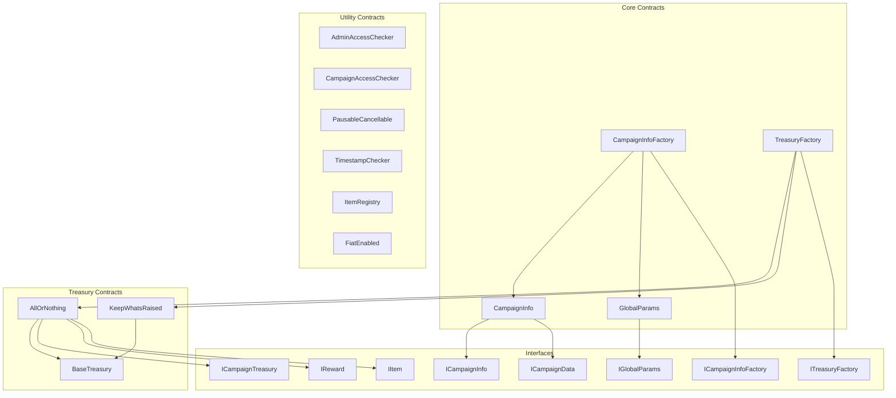
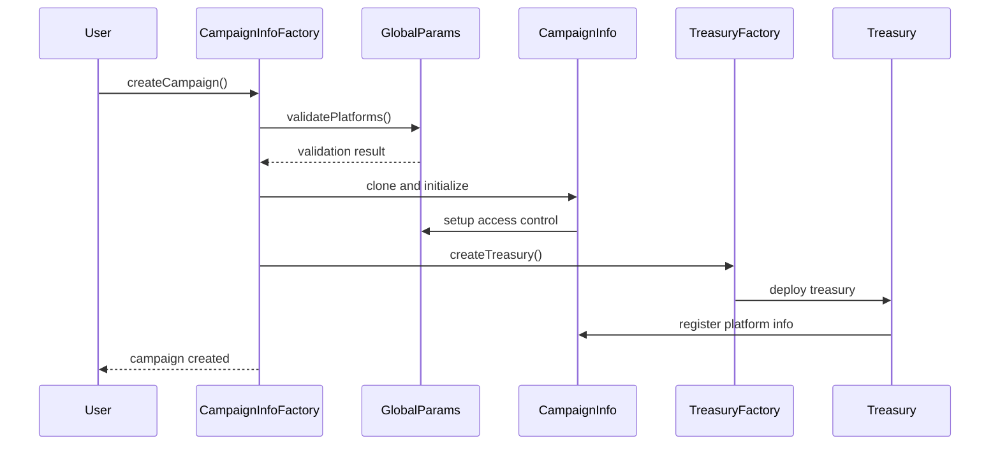
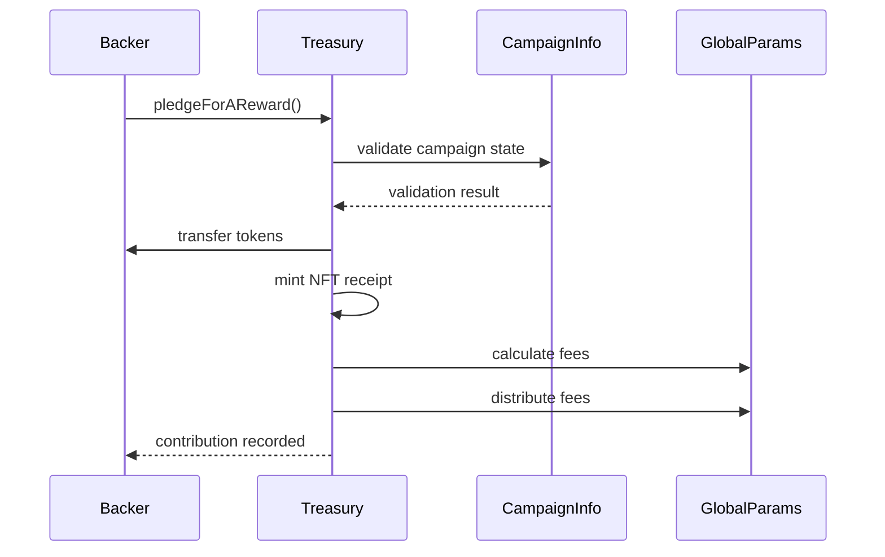

# Smart Contracts Overview

Oak Network's smart contract architecture is designed for modularity, security, and extensibility. This section provides a comprehensive overview of all contracts in the protocol.

## Architecture Diagram

import MermaidDiagram from '@site/src/components/MermaidDiagram';

<MermaidDiagram title="Smart Contract Architecture">



</MermaidDiagram>

## Contract Categories

### Core Contracts

These are the main contracts that define the protocol's functionality:

#### CampaignInfoFactory
- **Purpose**: Factory contract for creating campaign instances
- **Key Functions**: `createCampaign()`, `updateImplementation()`
- **Dependencies**: GlobalParams, CampaignInfo implementation

#### CampaignInfo
- **Purpose**: Stores campaign metadata and manages campaign state
- **Key Functions**: `updateLaunchTime()`, `updateDeadline()`, `updateGoalAmount()`
- **Dependencies**: GlobalParams, various utility contracts

#### GlobalParams
- **Purpose**: Manages protocol-wide parameters and platform configurations
- **Key Functions**: `setProtocolFeePercent()`, `addPlatform()`, `setTokenAddress()`
- **Dependencies**: None (root contract)

#### TreasuryFactory
- **Purpose**: Deploys appropriate treasury contracts for campaigns
- **Key Functions**: `createTreasury()`, `setTreasuryImplementation()`
- **Dependencies**: GlobalParams, treasury implementations

### Treasury Contracts

These contracts handle fund collection and distribution:

#### AllOrNothing
- **Purpose**: Implements "all or nothing" funding model
- **Key Functions**: `pledgeForAReward()`, `withdraw()`, `claimRefund()`
- **Dependencies**: BaseTreasury, IReward, ItemRegistry

#### KeepWhatsRaised
- **Purpose**: Implements "keep what's raised" funding model
- **Key Functions**: `pledge()`, `withdraw()`
- **Dependencies**: BaseTreasury

#### BaseTreasury
- **Purpose**: Abstract base contract for all treasury implementations
- **Key Functions**: `disburseFees()`, `_checkSuccessCondition()`
- **Dependencies**: CampaignInfo, utility contracts

### Utility Contracts

These contracts provide common functionality:

#### AdminAccessChecker
- **Purpose**: Manages protocol and platform admin access
- **Key Functions**: `onlyProtocolAdmin`, `onlyPlatformAdmin`
- **Dependencies**: GlobalParams

#### CampaignAccessChecker
- **Purpose**: Manages campaign-specific access control
- **Key Functions**: `onlyCampaignOwner`, `onlyCampaignAdmin`
- **Dependencies**: CampaignInfo

#### PausableCancellable
- **Purpose**: Provides pausing and cancellation functionality
- **Key Functions**: `pause()`, `unpause()`, `cancel()`
- **Dependencies**: None

#### TimestampChecker
- **Purpose**: Validates time-based conditions
- **Key Functions**: `currentTimeIsLess()`, `currentTimeIsWithinRange()`
- **Dependencies**: None

#### ItemRegistry
- **Purpose**: Manages reward items and inventory
- **Key Functions**: `addItem()`, `updateItem()`, `removeItem()`
- **Dependencies**: None

#### FiatEnabled
- **Purpose**: Provides fiat currency integration capabilities
- **Key Functions**: `convertToFiat()`, `convertFromFiat()`
- **Dependencies**: Price oracle contracts

## Contract Interactions

### Campaign Creation Flow

<MermaidDiagram title="Campaign Creation Flow">



</MermaidDiagram>

### Contribution Flow

<MermaidDiagram title="Contribution Flow">



</MermaidDiagram>

## Data Structures

### CampaignData

```solidity
struct CampaignData {
    uint256 launchTime;    // Campaign launch timestamp
    uint256 deadline;      // Campaign end timestamp
    uint256 goalAmount;    // Target funding amount
}
```

### Reward

```solidity
struct Reward {
    uint256 rewardValue;           // Minimum pledge amount
    bool isRewardTier;            // Whether this is a reward tier
    bytes32[] itemId;             // Associated item IDs
    uint256[] itemValue;          // Item values
    uint256[] itemQuantity;       // Item quantities
}
```

### PlatformInfo

```solidity
struct PlatformInfo {
    address adminAddress;          // Platform admin
    uint256 feePercent;           // Platform fee percentage
    address treasuryAddress;       // Platform treasury
    bool isListed;                // Whether platform is listed
}
```

## Security Considerations

### Access Control

- **Multi-level Access**: Protocol, platform, and campaign-level permissions
- **Role-based Security**: Clear separation of administrative functions
- **Emergency Controls**: Ability to pause/cancel in emergencies

### Reentrancy Protection

- **External Calls**: All external calls are made last
- **State Updates**: State is updated before external calls
- **Checks-Effects-Interactions**: Standard pattern implementation

### Input Validation

- **Parameter Bounds**: All parameters are validated for reasonable ranges
- **Type Safety**: Strong typing throughout the codebase
- **Overflow Protection**: SafeMath operations where needed

## Gas Optimization

### Storage Optimization

- **Packed Structs**: Efficient storage layout
- **Minimal Storage**: Only essential data stored on-chain
- **Event Logging**: Comprehensive event logging for off-chain indexing

### Function Optimization

- **Batch Operations**: Multiple operations in single transaction
- **Efficient Loops**: Optimized iteration patterns
- **Minimal External Calls**: Reduced cross-contract calls

## Deployment Considerations

### Upgradeability

- **Proxy Pattern**: Implementation contracts can be upgraded
- **Immutable Args**: Critical parameters stored in immutable args
- **Version Control**: Clear versioning and migration paths

### Network Compatibility

- **Celo Optimized**: Designed specifically for Celo blockchain
- **Gas Efficient**: Optimized for Celo's gas model
- **Mobile Friendly**: Consideration for mobile DeFi usage

## Testing Strategy

### Unit Tests

- **Individual Functions**: Each function tested in isolation
- **Edge Cases**: Boundary conditions and error cases
- **Mock Contracts**: Isolated testing with mocks

### Integration Tests

- **End-to-End Flows**: Complete user journeys
- **Cross-Contract**: Interactions between contracts
- **Real Scenarios**: Realistic usage patterns

### Security Tests

- **Fuzz Testing**: Random input testing
- **Formal Verification**: Mathematical proof of correctness
- **Audit Preparation**: Security-focused test cases

## Next Steps

- [Contract Reference](/docs/contracts/reference) - Detailed API documentation
- [Deployment Guide](/docs/contracts/deployment) - How to deploy contracts
- [Integration Examples](/docs/guides/integration-examples) - Practical usage examples
