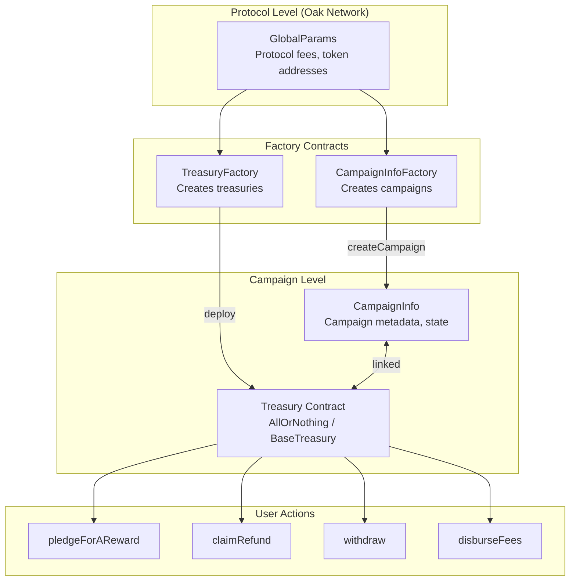
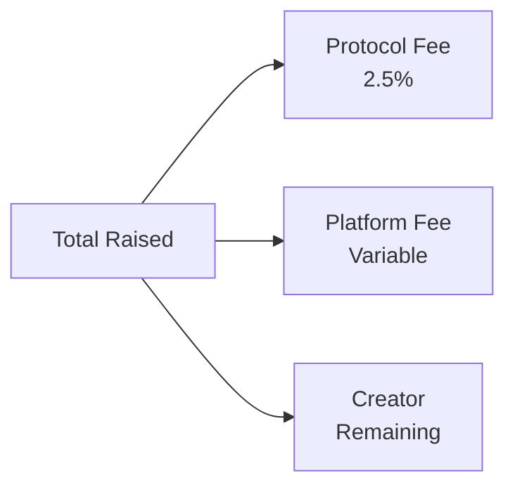
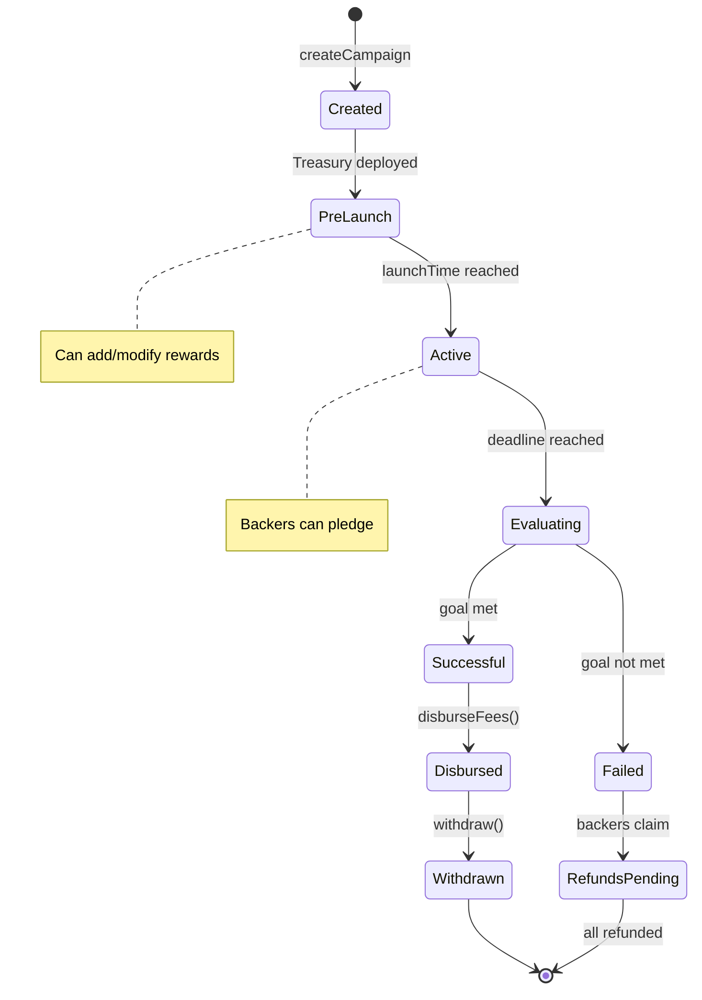

# Contracts SDK Complete Flow

Master the full smart contract architecture for crypto-native crowdfunding on Oak Network. This guide covers contract deployment, treasury management, and advanced integration patterns.

import MermaidDiagram from '@site/src/components/MermaidDiagram';

## Smart Contract Architecture

<MermaidDiagram title="Contract Architecture">



</MermaidDiagram>

---

## Contract Hierarchy

| Contract | Purpose | Deployed By |
|---|---|---|
| **GlobalParams** | Protocol-level configuration (fees, tokens) | Oak Network |
| **CampaignInfoFactory** | Creates CampaignInfo clones | Oak Network |
| **TreasuryFactory** | Deploys treasury contracts | Oak Network |
| **CampaignInfo** | Campaign metadata and state | Platform (via factory) |
| **BaseTreasury** | Abstract treasury base class | Not deployed directly |
| **AllOrNothing** | Refund-if-failed treasury model | Platform (via factory) |

---

## Complete Campaign Lifecycle

```mermaid
sequenceDiagram
    participant Creator
    participant CIF as CampaignInfoFactory
    participant CI as CampaignInfo
    participant TF as TreasuryFactory
    participant Treasury as AllOrNothing Treasury
    participant Backer
    participant Protocol as Protocol Admin
    
    rect rgb(40, 40, 60)
    Note over Creator,Treasury: Phase 1: Campaign Setup
    Creator->>CIF: createCampaign(data)
    CIF->>CI: Clone & initialize
    CI-->>CIF: Campaign address
    CIF-->>Creator: Campaign created
    
    Creator->>TF: deploy(campaignInfo, implementationId)
    TF->>Treasury: Clone & initialize
    Treasury-->>TF: Treasury address
    TF->>CI: setPlatformInfo(treasury)
    TF-->>Creator: Treasury deployed
    
    Creator->>Treasury: addRewards(rewards)
    Treasury-->>Creator: Rewards configured
    end
    
    rect rgb(40, 60, 40)
    Note over Creator,Backer: Phase 2: Campaign Active
    Note over CI: Launch time reached
    
    Backer->>Treasury: pledgeForAReward(rewardId, amount, shipping)
    Treasury->>Treasury: Transfer tokens from backer
    Treasury->>Treasury: Mint NFT receipt
    Treasury-->>Backer: Token ID returned
    
    Note over Treasury: More backers pledge...
    end
    
    rect rgb(60, 60, 40)
    Note over Creator,Protocol: Phase 3a: Campaign Succeeds
    Note over CI: Deadline reached, goal met
    
    Creator->>Treasury: disburseFees()
    Treasury->>Protocol: Transfer protocol fee
    Treasury->>CI: Transfer platform fee
    Treasury-->>Creator: Fees disbursed
    
    Creator->>Treasury: withdraw()
    Treasury-->>Creator: Remaining funds transferred
    end
    
    rect rgb(60, 40, 40)
    Note over Creator,Backer: Phase 3b: Campaign Fails
    Note over CI: Deadline reached, goal NOT met
    
    Backer->>Treasury: claimRefund(tokenId)
    Treasury->>Treasury: Burn NFT
    Treasury-->>Backer: Pledge amount returned
    end
```

<MermaidDiagram title="Campaign Lifecycle">



</MermaidDiagram>

---

## Protocol Setup (One-Time)

This is performed by Oak Network when deploying the protocol.

```javascript
const ethers = require('ethers');

// Deploy GlobalParams
const globalParams = await deployContract('GlobalParams', {
  protocolAdmin: protocolAdminAddress,
  protocolFeePercent: 250, // 2.5% (basis points)
  tokenAddress: USDC_ADDRESS,
});

// Deploy CampaignInfoFactory
const campaignFactory = await deployContract('CampaignInfoFactory', {
  globalParams: globalParams.address,
  campaignImplementation: campaignInfoImpl.address,
});

// Deploy TreasuryFactory
const treasuryFactory = await deployContract('TreasuryFactory', {
  globalParams: globalParams.address,
});

// Register AllOrNothing implementation for a platform
await treasuryFactory.registerTreasuryImplementation(
  platformHash,
  1, // Implementation ID
  allOrNothingImpl.address
);

// Approve implementation for use
await treasuryFactory.approveTreasuryImplementation(platformHash, 1);
```

---

## Campaign Creation

### Step 1: Create Campaign

```javascript
const ethers = require('ethers');

// Prepare campaign data
const campaignData = {
  launchTime: Math.floor(Date.now() / 1000) + 86400, // 1 day from now
  deadline: Math.floor(Date.now() / 1000) + 30 * 86400, // 30 days
  goalAmount: ethers.utils.parseUnits('10000', 6), // 10,000 USDC
};

// Generate unique identifier
const identifierHash = ethers.utils.keccak256(
  ethers.utils.toUtf8Bytes('my-campaign-2026')
);

// Create campaign
const tx = await campaignFactory.createCampaign(
  creatorAddress,
  identifierHash,
  [platformHash], // Selected platforms
  [], // Platform data keys
  [], // Platform data values
  campaignData
);

const receipt = await tx.wait();
const campaignAddress = receipt.events.find(
  e => e.event === 'CampaignInfoFactoryCampaignCreated'
).args.campaignAddress;

// Connect to campaign
const campaign = new ethers.Contract(campaignAddress, CampaignInfoABI, signer);
```

### Step 2: Deploy Treasury

```javascript
// Deploy treasury for this campaign
const treasuryTx = await treasuryFactory.deploy(
  platformHash,
  campaignAddress,
  1, // AllOrNothing implementation ID
  'My Campaign Treasury',
  'MCT'
);

const treasuryReceipt = await treasuryTx.wait();
const treasuryAddress = treasuryReceipt.events.find(
  e => e.event === 'TreasuryDeployed'
).args.treasuryAddress;

// Connect to treasury
const treasury = new ethers.Contract(treasuryAddress, AllOrNothingABI, signer);
```

### Step 3: Configure Rewards

```javascript
// Add reward tiers before launch
const rewards = [
  {
    rewardValue: ethers.utils.parseUnits('50', 6), // $50 minimum
    isRewardTier: true,
    itemId: [ethers.utils.keccak256(ethers.utils.toUtf8Bytes('early-bird'))],
    itemValue: [ethers.utils.parseUnits('50', 6)],
    itemQuantity: [1],
  },
  {
    rewardValue: ethers.utils.parseUnits('100', 6), // $100 minimum
    isRewardTier: true,
    itemId: [
      ethers.utils.keccak256(ethers.utils.toUtf8Bytes('product')),
      ethers.utils.keccak256(ethers.utils.toUtf8Bytes('exclusive-nft')),
    ],
    itemValue: [
      ethers.utils.parseUnits('80', 6),
      ethers.utils.parseUnits('20', 6),
    ],
    itemQuantity: [1, 1],
  },
];

const rewardNames = [
  ethers.utils.keccak256(ethers.utils.toUtf8Bytes('tier-early-bird')),
  ethers.utils.keccak256(ethers.utils.toUtf8Bytes('tier-product')),
];

await treasury.addRewards(rewardNames, rewards);
```

---

## Backer Interactions

### Pledging for a Reward

```javascript
// Backer approves token transfer
const usdc = new ethers.Contract(USDC_ADDRESS, ERC20ABI, backerSigner);
const pledgeAmount = ethers.utils.parseUnits('100', 6);
const shippingFee = ethers.utils.parseUnits('10', 6);

await usdc.approve(treasuryAddress, pledgeAmount.add(shippingFee));

// Backer pledges for a reward
const rewardName = ethers.utils.keccak256(
  ethers.utils.toUtf8Bytes('tier-product')
);

const pledgeTx = await treasury.connect(backerSigner).pledgeForAReward(
  rewardName,
  pledgeAmount,
  shippingFee
);

const pledgeReceipt = await pledgeTx.wait();
const tokenId = pledgeReceipt.events.find(
  e => e.event === 'Receipt'
).args.tokenId;

console.log('Backer received NFT receipt:', tokenId.toString());
```

### Checking Pledge Details

```javascript
// Get pledge info from NFT
const pledgeInfo = await treasury.getPledgeInfo(tokenId);
console.log('Pledge amount:', ethers.utils.formatUnits(pledgeInfo.amount, 6));
console.log('Reward ID:', pledgeInfo.rewardId);
console.log('Shipping fee:', ethers.utils.formatUnits(pledgeInfo.shippingFee, 6));
```

---

## Campaign Settlement

### Successful Campaign

```javascript
// Check campaign status
const deadline = await campaign.getDeadline();
const goal = await campaign.getGoalAmount();
const totalRaised = await treasury.getTotalPledged();

const now = Math.floor(Date.now() / 1000);
const hasEnded = now >= deadline.toNumber();
const isSuccessful = totalRaised.gte(goal);

if (hasEnded && isSuccessful) {
  // 1. Disburse fees first
  const disburseTx = await treasury.disburseFees();
  await disburseTx.wait();
  console.log('Protocol and platform fees disbursed');
  
  // 2. Withdraw remaining funds
  const withdrawTx = await treasury.withdraw();
  await withdrawTx.wait();
  console.log('Funds withdrawn to creator');
}
```

### Failed Campaign (Refunds)

```javascript
if (hasEnded && !isSuccessful) {
  // Each backer claims their refund with their NFT token ID
  const tokenId = 1; // Backer's NFT token ID
  
  const refundTx = await treasury.connect(backerSigner).claimRefund(tokenId);
  await refundTx.wait();
  
  // NFT is burned, funds returned
  console.log('Refund claimed successfully');
}
```

---

## Fee Structure

<MermaidDiagram title="Fee Distribution">



</MermaidDiagram>

```javascript
// Fee calculation example
const totalRaised = await treasury.getTotalPledged();
const protocolFeePercent = await globalParams.getProtocolFeePercent(); // 250 = 2.5%
const platformFeePercent = await campaign.getPlatformFeePercent();

const protocolFee = totalRaised.mul(protocolFeePercent).div(10000);
const platformFee = totalRaised.mul(platformFeePercent).div(10000);
const creatorAmount = totalRaised.sub(protocolFee).sub(platformFee);

console.log('Protocol fee:', ethers.utils.formatUnits(protocolFee, 6));
console.log('Platform fee:', ethers.utils.formatUnits(platformFee, 6));
console.log('Creator receives:', ethers.utils.formatUnits(creatorAmount, 6));
```

---

## Campaign State Machine

<MermaidDiagram title="Campaign States">



</MermaidDiagram>

---

## Events Reference

| Contract | Event | When Emitted |
|---|---|---|
| **CampaignInfoFactory** | `CampaignInfoFactoryCampaignCreated` | Campaign created |
| **TreasuryFactory** | `TreasuryDeployed` | Treasury deployed |
| **AllOrNothing** | `Receipt` | Backer pledges |
| **AllOrNothing** | `RefundClaimed` | Backer claims refund |
| **AllOrNothing** | `FeesDisbursed` | Fees distributed |
| **AllOrNothing** | `Withdrawn` | Creator withdraws |

### Listening to Events

```javascript
// Listen for new pledges
treasury.on('Receipt', (tokenId, backer, amount, rewardId, event) => {
  console.log(`New pledge: ${backer} pledged ${ethers.utils.formatUnits(amount, 6)} USDC`);
  console.log(`Token ID: ${tokenId.toString()}`);
});

// Listen for refunds
treasury.on('RefundClaimed', (tokenId, backer, amount, event) => {
  console.log(`Refund: ${backer} received ${ethers.utils.formatUnits(amount, 6)} USDC`);
});
```

---

## Multi-Platform Support

A campaign can be listed on multiple platforms simultaneously.

```javascript
// Create campaign for multiple platforms
const platformHashes = [
  ethers.utils.keccak256(ethers.utils.toUtf8Bytes('platform-a')),
  ethers.utils.keccak256(ethers.utils.toUtf8Bytes('platform-b')),
];

const tx = await campaignFactory.createCampaign(
  creatorAddress,
  identifierHash,
  platformHashes, // Multiple platforms
  [], // Platform data keys
  [], // Platform data values
  campaignData
);

// Deploy treasury for each platform
for (const platformHash of platformHashes) {
  await treasuryFactory.deploy(
    platformHash,
    campaignAddress,
    1,
    `Treasury ${platformHash}`,
    'TRS'
  );
}
```

---

## Security Considerations

| Risk | Mitigation |
|---|---|
| **Reentrancy** | Checks-effects-interactions pattern in all fund transfers |
| **Front-running** | Pledge amounts are fixed per reward tier |
| **Oracle manipulation** | No external price oracles; all amounts in stablecoin |
| **Access control** | Role-based permissions for admin functions |
| **Upgrade safety** | Immutable core logic; only parameters configurable |

---

## Gas Optimization

| Operation | Estimated Gas | Notes |
|---|---|---|
| `createCampaign` | ~200k | Clone pattern reduces cost |
| `deploy` (treasury) | ~250k | Clone pattern reduces cost |
| `pledgeForAReward` | ~150k | Includes NFT mint |
| `claimRefund` | ~80k | Burns NFT |
| `withdraw` | ~60k | Single transfer |

---

## Integration Patterns

### Subgraph Integration

```graphql
# Query campaigns
query Campaigns($creator: String!) {
  campaigns(where: { creator: $creator }) {
    id
    creator
    goalAmount
    deadline
    totalRaised
    treasuries {
      id
      pledges {
        backer
        amount
        tokenId
      }
    }
  }
}
```

### Webhook-like Pattern

```javascript
// Use event polling for backend integration
async function pollEvents(treasury, fromBlock) {
  const events = await treasury.queryFilter(
    treasury.filters.Receipt(),
    fromBlock
  );
  
  for (const event of events) {
    await processNewPledge(event);
  }
  
  return events.length > 0 
    ? events[events.length - 1].blockNumber 
    : fromBlock;
}
```

---

## Next Steps

- [Contracts SDK Quick Start](/docs/guides/contracts-sdk-quickstart) — Deploy your first campaign
- [Smart Contracts Overview](/docs/contracts/overview) — Technical reference
- [CampaignInfoFactory](/docs/contracts/campaign-info-factory) — Factory details
- [TreasuryFactory](/docs/contracts/treasury-factory) — Treasury deployment
- [AllOrNothing](/docs/contracts/all-or-nothing) — Refund mechanics
