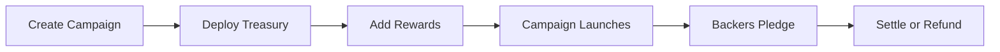

# Contracts SDK Quick Start

Deploy your first on-chain crowdfunding campaign using Oak Network's smart contracts. This guide covers the essential steps to get a campaign running.

import MermaidDiagram from '@site/src/components/MermaidDiagram';

<MermaidDiagram title="Quick Start Flow">



</MermaidDiagram>

---

## Prerequisites

- Node.js 18+
- ethers.js or viem
- A wallet with CELO for gas fees
- Access to Oak Network contract addresses

```bash
pnpm add ethers
```

---

## Step 1: Connect to Contracts

```javascript
const ethers = require('ethers');

// Connect to Celo
const provider = new ethers.providers.JsonRpcProvider('https://forno.celo.org');
const signer = new ethers.Wallet(process.env.PRIVATE_KEY, provider);

// Contract addresses (Celo Mainnet)
const CAMPAIGN_FACTORY = '0x...'; // CampaignInfoFactory
const TREASURY_FACTORY = '0x...'; // TreasuryFactory
const USDC_ADDRESS = '0x...';     // USDC on Celo

// Load contract ABIs
const campaignFactory = new ethers.Contract(
  CAMPAIGN_FACTORY,
  CampaignInfoFactoryABI,
  signer
);

const treasuryFactory = new ethers.Contract(
  TREASURY_FACTORY,
  TreasuryFactoryABI,
  signer
);
```

---

## Step 2: Create Campaign

```javascript
// Prepare campaign data
const campaignData = {
  launchTime: Math.floor(Date.now() / 1000) + 86400, // Launches in 1 day
  deadline: Math.floor(Date.now() / 1000) + 30 * 86400, // 30 day campaign
  goalAmount: ethers.utils.parseUnits('5000', 6), // 5,000 USDC goal
};

// Generate unique identifier
const identifierHash = ethers.utils.keccak256(
  ethers.utils.toUtf8Bytes(`my-campaign-${Date.now()}`)
);

// Create campaign
const tx = await campaignFactory.createCampaign(
  signer.address,        // Creator address
  identifierHash,        // Unique ID
  [platformHash],        // Selected platforms
  [],                    // Platform data keys
  [],                    // Platform data values
  campaignData
);

const receipt = await tx.wait();
const campaignAddress = receipt.events.find(
  e => e.event === 'CampaignInfoFactoryCampaignCreated'
).args.campaignAddress;

console.log('Campaign created:', campaignAddress);
```

---

## Step 3: Deploy Treasury

```javascript
// Deploy AllOrNothing treasury for this campaign
const treasuryTx = await treasuryFactory.deploy(
  platformHash,
  campaignAddress,
  1, // AllOrNothing implementation ID
  'My Campaign Treasury',
  'MCT'
);

const treasuryReceipt = await treasuryTx.wait();
const treasuryAddress = treasuryReceipt.events.find(
  e => e.event === 'TreasuryDeployed'
).args.treasuryAddress;

console.log('Treasury deployed:', treasuryAddress);

// Connect to treasury
const treasury = new ethers.Contract(treasuryAddress, AllOrNothingABI, signer);
```

---

## Step 4: Add Rewards

```javascript
// Define reward tiers
const rewards = [
  {
    rewardValue: ethers.utils.parseUnits('25', 6), // $25 minimum
    isRewardTier: true,
    itemId: [ethers.utils.keccak256(ethers.utils.toUtf8Bytes('thank-you'))],
    itemValue: [ethers.utils.parseUnits('25', 6)],
    itemQuantity: [1],
  },
  {
    rewardValue: ethers.utils.parseUnits('100', 6), // $100 minimum
    isRewardTier: true,
    itemId: [ethers.utils.keccak256(ethers.utils.toUtf8Bytes('product'))],
    itemValue: [ethers.utils.parseUnits('100', 6)],
    itemQuantity: [1],
  },
];

const rewardNames = [
  ethers.utils.keccak256(ethers.utils.toUtf8Bytes('tier-supporter')),
  ethers.utils.keccak256(ethers.utils.toUtf8Bytes('tier-backer')),
];

// Add rewards (must be before launch)
await treasury.addRewards(rewardNames, rewards);
console.log('Rewards added');
```

---

## Step 5: Backer Pledges

```javascript
// Backer's code
const backerSigner = new ethers.Wallet(BACKER_PRIVATE_KEY, provider);
const usdc = new ethers.Contract(USDC_ADDRESS, ERC20ABI, backerSigner);

const pledgeAmount = ethers.utils.parseUnits('100', 6);
const shippingFee = ethers.utils.parseUnits('0', 6); // No shipping

// Approve USDC transfer
await usdc.approve(treasuryAddress, pledgeAmount);

// Pledge for a reward
const rewardName = ethers.utils.keccak256(
  ethers.utils.toUtf8Bytes('tier-backer')
);

const pledgeTx = await treasury.connect(backerSigner).pledgeForAReward(
  rewardName,
  pledgeAmount,
  shippingFee
);

const pledgeReceipt = await pledgeTx.wait();
const tokenId = pledgeReceipt.events.find(
  e => e.event === 'Receipt'
).args.tokenId;

console.log('Pledge successful! NFT Token ID:', tokenId.toString());
```

---

## Step 6: Campaign Settlement

```javascript
const campaign = new ethers.Contract(campaignAddress, CampaignInfoABI, signer);

// Check campaign status
const deadline = await campaign.getDeadline();
const goal = await campaign.getGoalAmount();
const totalRaised = await treasury.getTotalPledged();

const now = Math.floor(Date.now() / 1000);
const hasEnded = now >= deadline.toNumber();
const isSuccessful = totalRaised.gte(goal);

console.log('Goal:', ethers.utils.formatUnits(goal, 6), 'USDC');
console.log('Raised:', ethers.utils.formatUnits(totalRaised, 6), 'USDC');
console.log('Successful:', isSuccessful);

if (hasEnded && isSuccessful) {
  // Campaign succeeded - creator withdraws
  await treasury.disburseFees();
  await treasury.withdraw();
  console.log('Funds withdrawn to creator!');
  
} else if (hasEnded && !isSuccessful) {
  // Campaign failed - backers claim refunds
  const tokenId = 1; // Backer's NFT token ID
  await treasury.connect(backerSigner).claimRefund(tokenId);
  console.log('Refund claimed!');
}
```

---

## Complete Example

```javascript
const ethers = require('ethers');

async function createCampaign() {
  // Setup
  const provider = new ethers.providers.JsonRpcProvider(RPC_URL);
  const signer = new ethers.Wallet(PRIVATE_KEY, provider);
  
  const campaignFactory = new ethers.Contract(
    CAMPAIGN_FACTORY,
    CampaignInfoFactoryABI,
    signer
  );
  
  const treasuryFactory = new ethers.Contract(
    TREASURY_FACTORY,
    TreasuryFactoryABI,
    signer
  );

  // 1. Create campaign
  const campaignData = {
    launchTime: Math.floor(Date.now() / 1000) + 86400,
    deadline: Math.floor(Date.now() / 1000) + 30 * 86400,
    goalAmount: ethers.utils.parseUnits('5000', 6),
  };
  
  const identifierHash = ethers.utils.keccak256(
    ethers.utils.toUtf8Bytes(`campaign-${Date.now()}`)
  );

  const createTx = await campaignFactory.createCampaign(
    signer.address,
    identifierHash,
    [platformHash],
    [],
    [],
    campaignData
  );
  
  const createReceipt = await createTx.wait();
  const campaignAddress = createReceipt.events.find(
    e => e.event === 'CampaignInfoFactoryCampaignCreated'
  ).args.campaignAddress;

  // 2. Deploy treasury
  const treasuryTx = await treasuryFactory.deploy(
    platformHash,
    campaignAddress,
    1,
    'Campaign Treasury',
    'CT'
  );
  
  const treasuryReceipt = await treasuryTx.wait();
  const treasuryAddress = treasuryReceipt.events.find(
    e => e.event === 'TreasuryDeployed'
  ).args.treasuryAddress;

  const treasury = new ethers.Contract(treasuryAddress, AllOrNothingABI, signer);

  // 3. Add rewards
  const rewards = [{
    rewardValue: ethers.utils.parseUnits('50', 6),
    isRewardTier: true,
    itemId: [ethers.utils.keccak256(ethers.utils.toUtf8Bytes('product'))],
    itemValue: [ethers.utils.parseUnits('50', 6)],
    itemQuantity: [1],
  }];
  
  const rewardNames = [
    ethers.utils.keccak256(ethers.utils.toUtf8Bytes('tier-main'))
  ];

  await treasury.addRewards(rewardNames, rewards);

  return {
    campaignAddress,
    treasuryAddress,
    identifierHash,
  };
}

createCampaign().then(console.log).catch(console.error);
```

---

## Key Concepts

| Concept | Description |
|---|---|
| **CampaignInfo** | Stores campaign metadata (goal, deadline, platforms) |
| **Treasury** | Holds funds, manages rewards, handles settlements |
| **AllOrNothing** | Treasury type where backers get refunds if goal isn't met |
| **NFT Receipt** | ERC721 token proving a backer's pledge |
| **Reward Tier** | Minimum pledge amount to receive specific rewards |

---

## Next Steps

- [Contracts SDK Complete Flow](/docs/guides/contracts-sdk-complete) — Full contract architecture
- [Smart Contracts Overview](/docs/contracts/overview) — Technical reference
- [AllOrNothing Contract](/docs/contracts/all-or-nothing) — Treasury details
- [CampaignInfoFactory](/docs/contracts/campaign-info-factory) — Campaign creation
