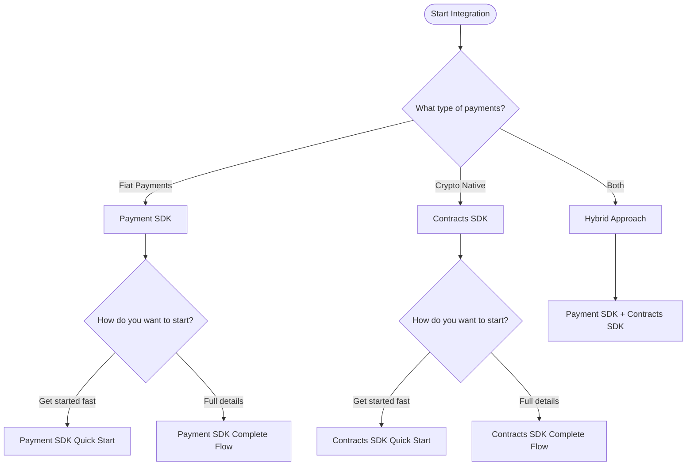
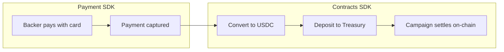

# Choose Your Integration Path

Oak Network provides payment infrastructure for crowdfunding platforms. Choose the integration path that fits your needs.

import MermaidDiagram from '@site/src/components/MermaidDiagram';

<MermaidDiagram title="Integration Decision Tree">

</MermaidDiagram>

---

## Payment SDK

Use the Payment SDK to collect fiat payments (card, PIX, bank transfer) from backers and pay out campaign creators. Supports automatic conversion to/from crypto.

| Guide | Time | What You'll Learn |
|---|---|---|
| [**Payment SDK Quick Start**](/docs/guides/payment-sdk-quickstart) | 10 min | 6-step universal flow to integrate payments |
| [**Payment SDK Complete Flow**](/docs/guides/payment-sdk-complete) | 30 min | Detailed provider-specific flows (US, Brazil), all operations |

### When to Use

- Accepting card payments from backers
- Processing PIX payments (Brazil)
- Paying out creators to bank accounts
- Converting fiat to/from crypto (on-ramp/off-ramp)
- Recurring subscriptions

### Supported Providers

| Region | Payment Provider | Crypto Provider | Currencies |
|---|---|---|---|
| **United States** | Stripe | Bridge | USD ↔ USDC |
| **Brazil** | PagarMe | Avenia | BRL ↔ BRLA |

---

## Contracts SDK

Use the Contracts SDK for crypto-native crowdfunding with on-chain campaign management, treasury contracts, and transparent fund handling.

| Guide | Time | What You'll Learn |
|---|---|---|
| [**Contracts SDK Quick Start**](/docs/guides/contracts-sdk-quickstart) | 15 min | Deploy a campaign and accept contributions |
| [**Contracts SDK Complete Flow**](/docs/guides/contracts-sdk-complete) | 45 min | Full contract architecture, treasury management, settlements |

### When to Use

- Crypto-native campaigns (USDC, cUSD)
- On-chain transparency and auditability
- All-or-nothing funding models
- NFT-based contribution receipts
- Decentralized campaign management

### Contract Architecture

| Contract | Purpose |
|---|---|
| **CampaignInfoFactory** | Creates campaign instances |
| **CampaignInfo** | Stores campaign metadata and state |
| **TreasuryFactory** | Deploys treasury contracts |
| **AllOrNothing** | Manages funds with refund-if-failed model |

---

## Hybrid Approach

Combine both SDKs: use the Payment SDK to collect fiat payments, then settle funds on-chain using smart contracts.

<MermaidDiagram title="Hybrid Flow">

</MermaidDiagram>

This approach gives you:
- Familiar payment methods for backers (card, PIX)
- On-chain transparency for campaign funds
- Decentralized settlement and refunds

---

## Quick Comparison

| Feature | Payment SDK | Contracts SDK |
|---|---|---|
| **Payment Methods** | Card, PIX, Bank Transfer | USDC, cUSD, ERC-20 |
| **KYC Required** | Yes (for creators) | No |
| **Settlement** | Off-chain (provider) | On-chain (smart contract) |
| **Refunds** | Manual via API | Automatic if campaign fails |
| **Transparency** | Provider dashboard | Blockchain explorer |
| **Best For** | Traditional platforms | Crypto-native platforms |

---

## Next Steps

Choose your path and get started:

- [Payment SDK Quick Start](/docs/guides/payment-sdk-quickstart) — Fastest way to integrate fiat payments
- [Payment SDK Complete Flow](/docs/guides/payment-sdk-complete) — Deep dive into all Payment SDK features
- [Contracts SDK Quick Start](/docs/guides/contracts-sdk-quickstart) — Deploy your first on-chain campaign
- [Contracts SDK Complete Flow](/docs/guides/contracts-sdk-complete) — Master the full contract architecture
