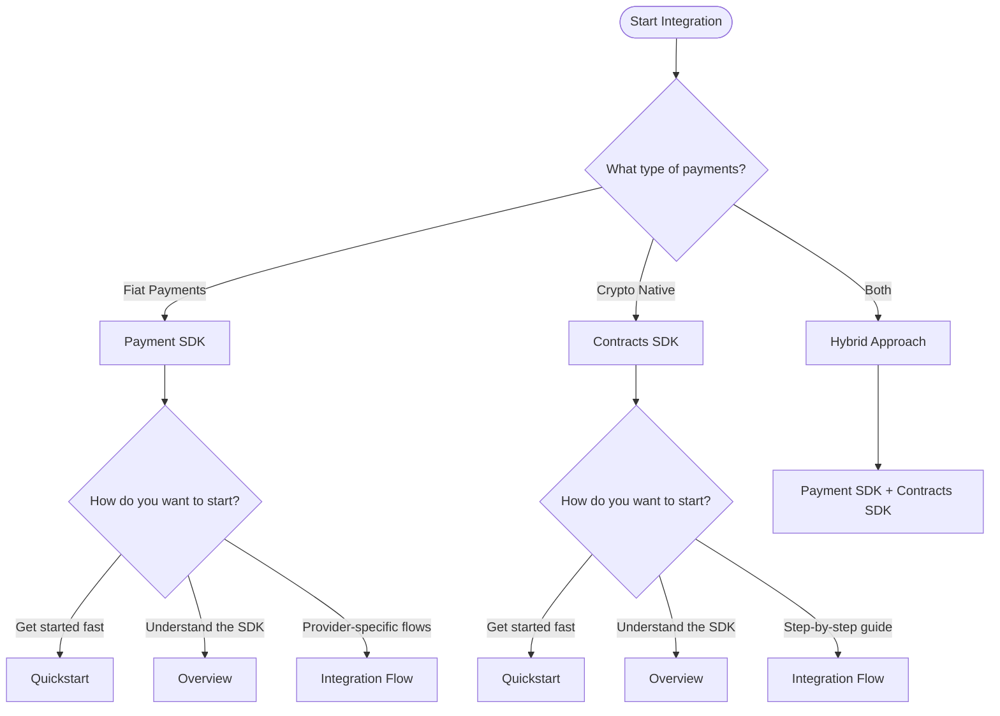
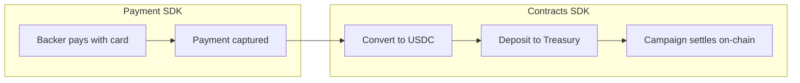

# Choose Your Integration Path

Oak Network provides payment infrastructure for crowdfunding platforms. Choose the integration path that fits your needs.

import MermaidDiagram from '@site/src/components/MermaidDiagram';

<MermaidDiagram title="Integration Decision Tree">

```mermaid
flowchart TD
    Start([Start Integration]) --> Q1{What type of payments?}
    
    Q1 -->|Fiat Payments| SDK[Payment SDK]
    Q1 -->|Crypto Native| Contracts[Contracts SDK]
    Q1 -->|Both| Hybrid[Hybrid Approach]
    
    SDK --> SDKChoice{How do you want to start?}
    SDKChoice -->|Get started fast| SDKQuick[Quickstart]
    SDKChoice -->|Understand the SDK| SDKFull[Overview]
    SDKChoice -->|Provider-specific flows| SDKFlow[Integration Flow]
    
    Contracts --> ContractChoice{How do you want to start?}
    ContractChoice -->|Get started fast| ContractQuick[Quickstart]
    ContractChoice -->|Understand the SDK| ContractFull[Overview]
    ContractChoice -->|Step-by-step guide| ContractFlow[Integration Flow]
    
    Hybrid --> HybridFlow[Payment SDK + Contracts SDK]
```

</MermaidDiagram>

---

## Payment SDK

Use the Payment SDK to collect fiat payments (card, PIX, bank transfer) from backers and pay out campaign creators. Supports automatic conversion to/from crypto.

| Guide | Time | What You'll Learn |
|---|---|---|
| [**Quickstart**](/docs/sdk/quickstart) | 5 min | Install, authenticate, first API call |
| [**Complete Guide**](/docs/sdk/overview) | 30 min | All services and operations |
| [**Integration Flow**](/docs/sdk/integration-flow) | 45 min | US/Brazil provider flows, subscriptions, webhook events, status reference |

### When to Use

- Accepting card payments from backers
- Processing PIX payments (Brazil)
- Paying out creators to bank accounts
- Converting fiat to/from crypto (on-ramp/off-ramp)
- Recurring subscriptions

### Supported Providers

| Region | Payment Provider | Crypto Provider | Currencies |
|---|---|---|---|
| **United States** | Stripe | Bridge | USD ↔ USDC |
| **Brazil** | PagarMe | N/A | BRL ↔ BRLA |

---

## Contracts SDK

Use the Contracts SDK for crypto-native crowdfunding with on-chain campaign management, treasury contracts, and transparent fund handling.

| Guide | Time | What You'll Learn |
|---|---|---|
| [**Quickstart**](/docs/contracts-sdk/quickstart) | 15 min | Deploy a campaign and accept contributions |
| [**Complete Guide**](/docs/contracts-sdk/overview) | 45 min | Full contract architecture, treasury management, settlements |
| [**Integration Flow**](/docs/contracts-sdk/integration-flow) | 60 min | Campaign creation, backer interactions, settlement, security, gas optimization |

### When to Use

- Crypto-native campaigns (USDC, cUSD)
- On-chain transparency and auditability
- All-or-nothing funding models
- NFT-based contribution receipts
- Decentralized campaign management

### Contract Architecture

| Contract | Purpose |
|---|---|
| **CampaignInfoFactory** | Creates campaign instances |
| **CampaignInfo** | Stores campaign metadata and state |
| **TreasuryFactory** | Deploys treasury contracts |
| **AllOrNothing** | Manages funds with refund-if-failed model |

---

## Hybrid Approach

Combine both SDKs: use the Payment SDK to collect fiat payments, then settle funds on-chain using smart contracts.

<MermaidDiagram title="Hybrid Flow">

```mermaid
flowchart LR
    subgraph Fiat["Payment SDK"]
        Backer[Backer pays with card]
        Capture[Payment captured]
    end
    
    subgraph Crypto["Contracts SDK"]
        OnRamp[Convert to USDC]
        Treasury[Deposit to Treasury]
        Settle[Campaign settles on-chain]
    end
    
    Backer --> Capture
    Capture --> OnRamp
    OnRamp --> Treasury
    Treasury --> Settle
```

</MermaidDiagram>

### When to Use

- Accepting fiat payments but settling funds on-chain
- Providing on-chain transparency while supporting traditional payment methods
- Platforms transitioning from fiat-only to crypto-enabled
- Campaigns that want blockchain auditability with familiar checkout experiences

### Benefits

- Familiar payment methods for backers (card, PIX)
- On-chain transparency for campaign funds
- Decentralized settlement and refunds

---

## Quick Comparison

| Feature | Payment SDK | Contracts SDK |
|---|---|---|
| **Payment Methods** | Card, PIX, Bank Transfer | USDC, cUSD, ERC-20 |
| **KYC Required** | Yes (for creators) | No |
| **Settlement** | Off-chain (provider) | On-chain (smart contract) |
| **Refunds** | Manual via API | Automatic if campaign fails |
| **Transparency** | Provider dashboard | Blockchain explorer |
| **Best For** | Traditional platforms | Crypto-native platforms |

---

## Next Steps

Choose your path and get started:

- [Payment SDK Quickstart](/docs/sdk/quickstart) — Fastest way to integrate fiat payments
- [Payment SDK Overview](/docs/sdk/overview) — All services and operations
- [Payment SDK Integration Flow](/docs/sdk/integration-flow) — US/Brazil provider flows, subscriptions, webhook events
- [Contracts SDK Quickstart](/docs/contracts-sdk/quickstart) — Deploy your first on-chain campaign
- [Contracts SDK Overview](/docs/contracts-sdk/overview) — Full contract architecture
- [Contracts SDK Integration Flow](/docs/contracts-sdk/integration-flow) — Campaign creation, backer interactions, settlement
