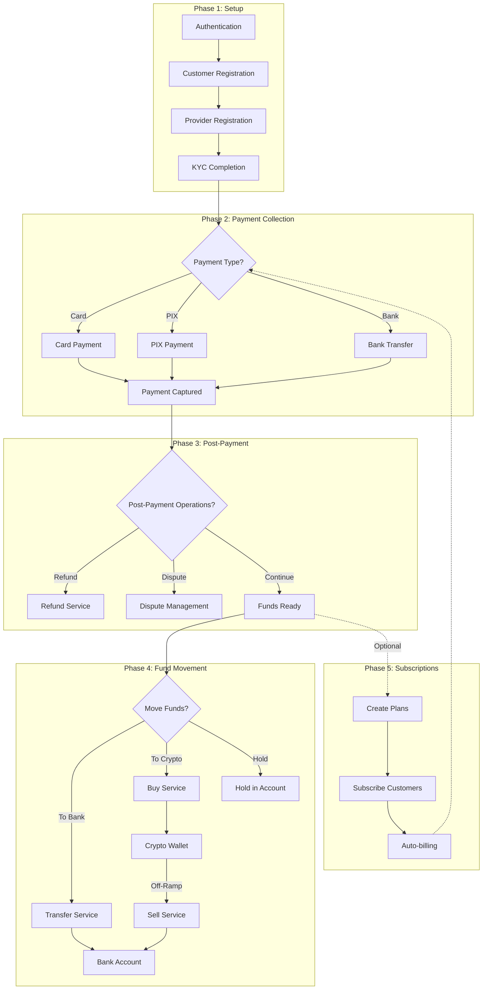
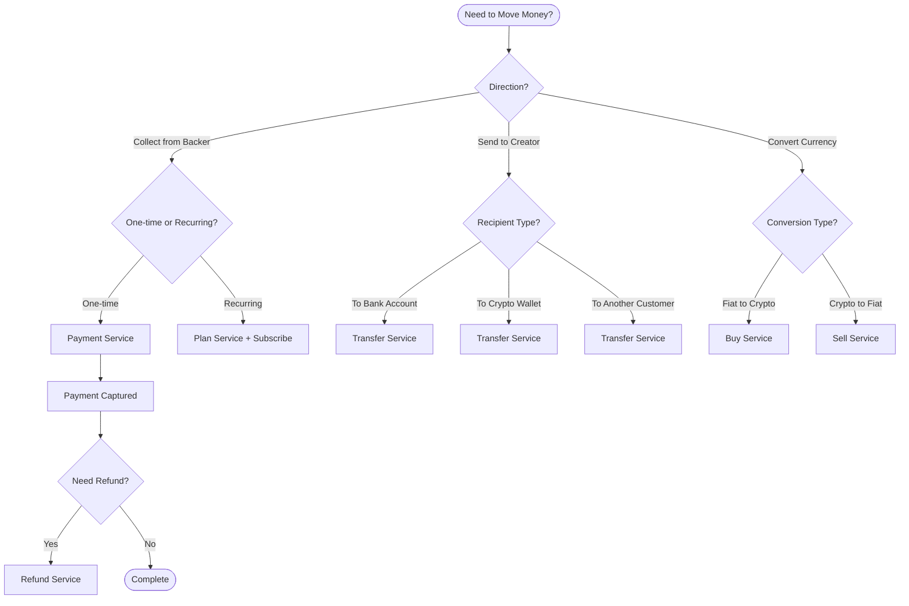
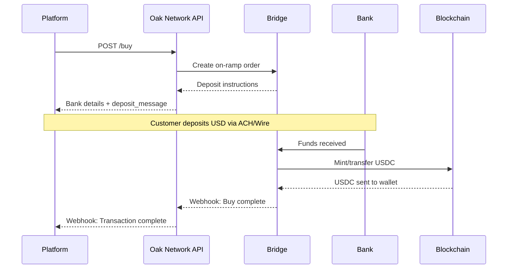
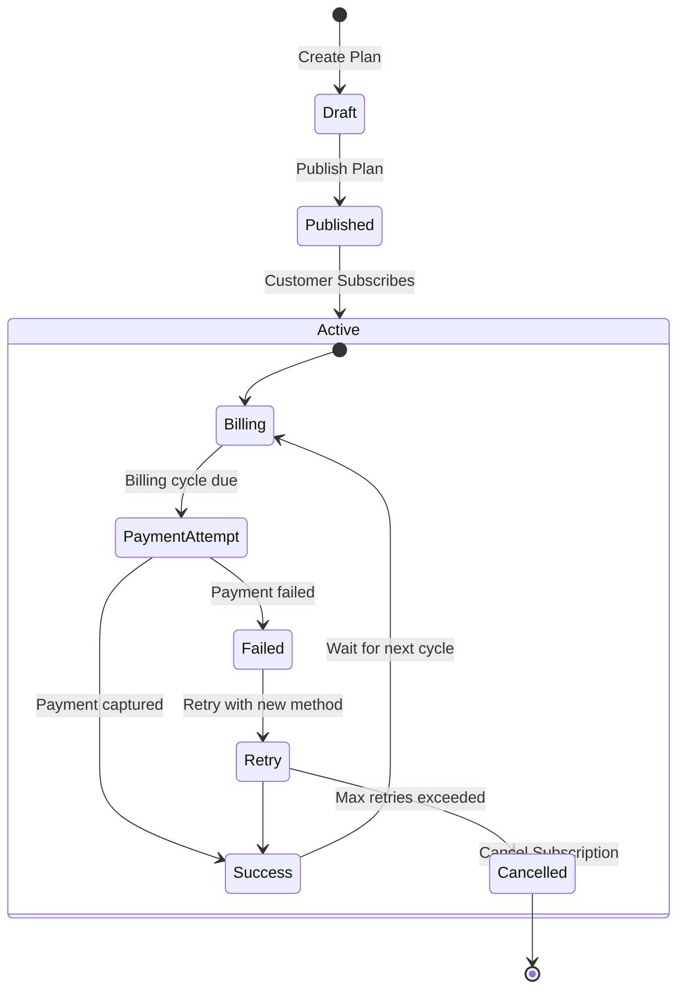
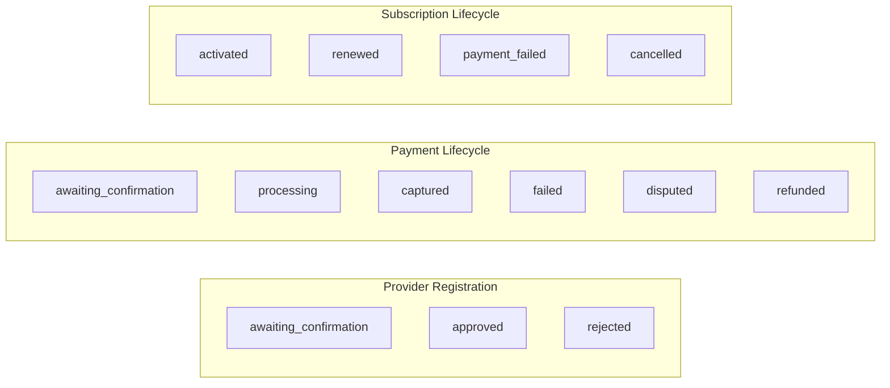

# Payment SDK Complete Flow

This guide covers detailed provider-specific integration flows, all operations, and advanced features of the Payment SDK.

import MermaidDiagram from '@site/src/components/MermaidDiagram';

## Complete Money Flow

<MermaidDiagram title="Payment SDK Money Flow">



</MermaidDiagram>

---

## When to Use Each Operation

<MermaidDiagram title="Operation Decision Guide">



</MermaidDiagram>

| Operation | Service | Use Case | Providers |
|---|---|---|---|
| **Payment** | `PaymentService` | Collect funds from backer (card, PIX) | Stripe, PagarMe, MercadoPago |
| **Refund** | `RefundService` | Return funds from a captured payment | Same as payment provider |
| **Transfer** | `TransferService` | Move funds to bank, wallet, or customer | Stripe, PagarMe, BRLA |
| **Buy** | `BuyService` | Convert fiat → crypto (on-ramp) | Bridge |
| **Sell** | `SellService` | Convert crypto → fiat (off-ramp) | Avenia |
| **Plans** | `PlanService` | Define subscription billing configuration | All |
| **Subscribe** | `SubscriptionService` | Attach customer to a plan | All |

---

## US Integration Flow (Stripe + Bridge)

Complete flow for US-based platforms with USD payments and optional USDC conversion.

```mermaid
sequenceDiagram
    participant Platform
    participant Oak as Oak Network API
    participant Stripe
    participant Bridge
    participant Backer
    participant Creator
    
    rect rgb(40, 40, 60)
    Note over Platform,Bridge: Phase 1: Setup & KYC
    Platform->>Oak: POST /merchant/token/grant
    Oak-->>Platform: access_token
    
    Platform->>Oak: POST /customers (creator)
    Oak-->>Platform: creator.customer_id
    
    Platform->>Oak: POST /provider-registration/:id/submit (stripe, connected_account)
    Oak-->>Platform: client_secret for Stripe onboarding
    Creator->>Stripe: Complete KYC via Stripe UI
    Stripe-->>Oak: Webhook: KYC approved
    
    Platform->>Oak: POST /provider-registration/:id/submit (bridge, customer)
    Oak-->>Platform: kyc_url, tos_url
    Creator->>Bridge: Complete Bridge KYC
    Bridge-->>Oak: Webhook: KYC approved
    
    Platform->>Oak: POST /customers (backer)
    Oak-->>Platform: backer.customer_id
    Platform->>Oak: POST /provider-registration/:id/submit (stripe, customer)
    Oak-->>Platform: Backer registered
    end
    
    rect rgb(40, 60, 40)
    Note over Platform,Bridge: Phase 2: Payment
    Platform->>Oak: POST /payments
    Oak->>Stripe: Create PaymentIntent
    Stripe-->>Oak: client_secret
    Oak-->>Platform: payment_id, client_secret
    
    Backer->>Stripe: Enter card details
    Stripe-->>Oak: Webhook: payment.captured
    Oak-->>Platform: Webhook: payment.captured
    end
    
    rect rgb(60, 60, 40)
    Note over Platform,Bridge: Phase 3: Virtual Account Setup (One-time)
    Platform->>Oak: POST /customers/:id/payment_methods (virtual_account)
    Oak->>Bridge: Create virtual account
    Bridge-->>Oak: bank_account_number, routing_number
    Oak-->>Platform: Virtual account details
    
    Platform->>Oak: POST /customers/:id/payment_methods (bank to Stripe)
    Oak->>Stripe: Add external account
    Stripe-->>Oak: External account linked
    Note over Stripe,Bridge: Stripe payouts now go to Bridge virtual account
    end
    
    rect rgb(60, 40, 40)
    Note over Platform,Bridge: Phase 4: Crypto Off-Ramp (Optional)
    Platform->>Oak: POST /customers/:id/payment_methods (bank to Bridge)
    Oak->>Bridge: Add real bank account
    Bridge-->>Oak: External account added
    
    Platform->>Oak: POST /customers/:id/payment_methods (liquidation_address)
    Oak->>Bridge: Create liquidation address
    Bridge-->>Oak: liquidation_address (0x...)
    Oak-->>Platform: Liquidation address
    
    Note over Platform,Bridge: Creator sends USDC to liquidation address
    Bridge-->>Creator: USD deposited to bank
    end
```

<MermaidDiagram title="US Flow - Complete Sequence">



</MermaidDiagram>

### Phase 1: Authentication & Customer Setup

```typescript
import { 
  createOakClient, 
  createCustomerService, 
  createProviderService 
} from '@oaknetwork/api';

const client = createOakClient({
  environment: 'sandbox',
  clientId: process.env.CLIENT_ID!,
  clientSecret: process.env.CLIENT_SECRET!,
});

const customers = createCustomerService(client);
const providers = createProviderService(client);

// Register campaign creator
const creator = await customers.create({
  email: 'creator@example.com',
  country_code: 'US',
});

// Register creator with Stripe as connected account
const stripeReg = await providers.submit(creator.value.data.customer_id, {
  provider: 'stripe',
  target_role: 'connected_account',
  provider_data: {
    account_type: 'custom',
    transfers_requested: true,
    card_payments_requested: true,
    tax_reporting_us_1099_k_requested: true,
    payouts_debit_negative_balances: true,
  },
});

// Use client_secret to load Stripe Connect onboarding UI
const { client_secret, publishable_key } = stripeReg.value.data.provider_response;

// Register creator with Bridge for crypto
const bridgeReg = await providers.submit(creator.value.data.customer_id, {
  provider: 'bridge',
  target_role: 'customer',
  provider_data: {
    callback_url: 'https://yourplatform.com/kyc-complete',
  },
});

// Redirect to Bridge KYC
const { kyc_url, tos_url } = bridgeReg.value.data.provider_response;
```

### Phase 2: Payment Collection

```typescript
import { createPaymentService } from '@oaknetwork/api';

const payments = createPaymentService(client);

// Create payment from backer to creator
const payment = await payments.create({
  provider: 'stripe',
  source: {
    amount: 10000, // $100.00 in cents
    customer: { id: backerCustomerId },
    currency: 'usd',
    payment_method: { type: 'card' },
    capture_method: 'automatic',
  },
  destination: {
    currency: 'usd',
    customer: { id: creatorCustomerId },
  },
  confirm: true,
  metadata: {
    campaign_id: 'campaign_12345',
    reward_tier: 'early_bird',
  },
});

if (payment.ok) {
  // Use client_secret to load Stripe payment UI
  const { client_secret } = payment.value.data.provider_response;
}
```

### Phase 3: Virtual Account for Auto-Conversion

```typescript
import { createPaymentMethodService } from '@oaknetwork/api';

const paymentMethods = createPaymentMethodService(client);

// Create Bridge virtual account (receives USD, converts to USDC)
const virtualAccount = await paymentMethods.create(creatorCustomerId, {
  type: 'virtual_account',
  provider: 'bridge',
  source_currency: 'usd',
  destination_currency: 'usdc',
  provider_data: {
    chain: 'ethereum',
    evm_address: creatorWalletAddress,
  },
});

// Link virtual account to Stripe as external account
const { bank_account_number, bank_routing_number } = 
  virtualAccount.value.data.provider_response.source_deposit_instructions;

const stripeExternal = await paymentMethods.create(creatorCustomerId, {
  type: 'bank',
  provider: 'stripe',
  bank_name: 'Bridge Virtual Bank',
  bank_account_number: bank_account_number,
  bank_routing_number: bank_routing_number,
  bank_account_type: 'CHECKING',
  bank_account_name: 'Creator Business',
  currency: 'usd',
  bank_metadata: {
    virtual_account_id: virtualAccount.value.data.id,
  },
});
```

### Phase 4: Off-Ramp (USDC to Bank)

```typescript
// Add real bank account to Bridge
const realBank = await paymentMethods.create(creatorCustomerId, {
  type: 'bank',
  provider: 'bridge',
  bank_name: 'Chase',
  bank_account_number: '123456789',
  bank_routing_number: '021000021',
  bank_account_type: 'CHECKING',
  bank_account_name: 'Creator Business',
  billing_address: {
    street_line_1: '123 Main St',
    city: 'New York',
    state: 'NY',
    postal_code: '10001',
    country: 'USA',
  },
});

// Create liquidation address (send USDC here → receive USD in bank)
const liquidation = await paymentMethods.create(creatorCustomerId, {
  type: 'liquidation_address',
  provider: 'bridge',
  source_currency: 'usdc',
  destination_currency: 'usd',
  destination_payment_method_id: realBank.value.data.id,
  provider_data: {
    destination_payment_rail: 'wire',
    chain: 'ethereum',
  },
});

// Creator sends USDC to this address to receive USD
const { liquidation_address } = liquidation.value.data;
```

---

## Brazil Integration Flow (PagarMe + Avenia)

Complete flow for Brazilian platforms with BRL payments and optional BRLA stablecoin conversion.

```mermaid
sequenceDiagram
    participant Platform
    participant Oak as Oak Network API
    participant PagarMe
    participant Avenia
    participant Konduto as Konduto (Fraud)
    participant Backer
    participant Creator
    
    rect rgb(40, 40, 60)
    Note over Platform,Avenia: Phase 1: Setup & KYC
    Platform->>Oak: POST /merchant/token/grant
    Oak-->>Platform: access_token
    
    Platform->>Oak: POST /customers (creator with CPF/CNPJ)
    Oak-->>Platform: creator.customer_id
    
    Platform->>Oak: POST /provider-registration/:id/submit (pagar_me)
    Oak->>PagarMe: Register recipient
    PagarMe-->>Oak: Approved (synchronous)
    Oak-->>Platform: Registration approved
    
    Platform->>Oak: POST /provider-registration/:id/submit (avenia)
    Oak->>Avenia: Create subaccount
    Avenia-->>Oak: Webhook: Subaccount created with BR code
    Oak-->>Platform: Subaccount details
    end
    
    rect rgb(40, 60, 40)
    Note over Platform,Konduto: Phase 2: Card Payment with Fraud Check
    Platform->>Oak: POST /payments (card + fraud_check)
    Oak->>Konduto: Fraud analysis
    Konduto-->>Oak: Risk score
    alt Risk acceptable
        Oak->>PagarMe: Process payment
        PagarMe-->>Oak: Payment captured
        Oak-->>Platform: Payment success
    else High risk
        Oak-->>Platform: Payment blocked
    end
    end
    
    rect rgb(60, 60, 40)
    Note over Platform,Avenia: Phase 2b: PIX Payment (Alternative)
    Platform->>Oak: POST /payments (pix)
    Oak->>PagarMe: Create PIX charge
    PagarMe-->>Oak: QR code, PIX link
    Oak-->>Platform: QR code for backer
    Backer->>PagarMe: Scan QR / Pay via PIX
    PagarMe-->>Oak: Webhook: PIX confirmed
    Oak-->>Platform: Payment success
    end
    
    rect rgb(60, 40, 60)
    Note over Platform,Avenia: Phase 3: Transfer to Crypto
    Platform->>Oak: POST /transfer (avenia)
    Oak->>Avenia: Transfer BRLA to wallet
    Avenia-->>Oak: Transfer complete
    Oak-->>Platform: BRLA in wallet
    end
    
    rect rgb(60, 40, 40)
    Note over Platform,Avenia: Phase 4: Sell (Off-Ramp)
    Platform->>Oak: POST /customers/:id/payment_methods (pix)
    Oak-->>Platform: PIX payment method added
    
    Platform->>Oak: POST /sell
    Oak->>Avenia: Sell BRLA for BRL
    Avenia-->>Oak: Sell order executed
    Avenia-->>Creator: BRL sent via PIX
    Oak-->>Platform: Sell complete
    end
```

<MermaidDiagram title="Brazil Flow - Complete Sequence">



</MermaidDiagram>

### Card Payment with Fraud Detection

```typescript
import { createPaymentService } from '@oaknetwork/api';

const payments = createPaymentService(client);

const cardPayment = await payments.create({
  provider: 'pagar_me',
  source: {
    amount: 10000, // R$100.00 in centavos
    customer: { id: backerCustomerId },
    currency: 'brl',
    payment_method: {
      id: savedCardId,
      type: 'card',
    },
    capture_method: 'automatic',
    fraud_check: {
      enabled: true,
      provider: 'konduto',
      config: {
        threshold: 'high',
        sequence: 'fraud_before_auth',
      },
      data: {
        last_four_digits: '1234',
        card_expiration_date: '12/2028',
        card_holder_name: 'João Silva',
      },
    },
  },
  confirm: true,
  metadata: {
    campaign_id: 'campanha_12345',
  },
});
```

### PIX Payment

```typescript
const pixPayment = await payments.create({
  provider: 'pagar_me',
  source: {
    amount: 10000,
    customer: { id: backerCustomerId },
    currency: 'brl',
    payment_method: {
      type: 'pix',
      expiry_date: '2025-12-31T23:59:59Z',
    },
  },
  confirm: true,
});

if (pixPayment.ok) {
  // Display QR code to backer
  // Payment confirmed via webhook when backer pays
}
```

### Transfer BRLA to Wallet

```typescript
import { createTransferService } from '@oaknetwork/api';

const transfers = createTransferService(client);

const transfer = await transfers.create({
  provider: 'avenia',
  source: {
    customer: { id: creatorCustomerId },
    amount: '10000',
    currency: 'brla',
  },
  destination: {
    payment_method: {
      type: 'customer_wallet',
      chain: 'polygon',
      evm_address: '0x1234567890abcdef...',
    },
  },
});
```

### Sell BRLA for BRL (Off-Ramp)

```typescript
import { createSellService, createPaymentMethodService } from '@oaknetwork/api';

const paymentMethods = createPaymentMethodService(client);
const sell = createSellService(client);

// Add PIX as payment method
const pixMethod = await paymentMethods.create(creatorCustomerId, {
  type: 'pix',
  pix_string: '12345678901', // CPF, phone, email, or random key
});

// Sell BRLA → BRL via PIX
const sellOrder = await sell.create({
  provider: 'avenia',
  source: {
    customer: { id: creatorCustomerId },
    currency: 'brla',
    amount: '10000',
  },
  destination: {
    customer: { id: creatorCustomerId },
    currency: 'brl',
    payment_method: {
      type: 'pix',
      id: pixMethod.value.data.id,
    },
  },
});
```

---

## Buy (On-Ramp) Flow

Convert fiat currency to cryptocurrency.

<MermaidDiagram title="Buy (On-Ramp) Flow">



</MermaidDiagram>

```typescript
import { createBuyService } from '@oaknetwork/api';

const buy = createBuyService(client);

const buyOrder = await buy.create({
  provider: 'bridge',
  source: {
    currency: 'usd',
  },
  destination: {
    currency: 'usdc',
    customer: { id: creatorCustomerId },
    payment_method: {
      type: 'customer_wallet',
      chain: 'polygon',
      evm_address: '0x1234567890abcdef...',
    },
  },
});

if (buyOrder.ok) {
  const { source_deposit_instructions } = buyOrder.value.data.provider_response;
  // Display bank details and deposit_message to customer
  // USDC arrives in wallet when complete
}
```

---

## Subscriptions Flow

Recurring billing with automatic payment collection.

<MermaidDiagram title="Subscriptions Lifecycle">



</MermaidDiagram>

```typescript
import { createPlanService, createSubscriptionService } from '@oaknetwork/api';

const plans = createPlanService(client);
const subscriptions = createSubscriptionService(client);

// 1. Create a plan (draft)
const plan = await plans.create({
  name: 'Premium Monthly',
  description: 'Full access to all features',
  price: 2999,
  currency: 'BRL',
  billing_cycle: 'month',
  billing_interval: 1,
  start_date: '2026-04-01',
  is_auto_renewable: true,
  allow_amount_override: false,
  created_by: 'admin',
});

// 2. Publish the plan
await plans.publish(plan.value.data.hash_id);

// 3. Subscribe a customer
const subscription = await subscriptions.subscribe({
  plan_id: plan.value.data.hash_id,
  price: 2999,
  customer_id: backerCustomerId,
  payment_method_id: savedCardId,
  payment_method_type: 'card',
  payment_method_provider: 'pagar_me',
});

// 4. Cancel subscription
await subscriptions.cancel(subscription.value.data.hash_id);
```

---

## Webhook Events Reference

<MermaidDiagram title="Webhook Event Categories">



</MermaidDiagram>

| Category | Event | When Triggered |
|---|---|---|
| **Provider Registration** | `provider_registration.awaiting_confirmation` | KYC/ToS link generated |
| | `provider_registration.approved` | KYC completed successfully |
| | `provider_registration.rejected` | KYC failed |
| **Payment** | `payment.awaiting_confirmation` | Payment intent created |
| | `payment.captured` | Payment successful |
| | `payment.failed` | Payment failed |
| | `payment.disputed` | Chargeback initiated |
| | `payment.refunded` | Refund issued |
| **Subscription** | `subscription.activated` | Subscription started |
| | `subscription.renewed` | Auto-renewal successful |
| | `subscription.cancelled` | Subscription ended |

---

## Status Reference

### Provider Registration Statuses

| Status | Meaning | Next Steps |
|---|---|---|
| `not_submitted` | Data saved locally | Submit to provider |
| `awaiting_confirmation` | Awaiting user action | User completes KYC/ToS |
| `processing` | Provider reviewing | Wait for decision |
| `approved` | Registration successful | Ready for payments |
| `rejected` | Registration failed | Check rejection reason |

### Payment Statuses

| Status | Meaning | Possible Actions |
|---|---|---|
| `created` | Payment object created | Confirm or cancel |
| `awaiting_confirmation` | Awaiting user action | User completes payment |
| `captured` | Funds captured | Refund if needed |
| `failed` | Payment failed | Retry with different method |
| `refunded` | Fully refunded | No further action |

---

## Next Steps

- [Payment SDK Quick Start](/docs/guides/payment-sdk-quickstart) — 6-step universal flow
- [Customers](/docs/sdk/customers) — Customer management API
- [Payments](/docs/sdk/payments) — Payment processing API
- [Buy and Sell](/docs/sdk/buy-and-sell) — Crypto on/off-ramp
- [Transfers](/docs/sdk/transfers) — Fund movement
