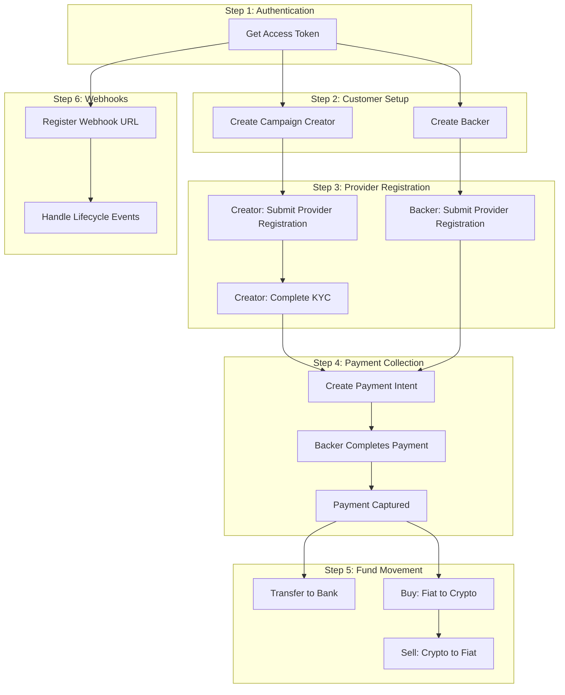

# Payment SDK Quick Start

Integrate Oak Network's Payment SDK in 6 steps. This guide covers the universal flow that works with any supported provider.

import MermaidDiagram from '@site/src/components/MermaidDiagram';

<MermaidDiagram title="Payment SDK Integration Flow">



</MermaidDiagram>

---

## Step 1: Authentication

The SDK handles OAuth2 authentication automatically. Tokens are valid for 55 minutes and refresh automatically.

```typescript
import { createOakClient } from '@oaknetwork/api';

const client = createOakClient({
  environment: 'sandbox', // or 'production'
  clientId: process.env.CLIENT_ID!,
  clientSecret: process.env.CLIENT_SECRET!,
});
```

> Contact [support@oaknetwork.org](mailto:support@oaknetwork.org) to get your sandbox credentials.

---

## Step 2: Customer Setup

Create customers for campaign creators (receive funds) and backers (contribute to campaigns).

```typescript
import { createCustomerService } from '@oaknetwork/api';

const customers = createCustomerService(client);

// Create campaign creator (receives funds)
const creator = await customers.create({
  email: 'creator@example.com',
  country_code: 'US', // Required for creators
});

// Create backer (contributes to campaigns)
const backer = await customers.create({
  email: 'backer@example.com',
});

if (creator.ok && backer.ok) {
  console.log('Creator ID:', creator.value.data.customer_id);
  console.log('Backer ID:', backer.value.data.customer_id);
}
```

| Role | Required Fields | Purpose |
|---|---|---|
| **Campaign Creator** | `email`, `country_code` | Receives campaign funds, requires full KYC |
| **Backer** | `email` | Contributes to campaigns, minimal verification |

---

## Step 3: Provider Registration

Register customers with payment providers. Campaign creators need full KYC verification to receive funds; backers need basic registration.

```typescript
import { createProviderService } from '@oaknetwork/api';

const providers = createProviderService(client);

// Register campaign creator (requires KYC)
const creatorReg = await providers.submit(creator.value.data.customer_id, {
  provider: 'stripe', // or 'pagar_me' for Brazil
  target_role: 'connected_account',
  provider_data: {
    account_type: 'custom',
    transfers_requested: true,
    card_payments_requested: true,
  },
});

if (creatorReg.ok) {
  const { client_secret } = creatorReg.value.data.provider_response;
  // Redirect creator to complete KYC using provider's UI
}

// Register backer (minimal verification)
const backerReg = await providers.submit(backer.value.data.customer_id, {
  provider: 'stripe',
  target_role: 'customer',
  provider_data: {},
});
```

| Status | Meaning | Next Step |
|---|---|---|
| `awaiting_confirmation` | User action needed | Complete KYC via provider UI |
| `processing` | Provider reviewing | Wait for webhook |
| `approved` | Ready for payments | Proceed to Step 4 |
| `rejected` | Verification failed | Check rejection reason |

---

## Step 4: Payment Collection

Create a payment from backer to campaign creator.

```typescript
import { createPaymentService } from '@oaknetwork/api';

const payments = createPaymentService(client);

const payment = await payments.create({
  provider: 'stripe',
  source: {
    amount: 10000, // $100.00 in cents
    customer: { id: backer.value.data.customer_id },
    currency: 'usd',
    payment_method: { type: 'card' },
    capture_method: 'automatic',
  },
  destination: {
    customer: { id: creator.value.data.customer_id },
    currency: 'usd',
  },
  confirm: true,
  metadata: {
    campaign_id: 'campaign_12345',
    reward_tier: 'early_bird',
  },
});

if (payment.ok) {
  const { client_secret } = payment.value.data.provider_response;
  // Use client_secret to show payment UI to backer
}
```

---

## Step 5: Fund Movement

After payment is captured, move funds using Transfer, Buy, or Sell services.

```typescript
import { createTransferService, createBuyService, createSellService } from '@oaknetwork/api';

// Option 1: Transfer to bank
const transfers = createTransferService(client);
const transfer = await transfers.create({
  provider: 'stripe',
  source: {
    amount: 9500,
    currency: 'usd',
    customer: { id: creator.value.data.customer_id },
  },
  destination: {
    customer: { id: creator.value.data.customer_id },
    payment_method: { type: 'bank', id: 'pm_bank_123' },
  },
});

// Option 2: Convert to crypto (on-ramp)
const buy = createBuyService(client);
const buyOrder = await buy.create({
  provider: 'bridge',
  source: { currency: 'usd' },
  destination: {
    currency: 'usdc',
    customer: { id: creator.value.data.customer_id },
    payment_method: {
      type: 'customer_wallet',
      chain: 'polygon',
      evm_address: '0x1234...',
    },
  },
});

// Option 3: Convert crypto back to fiat (off-ramp)
const sell = createSellService(client);
const sellOrder = await sell.create({
  provider: 'avenia',
  source: {
    customer: { id: creator.value.data.customer_id },
    currency: 'usdc',
    amount: 10000,
  },
  destination: {
    customer: { id: creator.value.data.customer_id },
    currency: 'usd',
    payment_method: { type: 'bank', id: 'pm_bank_123' },
  },
});
```

| Service | Direction | Use Case |
|---|---|---|
| **Transfer** | Platform → Bank/Wallet | Payout campaign funds to creator |
| **Buy** | Fiat → Crypto | On-ramp to stablecoin |
| **Sell** | Crypto → Fiat | Off-ramp to creator's bank |

---

## Step 6: Webhooks

Register a webhook to receive real-time notifications for payment and registration events.

```typescript
import { createWebhookService } from '@oaknetwork/api';

const webhooks = createWebhookService(client);

const webhook = await webhooks.register({
  url: 'https://yourplatform.com/webhooks/oak',
  description: 'Campaign payment notifications',
});

if (webhook.ok) {
  const { id, secret } = webhook.value.data;
  // Store secret securely for signature verification
}
```

| Event | When Triggered |
|---|---|
| `provider_registration.approved` | Creator KYC completed |
| `provider_registration.rejected` | Creator KYC failed |
| `payment.captured` | Backer payment successful |
| `payment.failed` | Backer payment declined |
| `payment.refunded` | Refund issued to backer |

---

## Complete Example

```typescript
import {
  createOakClient,
  createCustomerService,
  createProviderService,
  createPaymentService,
  createWebhookService,
} from '@oaknetwork/api';

async function integrateCrowdfundingPlatform() {
  // Step 1: Initialize client
  const client = createOakClient({
    environment: 'sandbox',
    clientId: process.env.CLIENT_ID!,
    clientSecret: process.env.CLIENT_SECRET!,
  });

  const customers = createCustomerService(client);
  const providers = createProviderService(client);
  const payments = createPaymentService(client);
  const webhooks = createWebhookService(client);

  // Step 2: Create customers
  const creator = await customers.create({
    email: 'creator@example.com',
    country_code: 'US',
  });

  const backer = await customers.create({
    email: 'backer@example.com',
  });

  // Step 3: Register with provider
  const creatorReg = await providers.submit(creator.value.data.customer_id, {
    provider: 'stripe',
    target_role: 'connected_account',
    provider_data: {
      account_type: 'custom',
      transfers_requested: true,
      card_payments_requested: true,
    },
  });

  // Wait for creator to complete KYC via webhook...

  await providers.submit(backer.value.data.customer_id, {
    provider: 'stripe',
    target_role: 'customer',
    provider_data: {},
  });

  // Step 4: Create payment
  const payment = await payments.create({
    provider: 'stripe',
    source: {
      amount: 10000,
      customer: { id: backer.value.data.customer_id },
      currency: 'usd',
      payment_method: { type: 'card' },
      capture_method: 'automatic',
    },
    destination: {
      customer: { id: creator.value.data.customer_id },
      currency: 'usd',
    },
    confirm: true,
    metadata: {
      campaign_id: 'campaign_12345',
      reward_tier: 'early_bird',
    },
  });

  // Step 6: Register webhook
  const webhook = await webhooks.register({
    url: 'https://yourplatform.com/webhooks/oak',
  });

  return { creator, backer, payment, webhook };
}
```

---

## Next Steps

- [Payment SDK Complete Flow](/docs/guides/payment-sdk-complete) — Detailed provider-specific flows (US, Brazil)
- [Customers](/docs/sdk/customers) — Customer management API
- [Payments](/docs/sdk/payments) — Payment processing API
- [Webhooks](/docs/sdk/webhooks) — Webhook handling
