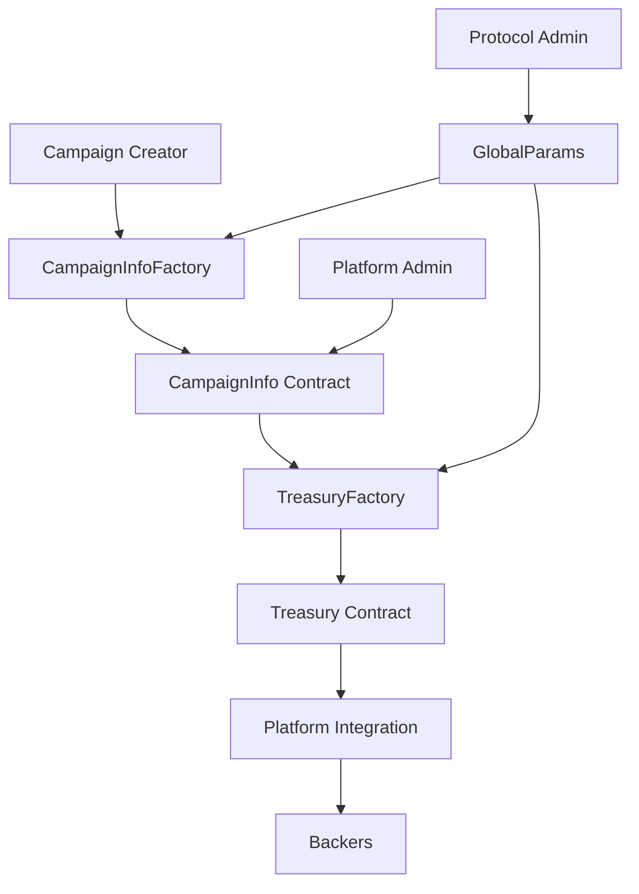

# Welcome to Oak Network

Oak Network is a decentralized, censorship-resistant crowdfunding protocol built on Celo. We provide infrastructure that any platform can integrate to enable secure, transparent, and accessible fundraising for creators, entrepreneurs, and communities.

import MermaidDiagram from '@site/src/components/MermaidDiagram';

<MermaidDiagram title="Oak Network Architecture">

</MermaidDiagram>

## Why Oak Network?

### 🎯 Decentralized & Censorship-Resistant
Campaigns live on-chain, ensuring they cannot be removed or altered by any central authority.

### 🔐 Security First
Our smart contracts are audited by **PeckShield** and **OpenZeppelin** already scheduled for January, and are part of **Immunefi's bug bounty program** with rewards up to $50,000.

### 🌍 Multi-Platform
Oak Network is infrastructure - integrate it into your existing platform to add crowdfunding capabilities.

### 💰 Flexible Treasuries
Choose from different treasury models like "All-or-Nothing" to suit your funding needs.

### 🚀 Developer-Friendly
Comprehensive documentation, SDKs, and integration guides to get you started quickly.

## Quick Links

- [Create Your First Campaign](/docs/guides/create-campaign) - Get started in minutes
- [Core Concepts](/docs/concepts/overview) - Understand the protocol
- [Integration Guides](/docs/guides/create-campaign) - Integrate Oak Network
- [Smart Contracts](/docs/contracts/overview) - Technical reference
- [Security](/docs/security/overview) - Security architecture and audits

## Get Started

Ready to build? Check out our [Create Your First Campaign](/docs/guides/create-campaign) guide or explore our [Platform Integration](/docs/guides/platform-integration) documentation.