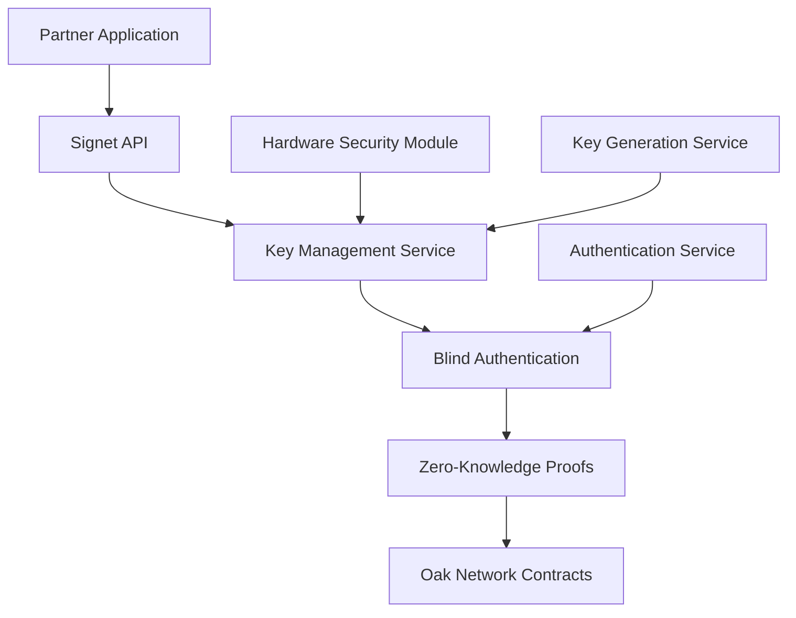
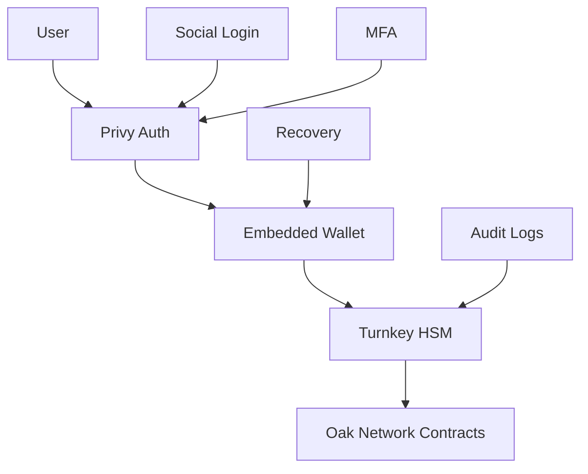

# Oak Network Roadmap

Oak Network is building the future of decentralized crowdfunding infrastructure. Here's what we're developing for early 2026 and beyond.

## 🚀 Early 2026 Roadmap

### Appstore - Extensible Platform Ecosystem

**Timeline: Q1 2026**

The Oak Network Appstore will extend our standalone client with a powerful app ecosystem, giving developers the ability to create and deploy custom features that can be used by creators, backers, and platforms.

#### Key Features

- **App Development Framework**: Complete toolkit for building Oak Network apps
- **Backend Integration**: Server-side components and API development tools
- **Frontend Components**: React/Next.js components and UI libraries
- **Smart Contract Templates**: Pre-built contract patterns for common use cases
- **App Store Marketplace**: Discover, install, and manage third-party apps
- **Revenue Sharing**: Developers earn from app usage and subscriptions

#### Developer Benefits

```javascript
// Example: Custom analytics app
class CampaignAnalyticsApp {
  async install() {
    // Register app with Oak Network
    await oakNetwork.apps.register({
      name: 'Campaign Analytics',
      version: '1.0.0',
      permissions: ['read:campaigns', 'read:contributions']
    });
  }
  
  async analyzeCampaign(campaignId) {
    // Custom analytics logic
    const data = await this.gatherCampaignData(campaignId);
    return this.generateInsights(data);
  }
}
```

### Catalyst - Centralized Development Experience

**Timeline: Q2 2026**

Catalyst is our centralized development platform that will accelerate platform and developer adoption by providing comprehensive APIs, SDKs, and tools for all trending technologies.

#### Core Components

- **Multi-Language SDKs**: TypeScript, Python, and Golang support
- **Payment Provider Integration**: On/off ramps, Stripe, and bridge solutions
- **API Gateway**: Unified API for all Oak Network functionality
- **Developer Dashboard**: Comprehensive management and analytics
- **Documentation Hub**: Interactive docs with code examples
- **Testing Sandbox**: Complete testing environment

#### Technology Stack

```typescript
// TypeScript SDK Example
import { OakNetwork } from '@oaknetwork/catalyst-ts';

const oak = new OakNetwork({
  apiKey: process.env.OAK_API_KEY,
  environment: 'production'
});

// Create campaign with payment integration
const campaign = await oak.campaigns.create({
  goal: 10000,
  currency: 'USD',
  paymentMethods: ['stripe', 'crypto', 'fiat'],
  platforms: ['web', 'mobile']
});
```

```python
# Python SDK Example
from oaknetwork import OakNetwork

oak = OakNetwork(api_key="your_api_key")

# Platform integration
platform = oak.platforms.create({
    name: "My Platform",
    fee_percent: 3.5,
    features: ["analytics", "custom_rewards"]
})
```

```go
// Golang SDK Example
package main

import (
    "github.com/oaknetwork/catalyst-go"
)

func main() {
    client := oaknetwork.NewClient("your_api_key")
    
    campaign, err := client.Campaigns.Create(&oaknetwork.CampaignRequest{
        Goal: 10000,
        Currency: "USD",
        Platforms: []string{"web", "mobile"},
    })
}
```

### Signet - Blind Key Management Platform

**Timeline: Q3 2026**

Signet is our revolutionary platform that enables partners to integrate with Oak Network infrastructure without sharing private keys, providing secure key management and blind authentication.

#### Revolutionary Features

- **Blind Key Registration**: Partners register without exposing private keys
- **Key Linking**: Link existing keys without sharing them
- **Key Generation**: Generate new keys for clients securely
- **Blind Authentication**: Verify ownership without revealing keys
- **Zero-Knowledge Proofs**: Cryptographic proofs of key ownership
- **Hardware Security**: Integration with hardware security modules

#### Security Architecture



#### Integration Example

```javascript
// Signet integration
import { SignetClient } from '@oaknetwork/signet';

const signet = new SignetClient({
  apiKey: process.env.SIGNET_API_KEY,
  environment: 'production'
});

// Register without sharing private key
const registration = await signet.register({
  publicKey: wallet.publicKey,
  platformId: 'my-platform',
  permissions: ['create:campaigns', 'manage:users']
});

// Blind authentication
const authProof = await signet.authenticate({
  challenge: randomChallenge,
  publicKey: wallet.publicKey
});

// Use with Oak Network
const campaign = await oakNetwork.createCampaign({
  ...campaignData,
  authProof: authProof
});
```

## 🔐 Enhanced Security Model

### Privy & Turnkey Integration

Oak Network leverages industry-leading security providers to ensure maximum security without holding any private keys.

#### Privy Integration

- **Embedded Wallets**: Seamless wallet creation and management
- **Social Login**: Email, Google, Apple, and social media authentication
- **Multi-Factor Authentication**: Enhanced security for all users
- **Recovery Mechanisms**: Secure account recovery without seed phrases

#### Turnkey Integration

- **Hardware Security**: Enterprise-grade key management
- **Multi-Signature Support**: Advanced transaction signing
- **Audit Trails**: Complete transaction and key usage logging
- **Compliance**: SOC 2 Type II and other security certifications

#### Security Architecture



#### No Key Storage Policy

Oak Network **never stores private keys**. All key management is handled by:

- **Privy**: For user-facing embedded wallets
- **Turnkey**: For enterprise and platform key management
- **User Wallets**: For direct blockchain interactions

```javascript
// Privy integration example
import { PrivyProvider } from '@privy-io/react-auth';

function App() {
  return (
    <PrivyProvider
      appId="your-privy-app-id"
      config={{
        embeddedWallets: {
          createOnLogin: 'users-without-wallets',
          requireUserPasswordOnCreate: true
        },
        loginMethods: ['email', 'google', 'apple'],
        appearance: {
          theme: 'dark',
          accentColor: '#10b981'
        }
      }}
    >
      <OakNetworkApp />
    </PrivyProvider>
  );
}
```

## 🌟 Long-term Vision (2026+)

### Decentralized Governance

- **Token-based Voting**: Community-driven protocol decisions
- **Proposal System**: Transparent governance process
- **Treasury Management**: Community-controlled protocol funds
- **Upgrade Mechanisms**: Decentralized protocol upgrades

### Cross-Chain Expansion

- **Multi-Chain Support**: Ethereum, Polygon, Arbitrum, and more
- **Cross-Chain Campaigns**: Campaigns spanning multiple networks
- **Bridge Integration**: Seamless asset transfers between chains
- **Unified Experience**: Consistent UX across all supported chains

### Advanced Features

- **AI-Powered Analytics**: Machine learning for campaign optimization
- **Dynamic Pricing**: Algorithmic fee adjustment based on demand
- **Insurance Products**: Campaign failure protection
- **Liquidity Pools**: Secondary markets for campaign tokens

## 🛠️ Developer Resources

### Getting Started

1. **Join the Developer Program**: Early access to new features
2. **Access Beta APIs**: Test new functionality before release
3. **Community Support**: Connect with other developers
4. **Documentation**: Comprehensive guides and examples

### Support Channels

- **Discord**: Real-time developer support
- **GitHub**: Open source development and issues
- **Documentation**: Comprehensive guides and API references
- **Email**: Direct support for enterprise partners

## 📅 Timeline Summary

| Quarter | Focus | Key Deliverables |
|---------|-------|------------------|
| Q1 2026 | Appstore | App development framework, marketplace |
| Q2 2026 | Catalyst | Multi-language SDKs, payment integration |
| Q3 2026 | Signet | Blind key management, zero-knowledge proofs |
| Q4 2026 | Integration | Full ecosystem integration, enterprise features |

## 🤝 Get Involved

### For Developers

- **Early Access**: Join our developer program for early access
- **Feedback**: Help shape the future of Oak Network
- **Contributions**: Contribute to open source development
- **Partnerships**: Build on top of Oak Network infrastructure

### For Platforms

- **Integration Support**: Dedicated support for platform integration
- **Custom Solutions**: Tailored solutions for your platform
- **Revenue Sharing**: Earn from platform usage
- **Priority Support**: Dedicated support channels

### For Users

- **Beta Testing**: Test new features before public release
- **Feedback**: Share your experience and suggestions
- **Community**: Join our growing community
- **Early Access**: Get early access to new features

---

**Ready to be part of the future of crowdfunding? Join us in building the next generation of decentralized infrastructure!** 🚀

