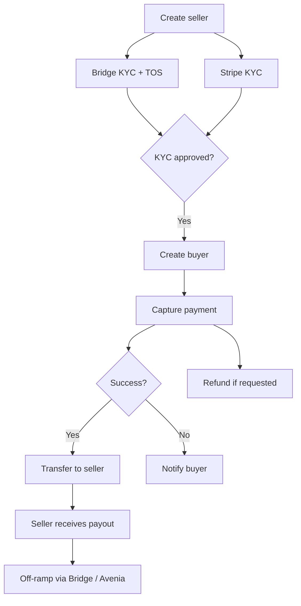

# E-commerce Payment Flow

This guide describes the full lifecycle of a payment in an e-commerce platform built on Oak Network — from seller onboarding through payment capture, settlement, withdrawals, and off-ramping to fiat.

:::info
Some steps in this flow require a frontend for provider KYC (Stripe onboarding, Bridge verification) and cannot be completed entirely in sandbox via the SDK alone. This guide documents the complete production flow with code for every SDK-driven step.
:::

## How the system works

Your platform's backend communicates exclusively with the Oak Network SDK. The SDK routes requests to the appropriate provider (Stripe, Bridge) behind the scenes. Your frontend handles provider-specific UI flows (Stripe onboarding, Bridge KYC/TOS). Webhook events keep your backend in sync at every stage.

The flow has three phases:

1. **Onboarding** — create customers, register with providers, complete KYC
2. **Payment** — capture payment from buyer, confirm on-chain, transfer to seller
3. **Settlement** — seller withdraws funds, optionally off-ramps crypto to fiat via Bridge

---

## Setup

```typescript
import 'dotenv/config';
import {
  createOakClient,
  createCustomerService,
  createProviderService,
  createPaymentMethodService,
  createPaymentService,
  createTransferService,
  createWebhookService,
  createRefundService,
  createTransactionService,
  createBuyService,
  createSellService,
} from '@oaknetwork/api';

const client = createOakClient({
  environment: 'sandbox',
  clientId: process.env.CLIENT_ID!,
  clientSecret: process.env.CLIENT_SECRET!,
});

const customers = createCustomerService(client);
const providers = createProviderService(client);
const paymentMethods = createPaymentMethodService(client);
const payments = createPaymentService(client);
const transfers = createTransferService(client);
const webhooks = createWebhookService(client);
const refunds = createRefundService(client);
const transactions = createTransactionService(client);
```

---

## Phase 1: Onboarding

### 1.1 Create seller profile

Create the seller as a customer with `country_code` (required for Stripe connected accounts).

```typescript
const seller = await customers.create({
  email: 'seller@marketplace.com',
  first_name: 'Jane',
  last_name: 'Merchant',
  country_code: 'US',
});

const sellerId = seller.value.data.id;
```

If the seller has a tax ID (ITIN), update the customer record:

```typescript
await customers.update(sellerId, {
  document_number: '123-45-6789',
  document_type: 'personal_tax_id',
});
```

### 1.2 Register seller with Bridge (KYC)

Register the seller with Bridge for crypto on/off-ramp capabilities.

```typescript
const bridgeReg = await providers.submitRegistration(sellerId, {
  provider: 'bridge',
  target_role: 'customer',
});
```

The registration creates the customer on Bridge's side. Check `getRegistrationStatus` to retrieve the KYC and TOS URLs your frontend needs:

```typescript
const status = await providers.getRegistrationStatus(sellerId);

if (status.ok) {
  for (const reg of status.value.data) {
    if (reg.provider === 'bridge') {
      const { kyc_url, tos_url, kyc_status, tos_status } = reg.provider_response;

      console.log('KYC URL:', kyc_url);       // Redirect seller here to verify identity
      console.log('TOS URL:', tos_url);       // Redirect seller here to accept terms
      console.log('KYC status:', kyc_status); // "not_started" → "approved"
      console.log('TOS status:', tos_status); // "pending" → "approved"
    }
  }
}
```

| Bridge response field | Description |
|---|---|
| `kyc_url` | URL to Bridge's hosted identity verification (Persona). Redirect the seller here. |
| `tos_url` | URL to Bridge's terms of service. The seller must accept before transacting. |
| `kyc_status` | `"not_started"`, `"pending"`, `"approved"`, or `"rejected"` |
| `tos_status` | `"pending"` or `"approved"` |

> Both `kyc_url` and `tos_url` must be opened in the seller's browser. Your backend cannot complete these — they require the seller to interact with Bridge's hosted UI.

**Webhook:** `provider_registration.approved` fires when Bridge KYC and TOS are both approved.

### 1.3 Register seller with Stripe (KYC)

Register the seller as a Stripe connected account to enable card payments and transfers.

```typescript
const stripeReg = await providers.submitRegistration(sellerId, {
  provider: 'stripe',
  target_role: 'connected_account',
  provider_data: {
    account_type: 'express',
    transfers_requested: true,
    card_payments_requested: true,
    tax_reporting_us_1099_k_requested: false,
    payouts_debit_negative_balances: false,
    external_account_collection_requested: false,
  },
});

if (stripeReg.ok) {
  const { provider_response, readiness } = stripeReg.value.data;

  // Pass these to your frontend to render Stripe's embedded onboarding
  console.log('Client secret:', provider_response.client_secret);
  console.log('Publishable key:', provider_response.publishable_key);
  console.log('Expires at:', new Date(provider_response.expires_at * 1000));

  // All capabilities are "restricted" until the seller completes KYC
  console.log('Card payments:', readiness.card_payments);
  console.log('Transfers:', readiness.transfers);
}
```

| Stripe response field | Description |
|---|---|
| `provider_response.client_secret` | Stripe account session secret — pass to Stripe.js to render onboarding |
| `provider_response.publishable_key` | Stripe publishable key for the session |
| `provider_response.expires_at` | Unix timestamp when the session expires |
| `readiness.*` | Capability status — `"restricted"` until KYC completes, then `"active"` |

> Your frontend uses `client_secret` and `publishable_key` to render Stripe's embedded onboarding component (Stripe Connect Onboarding). Once the seller completes KYC, capabilities move from `"restricted"` to `"active"`.

**Webhook:** `provider_registration.approved` fires when Stripe KYC is approved.

### 1.4 Create buyer

```typescript
const buyer = await customers.create({
  email: 'buyer@example.com',
  first_name: 'Bob',
  last_name: 'Buyer',
});

const buyerId = buyer.value.data.id;

// Register as Stripe customer (auto-approved, no KYC needed)
await providers.submitRegistration(buyerId, {
  provider: 'stripe',
  target_role: 'customer',
});
```

---

## Phase 2: Payment

### 2.1 Initialize and capture payment

When the buyer purchases a product, create a payment through Stripe. Your frontend collects the card details via Stripe Elements and provides a payment method token.

```typescript
const payment = await payments.create({
  provider: 'stripe',
  source: {
    amount: 15000,
    currency: 'usd',
    customer: { id: buyerId },
    payment_method: { type: 'card', id: 'pm_card_visa' },
    capture_method: 'automatic',
  },
  confirm: true,
  metadata: {
    order_id: 'order_001',
    product: 'Premium Widget',
  },
});

if (payment.ok) {
  const paymentId = payment.value.data.id;
  console.log('Payment captured:', paymentId);
  console.log('Status:', payment.value.data.status);
}
```

**Webhooks at this stage:**

| Event | Description |
|---|---|
| `payment.awaiting_confirmation` | Payment created, waiting for confirmation |
| `payment.updated` | Payment status changed |
| `payment.captured` | Payment captured successfully |
| `payment.succeeded` | Payment fully processed |
| `payment.failed` | Payment attempt failed — notify the buyer |

### 2.2 Check payment details

```typescript
const txList = await transactions.list({ limit: 5 });

if (txList.ok) {
  for (const tx of txList.value.data.transaction_list) {
    console.log(`${tx.id} — ${tx.type} — ${tx.status}`);
  }
}
```

---

## Phase 3: Settlement

### 3.1 Transfer to seller

After the payment is captured, transfer the seller's share (minus your platform fee) to their Stripe connected account.

```typescript
const transfer = await transfers.create({
  provider: 'stripe',
  source: {
    amount: 13500,
    currency: 'usd',
    customer: { id: sellerId },
  },
  destination: {
    customer: { id: sellerId },
    payment_method: { type: 'bank', id: sellerBankPmId },
  },
  metadata: {
    order_id: 'order_001',
    type: 'seller_payout',
  },
  provider_data: {
    statement_descriptor: 'MARKETPLACE PAYOUT',
  },
});

if (transfer.ok) {
  console.log('Transfer ID:', transfer.value.data.id);
  console.log('Status:', transfer.value.data.status);
}
```

**Webhook:** `transfer.succeeded` fires when the payout is complete.

### 3.2 Off-ramp to fiat (optional)

If the seller holds crypto (e.g., from a Bridge on-ramp or smart contract withdrawal), they can convert it to fiat via the sell (off-ramp) flow. This sends the funds to the seller's registered bank account.

#### Add seller's bank account

```typescript
const bankResult = await paymentMethods.add(sellerId, {
  type: 'bank',
  provider: 'bridge',
  currency: 'usd',
  bank_name: 'Chase',
  bank_account_number: '000123456789',
  bank_routing_number: '021000021',
  bank_account_type: 'checking',
  bank_account_name: 'Jane Merchant',
  billing_address: {
    street_line_1: '123 Main St',
    city: 'New York',
    state: 'NY',
    postal_code: '10001',
    country: 'US',
  },
});
```

#### Initiate off-ramp

```typescript
import { createSellService } from '@oaknetwork/api';

const sell = createSellService(client);

const sellResult = await sell.create({
  provider: 'avenia',
  source: {
    customer: { id: sellerId },
    currency: 'brla',
    amount: 5000,
  },
  destination: {
    customer: { id: sellerId },
    currency: 'brl',
    payment_method: {
      type: 'pix',
      id: pixPaymentMethodId,
    },
  },
});

if (sellResult.ok) {
  console.log('Off-ramp ID:', sellResult.value.data.id);
}
```

---

## Refund processing

Issue a refund against the original payment if the buyer requests one.

### Full refund

```typescript
const fullRefund = await refunds.create(paymentId, {});

if (fullRefund.ok) {
  console.log('Refund ID:', fullRefund.value.data.id);
}
```

### Partial refund

```typescript
const partialRefund = await refunds.create(paymentId, {
  amount: 5000,
  metadata: { reason: 'Partial return — 1 item' },
});
```

---

## Webhook reference

Register a webhook before starting the flow to receive events at every stage:

```typescript
const wh = await webhooks.register({
  url: 'https://your-server.com/webhooks/oak',
  description: 'E-commerce payment events',
});

if (wh.ok) {
  console.log('Webhook secret:', wh.value.data.secret);
}
```

### Handle incoming events

```typescript
import { parseWebhookPayload } from '@oaknetwork/api';
import express from 'express';

const app = express();

app.post('/webhooks/oak', express.raw({ type: 'application/json' }), (req, res) => {
  const result = parseWebhookPayload(
    req.body.toString(),
    req.headers['x-oak-signature'] as string,
    process.env.WEBHOOK_SECRET!,
  );

  if (!result.ok) {
    return res.status(401).json({ error: 'Invalid signature' });
  }

  switch (result.value.event) {
    case 'provider_registration.approved':
      // Stripe or Bridge KYC approved — enable features for this customer
      break;
    case 'provider_registration.restricted':
      // KYC needs attention — notify the seller
      break;
    case 'payment_method.created':
      // Payment method added
      break;
    case 'payment.captured':
      // Payment captured — initiate transfer to seller
      break;
    case 'payment.succeeded':
      // Payment fully processed — update order status
      break;
    case 'payment.failed':
      // Payment failed — notify buyer, retry or cancel order
      break;
    case 'transfer.succeeded':
      // Seller payout complete
      break;
  }

  res.json({ received: true });
});
```

### All events in this flow

| Event | Phase | Description |
|---|---|---|
| `provider_registration.approved` | Onboarding | Bridge or Stripe KYC approved |
| `provider_registration.restricted` | Onboarding | KYC needs additional information |
| `payment_method.created` | Onboarding | Payment method added to customer |
| `payment_method.approved` | Onboarding | Payment method verified |
| `payment.awaiting_confirmation` | Payment | Payment created |
| `payment.updated` | Payment | Payment status changed |
| `payment.captured` | Payment | Payment captured |
| `payment.succeeded` | Payment | Payment fully processed |
| `payment.failed` | Payment | Payment attempt failed |
| `transfer.succeeded` | Settlement | Seller payout completed |

---

## Flow summary



| Step | Service | Method |
|---|---|---|
| Create customer | `CustomerService` | `create()` |
| Register provider | `ProviderService` | `submitRegistration()` |
| Check KYC status | `ProviderService` | `getRegistrationStatus()` |
| Add payment method | `PaymentMethodService` | `add()` |
| Charge buyer | `PaymentService` | `create()` |
| Pay seller | `TransferService` | `create()` |
| Off-ramp to fiat | `SellService` | `create()` |
| Issue refund | `RefundService` | `create()` |
| Monitor events | `WebhookService` | `register()` |
| Query history | `TransactionService` | `list()` |

## What to read next

- [Stripe Integration](/docs/sdk/api-sdk/examples/stripe-integration) — focused step-by-step Stripe setup
- [Buy and Sell](/docs/sdk/api-sdk/buy-and-sell) — crypto on-ramp (Bridge) and off-ramp (Avenia)
- [Webhooks](/docs/sdk/api-sdk/webhooks) — register endpoints and verify signatures
- [Error Handling](/docs/sdk/api-sdk/error-handling) — the `Result<T>` pattern and retry configuration
