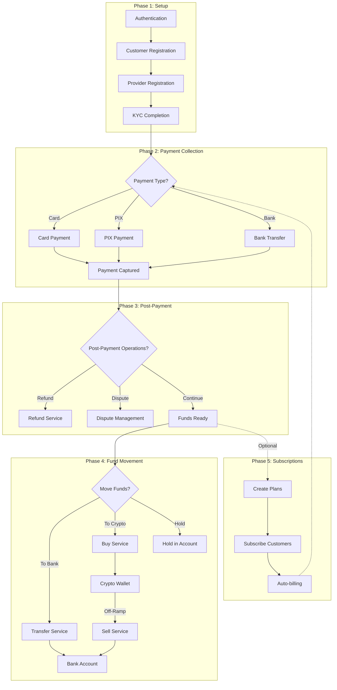
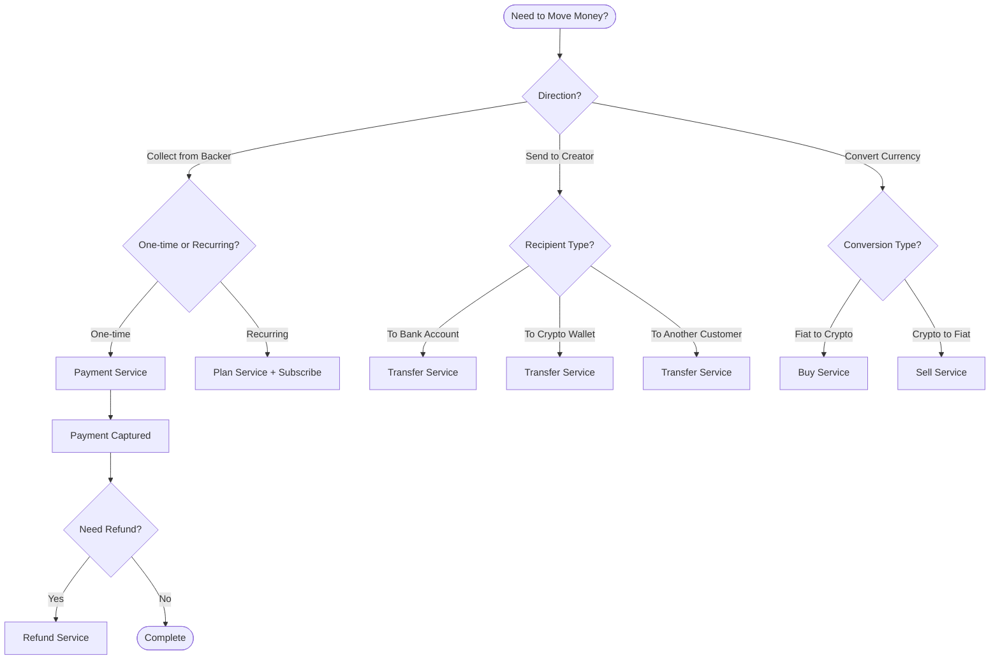

# Payment SDK

The `@oaknetwork/payments-sdk` package is a TypeScript SDK that wraps the Oak Network payment API — handling authentication, retries, and type safety so you can focus on building your integration.

import MermaidDiagram from '@site/src/components/MermaidDiagram';

:::tip Get your API credentials
To start building with the SDK, you need a **Client ID** and **Client Secret**. Reach out to **[support@oaknetwork.org](mailto:support@oaknetwork.org)** to get your sandbox credentials and start integrating today.
:::

## Highlights

- **Initialize a client** for sandbox or production: `createOakClient({ environment: 'sandbox', ... })`
- **Standalone service factories** — import only what you need: `createCustomerService(client)`, `createPaymentService(client)`, etc.
- **Type-safe results** on every call: every method returns `Result<T, OakError>` — no uncaught exceptions
- **Built-in retry** with exponential backoff, jitter, and `Retry-After` header support
- **Webhook signature verification** built in: `verifyWebhookSignature()` and `parseWebhookPayload()`
- **Two environments** out of the box: `sandbox` and `production`, plus `customUrl` for self-hosted setups

---

## Complete Money Flow

<MermaidDiagram title="Payment SDK Money Flow">



</MermaidDiagram>

---

## When to Use Each Operation

<MermaidDiagram title="Operation Decision Guide">



</MermaidDiagram>

| Operation | Service | Use Case | Providers |
|---|---|---|---|
| **Payment** | `PaymentService` | Collect funds from backer (card, PIX) | Stripe, PagarMe, MercadoPago |
| **Refund** | `RefundService` | Return funds from a captured payment | Same as payment provider |
| **Transfer** | `TransferService` | Move funds to bank, wallet, or customer | Stripe, PagarMe, BRLA |
| **Buy** | `BuyService` | Convert fiat → crypto (on-ramp) | Bridge |
| **Sell** | `SellService` | Convert crypto → fiat (off-ramp) | Bridge |
| **Plans** | `PlanService` | Define recurring billing plans | All |

---

## Quick example

```typescript
import { createOakClient, createCustomerService } from '@oaknetwork/payments-sdk';

const client = createOakClient({
  environment: 'sandbox',
  clientId: process.env.CLIENT_ID!,
  clientSecret: process.env.CLIENT_SECRET!,
});

const customers = createCustomerService(client);

const result = await customers.list();

if (result.ok) {
  console.log(result.value.data);
} else {
  console.error(result.error.message);
}
```

> See the full walkthrough in the [Quickstart](/docs/sdk/quickstart) guide.

## Start here

- [Installation](/docs/sdk/installation) — Install the package and configure credentials
- [Quickstart](/docs/sdk/quickstart) — 6-step universal integration flow
- [Choose Your Integration Path](/docs/guides/integration-overview) — Compare Payment SDK vs Contracts SDK

## Services

The SDK ships 10 service modules. Import the factory function for each service you need.

| Service | Factory | What it does |
|---|---|---|
| [`CustomerService`](/docs/sdk/customers) | `createCustomerService(client)` | Create, get, list, update, sync, and check balances |
| [`PaymentService`](/docs/sdk/payments) | `createPaymentService(client)` | Create, confirm, cancel payments |
| [`PaymentMethodService`](/docs/sdk/payment-methods) | `createPaymentMethodService(client)` | Add, list, get, delete payment methods |
| [`WebhookService`](/docs/sdk/webhooks) | `createWebhookService(client)` | Register, manage, and monitor webhooks |
| [`TransactionService`](/docs/sdk/transactions) | `createTransactionService(client)` | List, get, and settle transactions |
| [`TransferService`](/docs/sdk/transfers) | `createTransferService(client)` | Create provider transfers (Stripe, PagarMe, BRLA) |
| [`PlanService`](/docs/sdk/plans) | `createPlanService(client)` | CRUD subscription plans |
| [`RefundService`](/docs/sdk/refunds) | `createRefundService(client)` | Refund a payment |
| [`BuyService`](/docs/sdk/buy-and-sell) | `createBuyService(client)` | Crypto on-ramp via Bridge |
| [`SellService`](/docs/sdk/buy-and-sell) | `createSellService(client)` | Crypto off-ramp |

## Next up

- [Installation](/docs/sdk/installation) — install the package and configure credentials
- [Quickstart](/docs/sdk/quickstart) — your first working integration in under 5 minutes
- [Error Handling](/docs/sdk/error-handling) — understand the `Result<T>` pattern and error types
