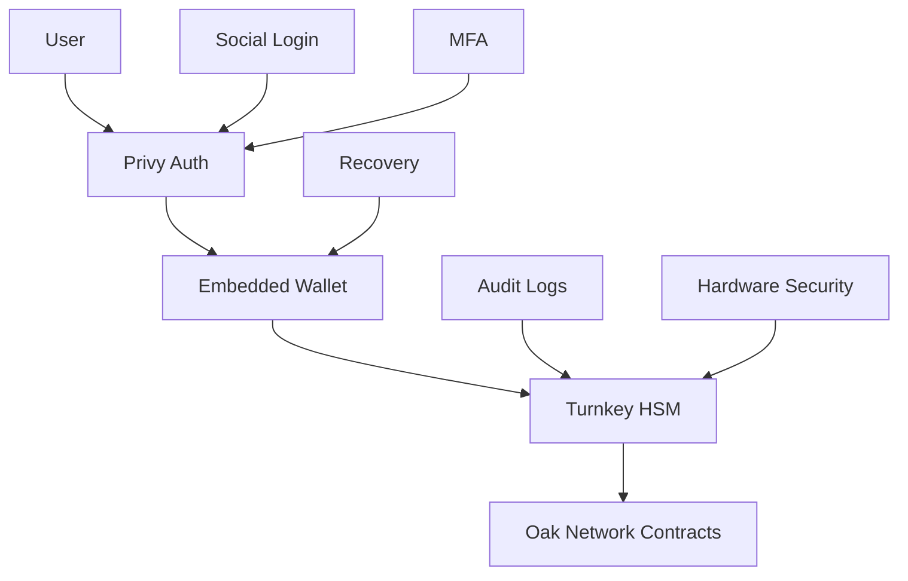

# Security Documentation

Oak Network implements a comprehensive security model designed to protect users, funds, and the protocol itself. This document outlines our security architecture, best practices, and incident response procedures.

## 📋 Table of Contents

- [Security Architecture](#security-architecture)
- [Zero Key Storage Policy](#zero-key-storage-policy)
- [Privy Integration](#privy-integration)
- [Turnkey Integration](#turnkey-integration)
- [Smart Contract Security](#smart-contract-security)
- [Access Control](#access-control)
- [Audit Reports](#audit-reports)
- [Bug Bounty Program](#bug-bounty-program)
- [Incident Response](#incident-response)
- [Best Practices](#best-practices)

## 🏗️ Security Architecture

### Overview

Oak Network implements a multi-layered security approach:

1. **Hardware Security Modules (HSM)** - Enterprise-grade key protection
2. **Embedded Wallets** - No seed phrase management required
3. **Social Authentication** - Secure login without private keys
4. **Smart Contract Audits** - Regular security assessments
5. **Access Control** - Role-based permissions
6. **Emergency Procedures** - Incident response protocols

### Security Model Diagram



## 🔐 Zero Key Storage Policy

### Core Principle

Oak Network **never stores private keys** on our servers or infrastructure. This eliminates the risk of key theft, server compromise, and insider threats.

### Implementation

- **No Key Storage** - Private keys are never stored in our database
- **Client-Side Generation** - Keys are generated in the user's browser
- **Hardware Security** - Keys are protected by HSM when possible
- **Social Recovery** - Account recovery without seed phrases

### Benefits

- **Reduced Attack Surface** - No centralized key storage
- **User Control** - Users maintain control of their keys
- **Compliance** - Meets enterprise security requirements
- **Trust** - Users don't need to trust us with their keys

## 🔑 Privy Integration

### Overview

Privy provides embedded wallet infrastructure with social authentication and recovery mechanisms.

### Features

#### Social Authentication
```javascript
// Login with social providers
const { user, wallet } = await privy.login({
  provider: 'google', // or 'apple', 'discord', etc.
  email: 'user@example.com'
});
```

#### Embedded Wallets
```javascript
// Create embedded wallet
const embeddedWallet = await privy.createWallet({
  userId: user.id,
  walletType: 'embedded'
});
```

#### Multi-Factor Authentication
```javascript
// Enable MFA
await privy.enableMFA({
  userId: user.id,
  method: 'sms' // or 'email', 'totp'
});
```

### Security Features

- **End-to-End Encryption** - All data encrypted in transit and at rest
- **Zero-Knowledge Architecture** - Privy cannot access user funds
- **Hardware Security** - Integration with device security features
- **Audit Logs** - Complete transaction history

### Recovery Mechanisms

```javascript
// Social recovery
const recoveredWallet = await privy.recoverWallet({
  socialProvider: 'google',
  email: 'user@example.com'
});

// Backup codes
const backupCodes = await privy.generateBackupCodes({
  userId: user.id
});
```

## 🛡️ Turnkey Integration

### Overview

Turnkey provides enterprise-grade hardware security modules for key management and transaction signing.

### Features

#### Hardware Security
- **HSM Protection** - Keys stored in hardware security modules
- **Key Isolation** - Each key is isolated and protected
- **Tamper Detection** - Hardware tamper detection and response
- **Compliance** - SOC 2 Type II certified

#### Key Management
```javascript
// Create HSM-protected key
const key = await turnkey.createKey({
  keyName: 'oak-network-key',
  curve: 'secp256k1',
  hsm: true
});

// Sign transaction
const signature = await turnkey.signTransaction({
  keyId: key.keyId,
  transaction: transactionData
});
```

#### Audit and Compliance
- **Audit Logs** - Complete key usage history
- **Compliance Reports** - SOC 2, GDPR compliance
- **Key Rotation** - Automatic key rotation policies
- **Access Control** - Fine-grained permissions

### Security Benefits

- **Hardware Protection** - Keys never leave the HSM
- **Audit Trail** - Complete transaction history
- **Compliance** - Meets enterprise security standards
- **Scalability** - Handles high-volume transactions

## 🔒 Smart Contract Security

### Security Measures

#### Access Control
```solidity
// Role-based access control
modifier onlyRole(bytes32 role) {
    require(hasRole(role, msg.sender), "AccessControl: account missing role");
    _;
}

// Admin functions
function setProtocolFee(uint256 newFee) external onlyRole(PROTOCOL_ADMIN_ROLE) {
    require(newFee <= MAX_FEE, "Fee too high");
    protocolFee = newFee;
    emit ProtocolFeeUpdated(newFee);
}
```

#### Input Validation
```solidity
// Validate inputs
function createCampaign(
    string memory title,
    uint256 goal,
    uint256 duration
) external {
    require(bytes(title).length > 0, "Title required");
    require(goal > 0, "Goal must be positive");
    require(duration >= MIN_DURATION && duration <= MAX_DURATION, "Invalid duration");
    // ... rest of function
}
```

#### Reentrancy Protection
```solidity
// Reentrancy guard
import "@openzeppelin/contracts/security/ReentrancyGuard.sol";

contract Treasury is ReentrancyGuard {
    function withdrawFunds() external nonReentrant {
        // ... withdrawal logic
    }
}
```

#### Pausability
```solidity
// Emergency pause functionality
import "@openzeppelin/contracts/security/Pausable.sol";

contract CampaignInfo is Pausable {
    function pledge() external whenNotPaused {
        // ... pledge logic
    }
}
```

### Security Patterns

#### Checks-Effects-Interactions
```solidity
function pledge(uint256 amount) external payable {
    // Checks
    require(amount > 0, "Amount must be positive");
    require(msg.value >= amount, "Insufficient payment");
    
    // Effects
    totalPledged += amount;
    pledges[msg.sender] += amount;
    
    // Interactions
    emit PledgeMade(msg.sender, amount);
}
```

#### Pull Over Push
```solidity
// Use pull pattern for withdrawals
mapping(address => uint256) public pendingWithdrawals;

function requestWithdrawal(uint256 amount) external {
    pendingWithdrawals[msg.sender] += amount;
}

function withdraw() external {
    uint256 amount = pendingWithdrawals[msg.sender];
    pendingWithdrawals[msg.sender] = 0;
    payable(msg.sender).transfer(amount);
}
```

## 👥 Access Control

### Role Hierarchy

```solidity
// Protocol roles
bytes32 public constant PROTOCOL_ADMIN_ROLE = keccak256("PROTOCOL_ADMIN_ROLE");
bytes32 public constant CAMPAIGN_CREATOR_ROLE = keccak256("CAMPAIGN_CREATOR_ROLE");
bytes32 public constant PAUSER_ROLE = keccak256("PAUSER_ROLE");
bytes32 public constant CANCELLER_ROLE = keccak256("CANCELLER_ROLE");
```

### Permission Matrix

| Role | Create Campaign | Pause Contract | Cancel Campaign | Set Parameters |
|------|----------------|----------------|-----------------|----------------|
| Protocol Admin | ✅ | ✅ | ✅ | ✅ |
| Campaign Creator | ✅ | ❌ | ❌ | ❌ |
| Pauser | ❌ | ✅ | ❌ | ❌ |
| Canceller | ❌ | ❌ | ✅ | ❌ |

### Multi-Sig Implementation

```solidity
// Multi-signature requirements
contract MultiSig {
    uint256 public constant REQUIRED_SIGNATURES = 3;
    mapping(address => bool) public isOwner;
    mapping(bytes32 => uint256) public confirmations;
    
    function executeTransaction(
        address destination,
        uint256 value,
        bytes memory data
    ) external {
        require(isOwner[msg.sender], "Not an owner");
        // ... multi-sig logic
    }
}
```

## 🔍 Audit Reports

### Completed Audits

#### PeckShield Security Audit
- **Date**: December 2024
- **Scope**: Core smart contracts
- **Status**: ✅ Completed
- **Report**: [PeckShield Audit Report](audits/PeckShield-Audit-Report-CreativeCrowdfunding_v1.0.pdf)

#### Key Findings
- **Critical Issues**: 0
- **High Issues**: 0
- **Medium Issues**: 2 (Fixed)
- **Low Issues**: 5 (Fixed)
- **Informational**: 8 (Addressed)

### Upcoming Audits

- **Q1 2025**: Trail of Bits comprehensive audit
- **Q2 2025**: ConsenSys Diligence audit
- **Q3 2025**: OpenZeppelin audit

## 🐛 Bug Bounty Program

### Scope

We run a bug bounty program to identify security vulnerabilities in our smart contracts and infrastructure.

### Rewards

| Severity | Reward Range |
|----------|--------------|
| Critical | $10,000 - $50,000 |
| High | $5,000 - $20,000 |
| Medium | $1,000 - $5,000 |
| Low | $100 - $1,000 |

### Eligible Targets

- Smart contracts on mainnet
- Smart contracts on testnet
- Web application
- API endpoints
- Documentation

### Out of Scope

- Social engineering attacks
- Physical attacks
- Third-party services
- Known issues

### How to Report

1. **Email**: security@oaknetwork.org
2. **HackerOne**: [hackerone.com/oaknetwork](https://hackerone.com/oaknetwork)
3. **Discord**: #security channel

### Responsible Disclosure

1. **Report** the vulnerability privately
2. **Wait** for our response (within 48 hours)
3. **Allow** us time to fix the issue
4. **Coordinate** public disclosure

## 🚨 Incident Response

### Emergency Contacts

- **Security Team**: security@oaknetwork.org
- **Emergency Hotline**: +1-XXX-XXX-XXXX
- **Discord**: #emergency channel

### Response Procedures

#### 1. Detection
- Automated monitoring systems
- Community reports
- Security team analysis

#### 2. Assessment
- Severity classification
- Impact analysis
- Containment strategy

#### 3. Response
- Immediate containment
- Communication plan
- Fix deployment

#### 4. Recovery
- System restoration
- Monitoring
- Post-incident review

### Communication Plan

#### Internal
- Security team notification
- Development team alert
- Management briefing

#### External
- Community announcement
- Social media updates
- Press release (if needed)

## 📚 Best Practices

### For Users

#### Wallet Security
- Use hardware wallets for large amounts
- Enable multi-factor authentication
- Keep backup codes secure
- Verify transaction details

#### Account Security
- Use strong, unique passwords
- Enable 2FA on all accounts
- Be cautious of phishing attempts
- Keep software updated

### For Developers

#### Smart Contract Development
- Follow security best practices
- Use established libraries
- Implement proper access control
- Test thoroughly

#### Integration Security
- Validate all inputs
- Use secure communication
- Implement proper error handling
- Monitor for anomalies

### For Platform Integrators

#### API Security
- Use HTTPS for all requests
- Implement rate limiting
- Validate all inputs
- Monitor usage patterns

#### Data Protection
- Encrypt sensitive data
- Implement proper access control
- Regular security audits
- Incident response plan

## 🔧 Security Tools

### Development Tools

- **Slither** - Static analysis
- **Mythril** - Security analysis
- **Echidna** - Fuzzing
- **Foundry** - Testing framework

### Monitoring Tools

- **Tenderly** - Transaction monitoring
- **Forta** - Real-time threat detection
- **OpenZeppelin Defender** - Security monitoring

### Audit Tools

- **Certora** - Formal verification
- **Halmos** - Symbolic execution
- **Medusa** - Multi-transaction fuzzing

## 📊 Security Metrics

### Key Performance Indicators

- **Time to Detection** - Average time to detect incidents
- **Time to Response** - Average time to respond to incidents
- **False Positive Rate** - Rate of false security alerts
- **Vulnerability Resolution** - Time to fix security issues

### Monthly Reports

- Security incident summary
- Vulnerability assessment
- Audit progress update
- Community security tips

---

**Security is our top priority.** If you discover a security vulnerability, please report it responsibly through our [bug bounty program](bug-bounty.md) or email security@oaknetwork.org.

**Need help?** Join our [Discord community](https://discord.gg/oaknetwork) or check our [Security Best Practices](best-practices.md).


