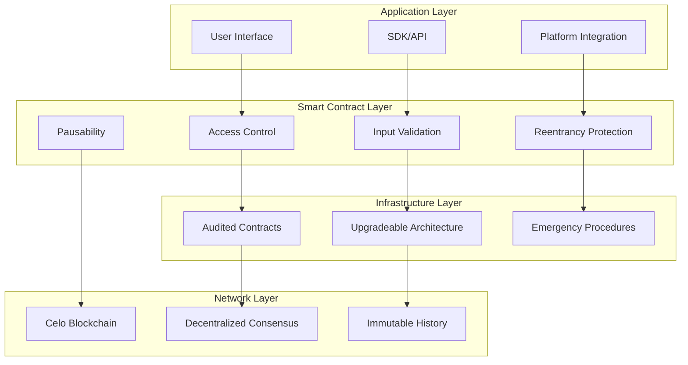
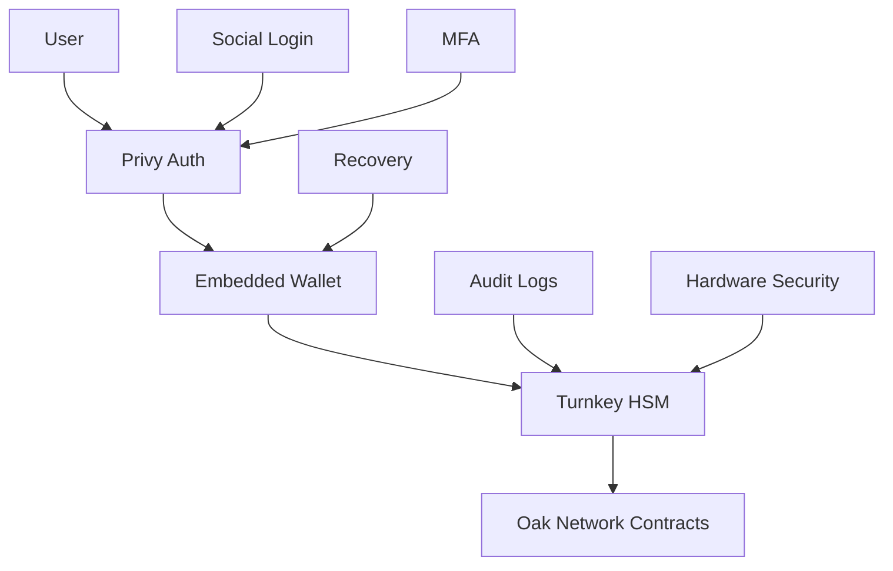

# Security Overview

Security is paramount in Oak Network. This section covers our security model, audit processes, and best practices for secure integration.

## Security Model

### Zero Key Storage Policy

Oak Network **never stores private keys**. We leverage industry-leading security providers to ensure maximum security:

- **Privy**: Embedded wallet management and social authentication
- **Turnkey**: Enterprise-grade hardware security modules
- **User Wallets**: Direct blockchain interactions with user-controlled keys

### Multi-Layer Security

Oak Network implements a comprehensive security model with multiple layers of protection:



### Key Management Security

#### Privy Integration

Oak Network integrates with Privy to provide secure, user-friendly wallet management:

```javascript
// Privy integration example
import { PrivyProvider } from '@privy-io/react-auth';

function OakNetworkApp() {
  return (
    <PrivyProvider
      appId="your-privy-app-id"
      config={{
        embeddedWallets: {
          createOnLogin: 'users-without-wallets',
          requireUserPasswordOnCreate: true
        },
        loginMethods: ['email', 'google', 'apple'],
        appearance: {
          theme: 'dark',
          accentColor: '#10b981'
        }
      }}
    >
      <App />
    </PrivyProvider>
  );
}
```

**Privy Security Features:**
- **Embedded Wallets**: Seamless wallet creation without seed phrases
- **Social Authentication**: Email, Google, Apple, and social media login
- **Multi-Factor Authentication**: Enhanced security for all users
- **Recovery Mechanisms**: Secure account recovery without private keys
- **Hardware Security**: Integration with device security features

#### Turnkey Integration

For enterprise and platform integrations, Oak Network uses Turnkey for hardware-grade security:

```javascript
// Turnkey integration example
import { TurnkeyClient } from '@turnkey/turnkey-sdk';

const turnkeyClient = new TurnkeyClient({
  apiBaseUrl: 'https://api.turnkey.com',
  apiKey: process.env.TURNKEY_API_KEY,
  privateKey: process.env.TURNKEY_PRIVATE_KEY
});

// Create secure key for platform
const keyResponse = await turnkeyClient.createKeys({
  organizationId: 'your-org-id',
  keyName: 'oak-platform-key',
  curve: 'CURVE_SECP256K1',
  addressFormats: ['ADDRESS_FORMAT_ETHEREUM']
});
```

**Turnkey Security Features:**
- **Hardware Security Modules**: Enterprise-grade key storage
- **Multi-Signature Support**: Advanced transaction signing
- **Audit Trails**: Complete transaction and key usage logging
- **Compliance**: SOC 2 Type II and other security certifications
- **Zero-Knowledge Proofs**: Cryptographic proofs without key exposure

#### Security Architecture



### Access Control

#### Role-Based Permissions

```solidity
// Protocol Admin - Highest level access
modifier onlyProtocolAdmin() {
    require(msg.sender == GLOBAL_PARAMS.getProtocolAdminAddress(), "Not protocol admin");
    _;
}

// Platform Admin - Platform-specific access
modifier onlyPlatformAdmin(bytes32 platformHash) {
    require(msg.sender == s_platforms[platformHash].adminAddress, "Not platform admin");
    _;
}

// Campaign Owner - Campaign-specific access
modifier onlyCampaignOwner() {
    require(msg.sender == owner(), "Not campaign owner");
    _;
}
```

#### Permission Hierarchy

1. **Protocol Admin**: Global protocol control
2. **Platform Admin**: Platform-specific control
3. **Campaign Owner**: Campaign-specific control
4. **Public**: Read-only access

### Input Validation

#### Parameter Validation

```solidity
// Comprehensive input validation
function createCampaign(
    address creator,
    bytes32 identifierHash,
    bytes32[] calldata selectedPlatformHash,
    CampaignData calldata campaignData
) external {
    // Validate creator
    require(creator != address(0), "Invalid creator");
    
    // Validate identifier
    require(identifierHash != bytes32(0), "Invalid identifier");
    
    // Validate campaign data
    require(campaignData.launchTime > block.timestamp, "Invalid launch time");
    require(campaignData.deadline > campaignData.launchTime, "Invalid deadline");
    require(campaignData.goalAmount > 0, "Invalid goal amount");
    
    // Validate platforms
    for (uint256 i = 0; i < selectedPlatformHash.length; i++) {
        require(
            GLOBAL_PARAMS.checkIfPlatformIsListed(selectedPlatformHash[i]),
            "Platform not listed"
        );
    }
}
```

#### Bounds Checking

```solidity
// Fee percentage bounds
uint256 public constant MAX_PLATFORM_FEE = 10; // 10% maximum

function setPlatformFee(bytes32 platformHash, uint256 feePercent) external {
    require(feePercent <= MAX_PLATFORM_FEE, "Fee too high");
    require(feePercent >= 0, "Fee cannot be negative");
    // ...
}
```

### Reentrancy Protection

#### Checks-Effects-Interactions Pattern

```solidity
function contribute(address backer, uint256 amount) external {
    // 1. Checks
    require(amount > 0, "Invalid amount");
    require(!paused(), "Contract paused");
    
    // 2. Effects
    s_pledgedAmount += amount;
    s_contributions[backer] += amount;
    
    // 3. Interactions
    TOKEN.safeTransferFrom(backer, address(this), amount);
    
    emit Contribution(backer, amount);
}
```

#### Reentrancy Guards

```solidity
// Reentrancy guard for critical functions
bool private locked;

modifier noReentrancy() {
    require(!locked, "Reentrancy detected");
    locked = true;
    _;
    locked = false;
}
```

## Audit Process

### Security Audits

Oak Network contracts undergo comprehensive security audits:

#### Audit Partners

- **PeckShield**: Leading blockchain security firm
- **Additional Auditors**: Multiple independent security firms
- **Community Audits**: Open source community review

#### Audit Scope

1. **Smart Contract Security**: Code review and vulnerability assessment
2. **Economic Security**: Tokenomics and incentive analysis
3. **Integration Security**: Cross-contract interaction analysis
4. **Upgrade Security**: Governance and upgrade mechanism review

#### Audit Reports

- [PeckShield Audit Report](/docs/security/audits/peckshield-audit.pdf)
- [Additional Audit Reports](/docs/security/audits/)

### Bug Bounty Program

#### Scope

- Smart contract vulnerabilities
- Integration security issues
- Economic exploits
- Governance attacks

#### Rewards

- **Critical**: Up to $50,000
- **High**: Up to $10,000
- **Medium**: Up to $5,000
- **Low**: Up to $1,000

#### Submission Process

1. **Report**: Submit detailed vulnerability report
2. **Review**: Security team reviews submission
3. **Validation**: Reproduce and validate issue
4. **Reward**: Issue reward for valid submissions

## Security Best Practices

### For Developers

#### Smart Contract Development

```solidity
// 1. Use established patterns
import "@openzeppelin/contracts/security/ReentrancyGuard.sol";
import "@openzeppelin/contracts/access/Ownable.sol";

// 2. Implement proper access control
modifier onlyAuthorized() {
    require(authorized[msg.sender], "Not authorized");
    _;
}

// 3. Validate all inputs
function updateParameter(uint256 newValue) external {
    require(newValue > 0, "Invalid value");
    require(newValue <= MAX_VALUE, "Value too high");
    parameter = newValue;
}

// 4. Use safe math operations
import "@openzeppelin/contracts/utils/math/SafeMath.sol";

using SafeMath for uint256;

function calculateFee(uint256 amount) public pure returns (uint256) {
    return amount.mul(FEE_PERCENT).div(100);
}
```

#### Integration Security

```javascript
// 1. Validate all inputs
function validateCampaignData(data) {
  if (!data.creator || !ethers.utils.isAddress(data.creator)) {
    throw new Error('Invalid creator address');
  }
  
  if (data.goalAmount <= 0) {
    throw new Error('Invalid goal amount');
  }
  
  if (data.deadline <= data.launchTime) {
    throw new Error('Invalid deadline');
  }
}

// 2. Handle errors gracefully
try {
  await contract.createCampaign(campaignData);
} catch (error) {
  if (error.message.includes('INVALID_INPUT')) {
    // Handle invalid input
  } else if (error.message.includes('UNAUTHORIZED')) {
    // Handle unauthorized access
  } else {
    // Handle unexpected errors
  }
}

// 3. Implement proper error handling
class SecureIntegration {
  async createCampaign(data) {
    try {
      this.validateInput(data);
      return await this.contract.createCampaign(data);
    } catch (error) {
      this.logError(error);
      throw new Error(`Campaign creation failed: ${error.message}`);
    }
  }
}
```

### For Platform Integrators

#### Access Control

```javascript
// 1. Secure admin keys
const adminWallet = new ethers.Wallet(process.env.ADMIN_PRIVATE_KEY);

// 2. Implement role-based access
class PlatformSecurity {
  constructor(adminWallet) {
    this.adminWallet = adminWallet;
    this.authorizedUsers = new Set();
  }
  
  async authorizeUser(userAddress) {
    // Implement authorization logic
    this.authorizedUsers.add(userAddress);
  }
  
  async createCampaign(userAddress, campaignData) {
    if (!this.authorizedUsers.has(userAddress)) {
      throw new Error('User not authorized');
    }
    
    return await this.createCampaignInternal(campaignData);
  }
}
```

#### Data Validation

```javascript
// 1. Validate all platform data
function validatePlatformData(data) {
  const requiredFields = ['name', 'description', 'goalAmount'];
  
  for (const field of requiredFields) {
    if (!data[field]) {
      throw new Error(`Missing required field: ${field}`);
    }
  }
  
  // Validate specific fields
  if (data.goalAmount <= 0) {
    throw new Error('Goal amount must be positive');
  }
  
  if (data.deadline <= Date.now() / 1000) {
    throw new Error('Deadline must be in the future');
  }
}

// 2. Sanitize user inputs
function sanitizeInput(input) {
  return input
    .trim()
    .replace(/[<>]/g, '') // Remove potential HTML tags
    .substring(0, 1000); // Limit length
}
```

### For Users

#### Wallet Security

1. **Use Hardware Wallets**: Store private keys in hardware wallets
2. **Secure Backup**: Create secure backups of seed phrases
3. **Regular Updates**: Keep wallet software updated
4. **Phishing Protection**: Verify website URLs and contracts

#### Transaction Security

1. **Verify Contracts**: Always verify contract addresses
2. **Check Gas Limits**: Set appropriate gas limits
3. **Review Transactions**: Review all transaction details
4. **Use Testnets**: Test on testnets before mainnet

## Emergency Procedures

### Pause Mechanism

```solidity
// Emergency pause functionality
function emergencyPause(string calldata reason) external onlyProtocolAdmin {
    _pause(reason);
    emit EmergencyPause(reason);
}

function emergencyUnpause(string calldata reason) external onlyProtocolAdmin {
    _unpause(reason);
    emit EmergencyUnpause(reason);
}
```

### Upgrade Mechanism

```solidity
// Upgradeable implementation
contract CampaignInfoFactory is Initializable, Ownable {
    address public implementation;
    
    function updateImplementation(address newImplementation) external onlyOwner {
        require(newImplementation != address(0), "Invalid implementation");
        implementation = newImplementation;
        emit ImplementationUpdated(newImplementation);
    }
}
```

### Incident Response

#### Response Team

- **Protocol Team**: Core development team
- **Security Team**: Dedicated security experts
- **Community Moderators**: Community support team

#### Response Process

1. **Detection**: Identify and assess security incident
2. **Containment**: Implement immediate containment measures
3. **Investigation**: Conduct thorough investigation
4. **Remediation**: Implement fixes and improvements
5. **Communication**: Communicate with community
6. **Prevention**: Update security measures

## Security Monitoring

### On-Chain Monitoring

```javascript
// Monitor for suspicious activities
class SecurityMonitor {
  async monitorTransactions() {
    const filter = contract.filters.Contribution();
    const events = await contract.queryFilter(filter);
    
    for (const event of events) {
      await this.analyzeContribution(event);
    }
  }
  
  async analyzeContribution(event) {
    const { contributor, amount } = event.args;
    
    // Check for unusual patterns
    if (amount.gt(ethers.utils.parseEther('100000'))) {
      await this.alertLargeContribution(contributor, amount);
    }
    
    // Check for rapid contributions
    const recentContributions = await this.getRecentContributions(contributor);
    if (recentContributions.length > 10) {
      await this.alertRapidContributions(contributor);
    }
  }
}
```

### Off-Chain Monitoring

- **Transaction Monitoring**: Monitor all protocol transactions
- **Anomaly Detection**: Detect unusual patterns and behaviors
- **Community Reports**: Process security reports from community
- **Regular Audits**: Conduct regular security assessments

## Security Resources

### Documentation

- [Security Best Practices](/docs/security/best-practices)
- [Audit Reports](/docs/security/audits)
- [Bug Bounty Program](/docs/security/bug-bounty)
- [Incident Response](/docs/security/incident-response)

### Tools

- [Security Checklist](/docs/security/checklist)
- [Vulnerability Scanner](/docs/security/scanner)
- [Security Testing Guide](/docs/security/testing)

### Community

- [Security Discord Channel](https://discord.gg/oaknetwork)
- [Security GitHub Issues](https://github.com/oaknetwork/security)
- [Security Email](security@oaknetwork.org)

## Next Steps

- [Audit Reports](/docs/security/audits) - Review security audits
- [Best Practices](/docs/security/best-practices) - Security guidelines
- [Bug Bounty](/docs/security/bug-bounty) - Participate in bug bounty
- [Incident Response](/docs/security/incident-response) - Emergency procedures
